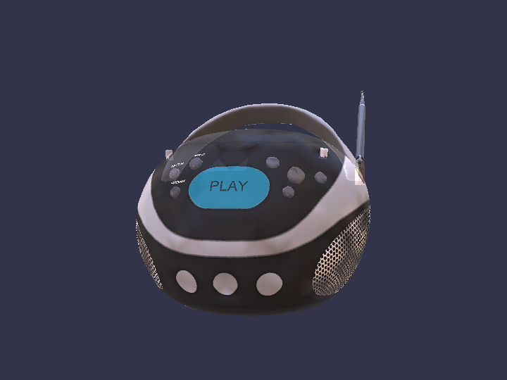

# bblitec

[](https://github.com/sailro/bblitec/actions/workflows/ci.yml)

> Experimental Babylon Lite TypeScript-to-C++ transpiler and SDL3 native runtime.

This repository contains a working, deliberately narrow Babylon Lite native compiler prototype. It accepts scene-building TypeScript written against `@babylonjs/lite`, removes browser-only setup, lowers supported API calls to typed C++, and emits a native source manifest containing only the runtime features reached by the program.

The prototype now supports two official-style targets: the primitives scene and the BoomBox glTF demo. `examples\boombox.ts` tracks the authoritative parity source at `BabylonJS/Babylon-Lite/lab/lite/src/lite/scene1.ts`; browser-only timing/dataset instrumentation is erased by the compiler. The BoomBox path downloads the source GLB during transpilation, uses generated typed C++ to decode its schema, accessors, hierarchy, materials, and embedded PNGs, then renders it through SDL.

**Status:** research prototype. The accepted TypeScript and Babylon Lite API surface is intentionally constrained and validated at transpile time.



_The Babylon Lite BoomBox parity scene transpiled to C++ and rendered through the native SDL3 runtime._

## Pipeline

```text
Babylon Lite TypeScript
        |
        v
TypeScript AST + intrinsic validation
        |
        v
typed native operations + reached feature set
        |
        +--> main.cpp
        +--> features.cmake
        +--> manifest.json
        +--> upstream-generated C++
                    |
                    v
          C++20 engine code + PAL
                    |
                    v
            SDL3 window/input/rendering
```

This is a compiler, not a JavaScript interpreter. Unsupported JavaScript or Babylon Lite APIs fail with source locations instead of being silently ignored.

## Upstream transpilation direction

The long-term architecture is to transpile the reachable Babylon Lite implementation itself and keep hand-written native code only at the platform abstraction layer (PAL).

`@babylonjs/lite@1.18.0` is pinned as the upstream source artifact. Its package metadata pins GitHub source commit `7184feda683072980735f9a180e6f567ee5717ba`, and its source maps embed the original TypeScript for each published module.

```text
BoomBox TypeScript imports
        |
        v
Babylon Lite public-export resolution
        |
        v
reachable TypeScript module graph
        |
        v
supported TS lowering + generated C++
        |
        v
PAL (filesystem, paths, environment, clock, SDL)
```

Generate the conservative BoomBox module graph:

```powershell
npm run analyze:boombox
```

The current graph contains 218 runtime modules and approximately 1.35 MiB of TypeScript. Its main unsupported pressures are async/await, closures, dynamic imports, and Web platform references such as `fetch`, `navigator`, and `requestAnimationFrame`.

The current vertical migration generates these implementations from pinned upstream TypeScript:

- `createEngine` and `startEngine` API wrappers from `engine/engine.ts`, delegating host creation and the run loop to PAL
- `createHemisphericLight` from `light/hemispheric.ts`
- `localMatrixFromDirection` from `light/light-matrix.ts`
- `createArcRotateCamera` from `camera/arc-rotate.ts`
- `createDefaultCamera` framing constants and factory from `scene/scene-camera.ts`
- `attachControl` inertia integration from `camera/arc-rotate-controls.ts`; SDL only translates native events into inertial offsets
- Babylon `.env` magic, manifest layout, face slicing, and spherical-harmonic conversion from `loader-env/env-parse.ts` and `loader-env/load-env.ts`
- `createSceneContext`, mesh/light/asset routing in `addToScene`, and idempotent `registerScene` semantics from `scene/scene-core.ts`
- GLB magic/chunk validation and framing from `loader-gltf/gltf-glb-parser.ts`
- box/ground mesh factory defaults from `mesh/create-box.ts`, `mesh/create-ground.ts`, and `mesh/mesh-factories.ts`
- `createStandardMaterial` defaults from `material/standard/create-standard-material.ts`

Their generated sources and provenance are emitted under `generated\<scene>\upstream`. The previous hand-written light, camera, mesh-factory, standard-material, core, environment, and glTF loader C++ files have been removed.

The PAL currently owns native file reads, path joining, environment variables, monotonic timing, image decoding, and the SDL window/input/render implementation. `pal_sdl.cpp` still contains transitional scene traversal and PBR calculations; those are the next major block to move into generated Babylon render/frame-graph code.

The lowering code is split into dedicated engine, scene, light, camera, environment, and glTF lowerer classes with a shared `LoweringContext`; adding language coverage no longer requires extending one monolithic transpiler file.

### TypeScript runtime coverage

The native runtime now provides explicitly typed implementations for:

- `ArrayBuffer`, typed arrays, and `DataView`
- `Blob` and UTF-8 `TextDecoder`
- `Promise<T>` plus synchronous AOT `await` specialization
- `JSON.parse` into a typed `JsonValue` variant (`null`, boolean, number, string, array, or object)
- PAL-backed asset fetch and image decoding
- compile-time specialization of glTF dynamic feature imports from typed GLB metadata

Explicit TypeScript `any` is forbidden by an AST-level test. Dynamic JSON must be narrowed through typed records or `JsonValue` accessors. The current promise implementation is deliberately immediate: remote assets are materialized during transpilation, so the generated BoomBox loader performs deterministic local PAL reads rather than retaining a native asynchronous scheduler.

## Prerequisites

- Node.js 22 or newer
- A C++20 compiler
- CMake 3.24 or newer
- [vcpkg](https://github.com/microsoft/vcpkg) for SDL3, SDL3_image, and nlohmann-json

The commands below use PowerShell and have been exercised with MSVC on Windows.

## Quick start

```powershell
git clone https://github.com/sailro/bblitec.git
cd bblitec
npm ci
npm test
npm run compile:example
npm run compile:boombox
```

The generated files are written to `generated\primitives` and `generated\boombox`.

To build the native application, install a C++20 compiler and CMake. SDL3 is declared by `native\vcpkg.json`; configure with a vcpkg toolchain to install and use it:

```powershell
$env:VCPKG_ROOT = "C:\path\to\vcpkg"
cmake -S native -B native\build `
  -DCMAKE_BUILD_TYPE=Release `
  -DCMAKE_TOOLCHAIN_FILE="$env:VCPKG_ROOT\scripts\buildsystems\vcpkg.cmake" `
  -DBBLITE_GENERATED_DIR="$PWD\generated\boombox"
cmake --build native\build
```

When CMake finds SDL3, the executable opens an SDL window. Primitive meshes render as wireframes; glTF meshes render as textured triangles with back-face culling, painter-depth ordering, normal/metallic-roughness-assisted vertex lighting, and an emissive pass. Babylon-style ArcRotate controls are available: left-drag orbits, right/middle-drag pans, and the mouse wheel zooms. Arrow keys and `W`/`S` remain keyboard fallbacks.

Set `BBLITE_MAX_FRAMES` to a positive number for automated runs. Set `BBLITE_SCREENSHOT` to a PNG path to capture a deterministic frame:

```powershell
$env:BBLITE_MAX_FRAMES = "1"
$env:BBLITE_SCREENSHOT = "$PWD\boombox.png"
.\native\build\bblite_native.exe
```

Set `BBLITE_BENCHMARK_FRAMES` to collect steady-state CPU frame-submission timing after an automatic warmup. Benchmark mode disables vsync and the interactive 1 ms sleep:

```powershell
$env:BBLITE_BENCHMARK_FRAMES = "2000"
.\native\build\bblite_native.exe
```

Configuring without SDL keeps the headless backend available. The generated glTF loader uses the typed JSON runtime; SDL_image is linked only by rendered glTF builds.

Remote scene assets referenced by supported intrinsics are downloaded during transpilation into the ignored `generated` directory. They are not committed to this repository.

## Visual parity

`bblitec` adapts the comparison math from Babylon Lite's Apache-2.0
[`tests/shared/compare-core.ts`](https://github.com/BabylonJS/Babylon-Lite/blob/master/tests/shared/compare-core.ts):

- RGB mean absolute difference (MAD) on the 0–255 scale
- exact and within-1/3/5-byte pixel ratios
- foreground-region MAD using Babylon's `[51, 51, 77]` background mask and distance threshold `30`
- the same red/green/blue diff-map encoding

Capture or refresh the 1280×720 Babylon.js golden from the upstream BoomBox Playground snippet:

```powershell
npm run parity:reference -- --force
```

After building `native\build-boombox-release\bblite_native.exe`, render the deterministic native frame and compare it:

```powershell
npm run parity:boombox
```

The native actual, diff map, and JSON report are written to ignored `artifacts\parity`. The committed golden and its capture metadata live in `reference\boombox`.

Current native regression ceilings are `4.6` full-image MAD and `21.5` foreground-region MAD. They are intentionally separate from Babylon Lite's upstream scene-1 targets (`0.19` and `0.03`, with 99% of foreground pixels within one byte): those remain the long-term parity goal. The current diff map identifies the missing environment ground/background and per-pixel GPU PBR as the dominant gaps.

The `boombox-parity` GitHub Actions job runs this gate on Windows and uploads the native actual, diff map, and JSON report on every push and pull request.

## Supported Babylon Lite subset

| Area | Supported source forms |
| --- | --- |
| Engine | `createEngine`, `createSceneContext`, `registerScene`, `startEngine` |
| Scene | `scene.clearColor`, `scene.camera`, `addToScene` |
| Cameras | `createArcRotateCamera`, `createDefaultCamera`, `attachControl`, `alpha`, `beta`, `radius` |
| Lighting | `createHemisphericLight` |
| Geometry | `createBox`, `createGround`, `loadGltf` for triangle GLB files with embedded images |
| Environment | `loadEnvironment` with Babylon `.env` irradiance, RGBD specular cubemap mips, and the official BRDF LUT |
| Materials | `createStandardMaterial`, `diffuseColor`, mesh material assignment, glTF metallic-roughness materials |
| Transforms | `position.set`, `rotation.set`, `scaling.set`, `rotation.x/y/z` |
| Expressions | Numeric literals, variables, `Math.PI`, unary `+/-`, and `+ - * /` |
| Browser erasure | `document.getElementById(...)`, `document.querySelector(...)`, `HTMLCanvasElement`, `async`, `await`, and the outer `main().catch(...)` |

Current boundaries are intentional: one entry file, one engine, static scene construction, embedded-image triangle glTF/GLB only, and no arbitrary object allocation, callbacks, animation, skinning, morphing, physics, custom shaders, networking, or audio graph yet. The native path consumes the same `.env` irradiance, RGBD cubemap mips, and BRDF LUT as Babylon Lite, but evaluates them per vertex through SDL's geometry renderer rather than per pixel in a WebGPU PBR shader. It also painter-sorts triangles instead of using a GPU depth buffer, so the BoomBox is substantially closer but not pixel-identical. The source GLB has no alpha or transmission metadata; the native demo infers its smoked-glass lid from dark, smooth, upward-facing material data to preserve the intended transparent appearance.

## Tree shaking and data layout

`features.cmake` lists only reached native and generated modules. For example, a box-only scene links the PAL sources plus generated engine, scene, and mesh factory code; ground, materials, lights, and cameras remain absent unless referenced.

The runtime stores meshes, materials, lights, and cameras in contiguous vectors and exposes small typed handles. Scene membership is stored as handle arrays. This preserves Babylon Lite's data-oriented direction and gives a path to structure-of-arrays storage, SIMD transform passes, job systems, and an SDL GPU backend without changing source-level scene code.

## Memory management

The supported subset does not need a tracing garbage collector: generated locals have normal C++ lifetimes, while engine-owned records live in contiguous arenas and are addressed by handles. This is faster and easier to reason about than introducing GC at the first milestone.

Boehm GC remains a reasonable optional compatibility layer once the compiler supports dynamic JavaScript object graphs, closures escaping their scope, cyclic user objects, or runtime module loading. It should be integrated as a separately licensed dependency rather than copying Mono's integration file directly. Native SDL/GPU resources should still use deterministic RAII regardless of whether managed objects use GC.

## Next architectural milestones

1. Replace painter-depth SDL geometry with an SDL3 GPU depth buffer and per-pixel metallic-roughness/IBL shaders.
2. Add multi-file module resolution and lower simple user functions, loops, and render callbacks.
3. Compile glTF assets into a native packed scene format and emit loader-free scene blobs.
4. Split the current array-of-records storage into hot/cold structure-of-arrays components and add generation-checked handles.
5. Add optional Boehm-backed managed allocations only for JavaScript semantics that cannot be represented with arenas or ownership.

## Acknowledgements

This prototype is not affiliated with or endorsed by the Babylon.js project. Babylon.js and Babylon Lite are Apache-2.0 projects maintained by their respective contributors. SDL, SDL_image, nlohmann-json, and downloaded demo assets remain subject to their respective licenses.
