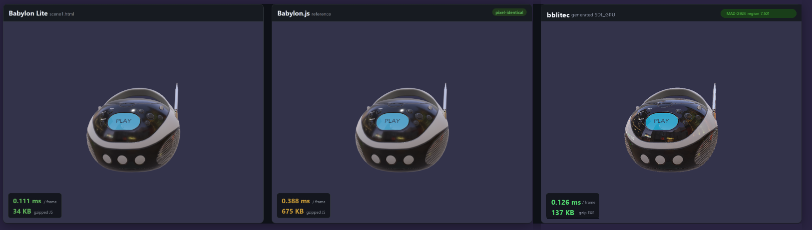

# bblitec

> Experimental Babylon Lite TypeScript-to-C++ transpiler and SDL3 native runtime.

This repository contains a working, deliberately narrow Babylon Lite native compiler prototype. It accepts scene-building TypeScript written against `@babylonjs/lite`, removes browser-only setup, lowers supported API calls to typed C++, and emits a native source manifest containing only the runtime features reached by the program.

The prototype now supports two official-style targets: the primitives scene and the BoomBox glTF demo. `examples\boombox.ts` tracks the authoritative parity source at `BabylonJS/Babylon-Lite/lab/lite/src/lite/scene1.ts`; browser-only timing/dataset instrumentation is erased by the compiler. The BoomBox path downloads the source GLB during transpilation, uses generated typed C++ to decode its schema, accessors, hierarchy, materials, and embedded PNGs, then renders it through SDL.

**Status:** research prototype. The accepted TypeScript and Babylon Lite API surface is intentionally constrained and validated at transpile time.



_The original comparison is preserved and the current generated SDL_GPU output
is appended with its measured size, speed, and parity._

Detailed documentation:

- [Architecture and generated/PAL boundary](docs/architecture.md)
- [Build, test, parity, and troubleshooting guide](docs/development.md)
- [Semantic and shader fidelity strategy](docs/fidelity.md)
- [Supported subset, metrics, and roadmap](docs/status.md)
- [Prioritized implementation backlog](TODO.md)

## Pipeline

```text
Babylon Lite TypeScript
        |
        v
TypeScript AST + intrinsic validation
        |
        v
typed native operations + reached feature set
        |
        +--> main.cpp
        +--> features.cmake
        +--> manifest.json
        +--> upstream-generated C++
                    |
                    v
          C++20 engine code + PAL
                    |
                    v
            SDL3 window/input/rendering
```

This is a compiler, not a JavaScript interpreter. Unsupported JavaScript or Babylon Lite APIs fail with source locations instead of being silently ignored.

## Upstream transpilation direction

The long-term architecture is to transpile the reachable Babylon Lite implementation itself and keep hand-written native code only at the platform abstraction layer (PAL).

`@babylonjs/lite@1.18.0` is pinned as the upstream source artifact. Its package metadata pins GitHub source commit `7184feda683072980735f9a180e6f567ee5717ba`, and its source maps embed the original TypeScript for each published module.

```text
BoomBox TypeScript imports
        |
        v
Babylon Lite public-export resolution
        |
        v
reachable TypeScript module graph
        |
        v
supported TS lowering + generated C++
        |
        v
PAL (filesystem, paths, environment, clock, SDL)
```

Generate the conservative BoomBox module graph:

```powershell
npm run analyze:boombox
```

The current graph contains 218 runtime modules and approximately 1.35 MiB of
TypeScript. It records async functions, closures, dynamic imports, and Web
platform references. The supported vertical slice specializes asset fetches,
dynamic glTF feature imports, and immediate AOT promises; arbitrary closures,
runtime module loading, and general browser APIs remain future work.

The current vertical migration generates these implementations from pinned upstream TypeScript:

- `createEngine` and `startEngine` API wrappers from `engine/engine.ts`, delegating host creation and the run loop to PAL
- `createHemisphericLight` from `light/hemispheric.ts`
- `localMatrixFromDirection` from `light/light-matrix.ts`
- `createArcRotateCamera` from `camera/arc-rotate.ts`
- `createDefaultCamera` framing constants and factory from `scene/scene-camera.ts`
- `attachControl` inertia integration from `camera/arc-rotate-controls.ts`; SDL only translates native events into inertial offsets
- Babylon `.env` magic, manifest layout, face slicing, and spherical-harmonic conversion from `loader-env/env-parse.ts` and `loader-env/load-env.ts`
- `createSceneContext`, mesh/light/asset routing in `addToScene`, and idempotent `registerScene` semantics from `scene/scene-core.ts`
- GLB magic/chunk validation and framing from `loader-gltf/gltf-glb-parser.ts`
- the full typed glTF vertical slice from `loader-gltf/load-gltf.ts`, including
  accessors, geometry, hierarchy, embedded images, metallic-roughness
  materials, alpha modes, and double-sided state
- box/ground mesh factory defaults from `mesh/create-box.ts`, `mesh/create-ground.ts`, and `mesh/mesh-factories.ts`
- `createStandardMaterial` defaults from `material/standard/create-standard-material.ts`
- render-item planning, camera matrices, and PBR uniforms from
  `frame-graph/render-task.ts` and scene uniform sources
- GGX/Smith lighting, specular AA, SH irradiance, BRDF energy conservation,
  tone mapping, and contrast from the PBR/IBL shader modules
- transparent background-ground and RGBA16F DDS skybox passes from Babylon
  Lite's background renderable modules

Their generated sources and provenance are emitted under `generated\<scene>\upstream`. The previous hand-written light, camera, mesh-factory, standard-material, core, environment, and glTF loader C++ files have been removed.

The PAL owns native file reads, path joining, environment variables, monotonic timing, image decoding, SDL window/input integration, and SDL_GPU resource/command submission. The compiler now generates the glTF render-item plan and scene-specialized PBR shader sources from pinned Babylon Lite frame-graph, PBR, IBL, and scene-uniform semantics. `pal_sdl.cpp` remains only as the deterministic CPU fallback.

The lowering code is split into dedicated engine, scene, light, camera, environment, glTF, factory, and renderer lowerer classes with a shared `LoweringContext`; adding language coverage no longer requires extending one monolithic transpiler file.

### TypeScript runtime coverage

The native runtime now provides explicitly typed implementations for:

- `ArrayBuffer`, typed arrays, and `DataView`
- UTF-8 `TextDecoder`
- `Promise<T>` plus synchronous AOT `await` specialization
- `JSON.parse` into a typed `JsonValue` variant (`null`, boolean, number, string, array, or object)
- PAL-backed asset fetch and image decoding
- compile-time specialization of glTF dynamic feature imports from typed GLB metadata

Explicit TypeScript `any` is forbidden by an AST-level test. Dynamic JSON must be narrowed through typed records or `JsonValue` accessors. The current promise implementation is deliberately immediate: remote assets are materialized during transpilation, so the generated BoomBox loader performs deterministic local PAL reads rather than retaining a native asynchronous scheduler.

## Prerequisites

- Node.js 22 or newer
- A C++20 compiler
- CMake 3.24 or newer
- [vcpkg](https://github.com/microsoft/vcpkg) for SDL3, SDL3_image, and nlohmann-json

The commands below use PowerShell and have been exercised with MSVC on Windows.

## Quick start

```powershell
git clone https://github.com/sailro/bblitec.git
cd bblitec
npm ci
npm test
npm run compile:example
npm run compile:boombox
npm run shaders:build
```

The generated files are written to `generated\primitives` and `generated\boombox`.

To build the native application, install a C++20 compiler and CMake. SDL3 is declared by `native\vcpkg.json`; configure with a vcpkg toolchain to install and use it:

```powershell
$env:VCPKG_ROOT = "C:\path\to\vcpkg"
cmake -S native -B native\build `
  -DCMAKE_BUILD_TYPE=Release `
  -DCMAKE_TOOLCHAIN_FILE="$env:VCPKG_ROOT\scripts\buildsystems\vcpkg.cmake" `
  -DBBLITE_GENERATED_DIR="$PWD\generated\boombox"
cmake --build native\build
```

When CMake finds SDL3, the executable opens an SDL window. Primitive meshes
render through the fallback path. Generated glTF scenes use SDL_GPU static
vertex/index buffers, a depth target, metadata-driven material buckets, and
generated per-pixel PBR/IBL shaders. Babylon-style ArcRotate controls are
available: left-drag orbits, right/middle-drag pans, and the mouse wheel zooms.
Arrow keys and `W`/`S` remain keyboard fallbacks.

Set `BBLITE_MAX_FRAMES` to a positive number for automated runs. Set `BBLITE_SCREENSHOT` to a PNG path to capture a deterministic frame:

```powershell
$env:BBLITE_MAX_FRAMES = "1"
$env:BBLITE_SCREENSHOT = "$PWD\boombox.png"
.\native\build\bblite_native.exe
```

Set `BBLITE_BENCHMARK_FRAMES` to collect steady-state CPU frame-submission timing after an automatic warmup. Benchmark mode disables vsync and the interactive 1 ms sleep:

```powershell
$env:BBLITE_BENCHMARK_FRAMES = "2000"
.\native\build\bblite_native.exe
```

### SDL_GPU fast path

Rendered glTF scenes use the static-buffer, depth-tested SDL_GPU renderer by default. Set `BBLITE_GPU=0` to force the deterministic CPU fallback:

```powershell
$env:BBLITE_GPU = "0"
.\native\build\bblite_native.exe
```

The PAL selects shaders for the active SDL_GPU backend:

| Platform | SDL_GPU backend | Shader artifact |
| --- | --- | --- |
| Windows | Direct3D 12 | DXIL |
| Linux / Android | Vulkan | SPIR-V |
| macOS / iOS | Metal | MSL |

Shader sources are emitted into `generated\boombox\upstream\shaders` by
`compile:boombox`. Compile the generated DXIL and SPIR-V before a native GPU
build with:

```powershell
cd tools\shader-compiler
$env:VCPKG_ROOT = "C:\path\to\vcpkg"
& "$env:VCPKG_ROOT\vcpkg.exe" install
cd ..\..
npm run shaders:build
```

On the development machine, the optimized BoomBox CPU fallback measured **5.516 ms/frame** average CPU submission. The compiler-generated 4x-MSAA material/IBL/skybox SDL_GPU Direct3D 12 path measured **0.126 ms average / 0.089 ms median**, approximately **44× faster** CPU-side.

The GPU path is the default for generated glTF scenes. Set `BBLITE_GPU=0` only when the deterministic CPU fallback is required.

The SDL_GPU path now supports deterministic swapchain readback, ArcRotate mouse controls, normal and metallic-roughness maps, emissive materials, glTF `OPAQUE`/`MASK`/`BLEND` alpha modes, single- and double-sided material buckets, Babylon `.env` cubemap mips, spherical-harmonic irradiance, and the BRDF LUT. Run its local visual regression gate with:

```powershell
npm run parity:boombox:gpu
```

The compiler generates and enables Babylon Lite's RGBA16F DDS skybox by default. It also generates the transparent ground pass and materializes `groundTextureUrl`; set `BBLITE_GROUND=1` to enable that pass explicitly because Babylon.js's current golden does not compose it identically.

The current D3D12 GPU baseline is **0.924 full-image MAD / 7.501 foreground-region MAD**, improving substantially on both the first measurable reduced-shader baseline (**7.720 / 58.573**) and the CPU fallback (**4.452 / 21.191**). The remaining gap is concentrated in fine foreground material and rasterization differences.

Configuring without SDL keeps the headless backend available. The generated glTF loader uses the typed JSON runtime; SDL_image is linked only by rendered glTF builds.

Remote scene assets referenced by supported intrinsics are downloaded during transpilation into the ignored `generated` directory. They are not committed to this repository.

## Visual parity

`bblitec` adapts the comparison math from Babylon Lite's Apache-2.0
[`tests/shared/compare-core.ts`](https://github.com/BabylonJS/Babylon-Lite/blob/master/tests/shared/compare-core.ts):

- RGB mean absolute difference (MAD) on the 0–255 scale
- exact and within-1/3/5-byte pixel ratios
- foreground-region MAD using Babylon's `[51, 51, 77]` background mask and distance threshold `30`
- the same red/green/blue diff-map encoding

Capture or refresh the 1280×720 Babylon.js golden from the upstream BoomBox Playground snippet:

```powershell
npm run parity:reference -- --force
```

After building `native\build-boombox-release\bblite_native.exe`, render the deterministic native frame and compare it:

```powershell
npm run parity:boombox
```

The native actual, renderer-specific diff map, and JSON report are written to
ignored `artifacts\parity`. Reports include semantic renderer metadata,
channel bias, edge/interior attribution, and spatial hotspots. The committed
golden and its capture metadata live in `reference\boombox`.

The CPU regression ceilings are `4.6` full-image MAD and `21.5`
foreground-region MAD. The generated GPU ceilings are `1.0` and `8.0`.
They remain intentionally separate from Babylon Lite's upstream scene-1
targets (`0.19` and `0.03`, with 99% of foreground pixels within one byte).

Validation is intentionally local: compiler tests, native builds, CPU parity,
and device-specific GPU parity are run on known toolchains and drivers.

## Supported Babylon Lite subset

| Area | Supported source forms |
| --- | --- |
| Engine | `createEngine`, `createSceneContext`, `registerScene`, `startEngine` |
| Scene | `scene.clearColor`, `scene.camera`, `addToScene` |
| Cameras | `createArcRotateCamera`, `createDefaultCamera`, `attachControl`, `alpha`, `beta`, `radius` |
| Lighting | `createHemisphericLight` |
| Geometry | `createBox`, `createGround`, `loadGltf` for triangle GLB files with embedded images |
| Environment | `loadEnvironment` with Babylon `.env` irradiance, RGBD specular cubemap mips, BRDF LUT, DDS skybox, and generated ground |
| Materials | `createStandardMaterial`, `diffuseColor`, glTF metallic-roughness, normal, ORM, emissive, alpha modes, and double-sided state |
| Transforms | `position.set`, `rotation.set`, `scaling.set`, `rotation.x/y/z` |
| Expressions | Numeric literals, variables, `Math.PI`, unary `+/-`, and `+ - * /` |
| Browser erasure | `document.getElementById(...)`, `document.querySelector(...)`, `HTMLCanvasElement`, `async`, `await`, and the outer `main().catch(...)` |

Current boundaries are intentional: one entry file, one engine, static scene
construction, embedded-image triangle glTF/GLB only, and no arbitrary object
allocation, animation, skinning, morphing, physics, custom user shaders,
networking, or audio graph yet. The GPU path uses a depth buffer and generated
per-pixel PBR/IBL shaders. Material behavior is driven by glTF metadata; there
are no BoomBox geometry or reference-image heuristics.

## Tree shaking and data layout

`features.cmake` lists only reached native and generated modules. For example, a box-only scene links the PAL sources plus generated engine, scene, and mesh factory code; ground, materials, lights, and cameras remain absent unless referenced.

The runtime stores meshes, materials, lights, and cameras in contiguous vectors and exposes small typed handles. Scene membership is stored as handle arrays. This preserves Babylon Lite's data-oriented direction and gives a path to structure-of-arrays storage, SIMD transform passes, job systems, and an SDL GPU backend without changing source-level scene code.

## Memory management

The supported subset does not need a tracing garbage collector: generated locals have normal C++ lifetimes, while engine-owned records live in contiguous arenas and are addressed by handles. This is faster and easier to reason about than introducing GC at the first milestone.

Boehm GC remains a reasonable optional compatibility layer once the compiler supports dynamic JavaScript object graphs, closures escaping their scope, cyclic user objects, or runtime module loading. It should be integrated as a separately licensed dependency rather than copying Mono's integration file directly. Native SDL/GPU resources should still use deterministic RAII regardless of whether managed objects use GC.

## Next architectural milestones

1. Replace specialized shader templates with a general composed-WGSL/IR
   lowering pipeline.
2. Validate Vulkan/SPIR-V and Metal/MSL on real devices.
3. Add a second unrelated glTF scene as a generalization gate.
4. Expand TypeScript and glTF coverage: modules, functions, loops, callbacks,
   animation, skinning, morphing, and extensions.
5. Compile assets into a native packed format and add optional managed
   allocation only for JavaScript semantics that require it.

## Acknowledgements

This prototype is not affiliated with or endorsed by the Babylon.js project. Babylon.js and Babylon Lite are Apache-2.0 projects maintained by their respective contributors. SDL, SDL_image, nlohmann-json, and downloaded demo assets remain subject to their respective licenses.
