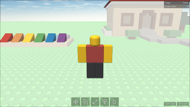
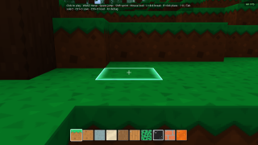
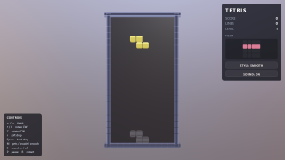
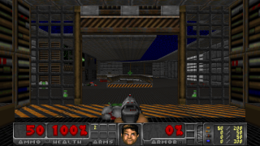
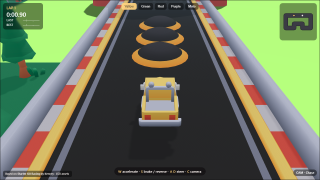
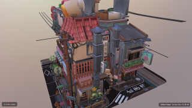
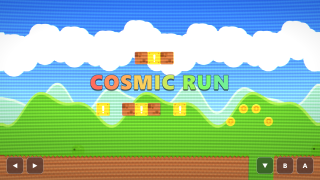
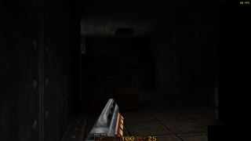
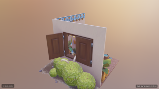
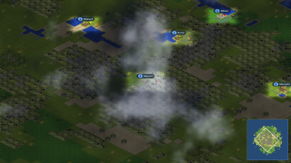

# Babylon Lite Native

> Babylon Lite TypeScript-to-C++ compiler with an SDL3 native
> runtime and dual SDL_GPU / Dawn (WebGPU) render backends.

`bblitec` compiles a statically analyzable subset of `@babylonjs/lite` scene
code into C++20. It reconstructs the pinned upstream TypeScript from source
maps, emits only reached features, materializes remote assets at compile time,
and keeps handwritten C++ at the platform abstraction layer.

**Scope:** the documented reachable subset, not a general JavaScript runtime.
Unsupported syntax and APIs fail at compile time with source locations.

| [](docs/status.md#curated-parity-scenes) | [](docs/status.md#curated-parity-scenes) | [](docs/status.md#curated-parity-scenes) | [](docs/status.md#curated-parity-scenes) |
| :-: | :-: | :-: | :-: |
| [](docs/status.md#curated-parity-scenes) | [](docs/status.md#curated-parity-scenes) | [](docs/status.md#upstream-application-gates) | [](docs/status.md#upstream-application-gates) |
| [](docs/status.md#upstream-application-gates) | [](docs/status.md#upstream-application-gates) | [](docs/status.md#upstream-application-gates) | [](docs/status.md#upstream-application-gates) |
| [](docs/status.md#upstream-application-gates) | [](docs/status.md#upstream-application-gates) | [](docs/status.md#upstream-application-gates) | [](docs/status.md#upstream-application-gates) |

*A few of the 213 curated parity scenes and 12 demos, compiled to native C++
and rendered on both GPU backends — click any frame for the measured numbers.*

## Current proof points

- Pinned upstream: `@babylonjs/lite@1.27.0`,
  commit `64710b56f9dfe175d919c635812f84c8872d467c`.
- Curated Babylon Lite parity scenes and demos, plus primitives and project-owned differential regression gates.
- External glTF/GLB support.
- Support for Typescript structs, nullable objects, dynamic arrays,
  enums, switch/break/continue, destructuring, spread, runtime Math.
- Standard/PBR/Grid rendering — Standard and PBR both through Babylon
  Lite's own composed per-variant stages on every draw — ordered draw
  lists, custom alpha variants, frame-graph MRT/depth passes, negative
  transforms, runtime scene mutation, property animation, and tree-shaken
  GPU deformation.
- Exact HDR GGX preprocessing and transmission/IOR/volume scene-color rendering.
- WGSL shaders compiled by pinned Tint for D3D12, Vulkan, and Metal.
- Two complete, mutually validating GPU backends: SDL_GPU over offline-compiled
  shaders, and Dawn (WebGPU) rendering through the browser reference's own
  compiler and rasterization stack — every expressible scene passes on both.

See [features](docs/features.md) for the supported feature set — split into
what is decided at compile time and what lives at run time — and
[current status](docs/status.md) for all measured scene results.

## Quick start

Requirements: Node.js 22.12+, CMake 3.24+, Ninja, a C++20 compiler, vcpkg,
PowerShell and DXC for shader compilation, and Chrome/Edge with WebGPU for
browser references and executed asset compilation — the HDR GGX prefilter,
Basis transcodes, drawn atlases, and node-particle bakes (see
[development](docs/development.md)).

**A built scene requires a GPU.** Both backends render through one, there is
no software fallback, and a device that cannot be brought up is an error
rather than a slower picture.

```powershell
git clone https://github.com/sailro/bblitec.git
cd bblitec
npm ci
npm run dev:setup
npm run doctor
npm test
npm run scene -- process scene1
npm run scene -- parity scene1
npm run sweep
```

Process an unregistered repository-local scene with derived defaults:

```powershell
npm run scene -- process examples\my-scene.ts
npm run scene -- parity examples\my-scene.ts --recapture-reference
```

`process` performs generation, scene-local shader compilation, CMake
configuration, and a parallel native build. Ninja is the default generator;
set `BBLITE_CMAKE_GENERATOR` to override it. On Windows the scene command
discovers Visual Studio's CMake, Ninja, clang-cl/MSVC, Windows SDK, and vcpkg;
explicit environment variables remain overrides. `dev:setup` installs the full
development vcpkg profile and builds pinned Dawn, Tint, DXC, and LabSound.
Build trees are disposable and generator-specific.

## Documentation (start here in a fresh session)

| Page | Purpose |
| --- | --- |
| [Architecture](docs/architecture.md) | Compiler pipeline, ownership boundaries, runtime, renderer |
| [Features](docs/features.md) | Supported feature families, compile-time versus run-time, boundaries |
| [Development](docs/development.md) | Setup, commands, builds, switches, parity, troubleshooting |
| [Debugging](docs/debugging.md) | The diagnostic ladder: capturing both renderers and diffing them |
| [Fidelity](docs/fidelity.md) | Semantic adaptations, shader contracts, diagnostics |
| [Status](docs/status.md) | Measured baselines, parity scenes, diagnostics |
| [Backends](docs/backends.md) | The two GPU render backends: architecture, comparison, porting contracts |
| [Native page UI](docs/ui.md) | Scene-created DOM/CSS lowering to retained RmlUi controls |
| [TODO](TODO.md) | Prioritized future work only |

## Design constraints

- Generate Babylon behavior from pinned upstream sources; PAL owns only OS and
  SDL mechanics.
- Treat pinned golden applications as immutable evidence. Their source must
  remain byte-for-byte identical to the pinned upstream commit; integration
  work belongs in the compiler, lowerers, generated runtime, or PAL, never in
  a golden program.
- Render on a GPU or fail explicitly. A degraded path nothing measures is
  worse than an error that names what is missing.
- Preserve tree shaking, provenance, typed records, and C++20 portability.
- Do not tune shaders or loader behavior against a golden image.
- Keep generated output disposable; fix compiler, lowerer, template, or PAL
  sources instead.

## Acknowledgements

This project is not affiliated with or endorsed by Babylon.js. Babylon.js
and Babylon Lite are Apache-2.0 projects. DAWN, SDL, and downloaded assets
retain their respective licenses.
