# Current status

`bblitec` is a real compiler for a deliberately constrained reachable subset
of Babylon Lite. It is not yet a universal TypeScript or Babylon runtime.
The supported feature set, split into what is decided at compile time and what
lives at run time, is in [features](features.md).

## Curated parity scenes

Thresholds live in `src/scene-registry.ts`; run one scene with
`npm run scene -- parity scene<ID>` or all registered parity scenes with
`npm run scenes:parity`.

Both native GPU backends are measured against the same full-page goldens,
including reached DOM/CSS UI. Dawn renders through the browser reference's own
compiler and rasterization stack (see [backends](backends.md)). Each backend
column is full-image / foreground MAD. Severity:
green below 0.500,
$\color{#9a6700}{\textsf{yellow from 0.500 to below 1.000}}$, and
$\color{#cf222e}{\textsf{red above 1.000}}$.
A value in the green band prints plain; colour marks only values that need
attention. This keeps the table within GitHub's math-rendering limit.

A scene that does not reach zero carries a recorded adaptation: every
generated scene writes a `fidelity.json` giving the source and native
semantics side by side, with its risk and validation.

Scenes 40, 44 and 100 compare Bullet with Havok at the same moving pose, not
two renderers over one simulation. Scene 100's golden is byte-identical to
scene 40's, which makes it the collision-event variant of that scene; scene
44 freezes two stacks mid-collapse, one of them started asleep
([fidelity](fidelity.md#physics-contract)).

| Scene | Preview | SDL_GPU | Dawn | Coverage |
| ---: | :---: | ---: | ---: | --- |
| 1 |  | 0.001 / 0.007 | 0.001 / 0.007 | BoomBox PBR |
| 2 |  | 0.000 / 0.000 | 0.000 / 0.000 | Directional Light Sphere |
| 3 |  | 0.000 / 0.000 | 0.000 / 0.000 | Fog Boxes |
| 4 | 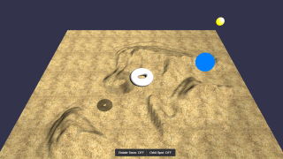 | 0.262 / 0.262 | 0.262 / 0.262 | ESM Directional and PCF Spot Shadows |
| 5 |  | 0.000 / 0.000 | 0.000 / 0.000 | Alien Morph and Skeleton |
| 6 |  | 0.001 / 0.013 | 0.001 / 0.013 | PBR Gold Sphere |
| 7 |  | 0.001 / 0.010 | 0.001 / 0.010 | ChibiRex Default Camera |
| 8 |  | 0.000 / 0.000 | 0.000 / 0.000 | HDR Glass Sphere |
| 9 |  | 0.000 / 0.000 | 0.000 / 0.000 | Sponza |
| 10 |  | 0.000 / 0.000 | 0.000 / 0.000 | PBR Rough Sphere |
| 11 |  | 0.010 / 0.281 | 0.010 / 0.281 | Spec-Gloss Shark |
| 12 |  | 0.000 / 0.003 | 0.000 / 0.003 | PBR Shader Balls |
| 13 |  | 0.001 / 0.006 | 0.001 / 0.006 | PBR Spheres Grid |
| 14 |  | 0.012 / 0.006 | 0.012 / 0.006 | Flight Helmet |
| 15 |  | 0.000 / 0.000 | 0.000 / 0.000 | Two Spot Lights |
| 16 | 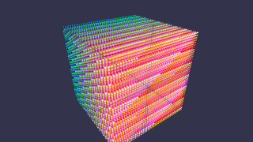 | 0.000 / 0.000 | 0.000 / 0.000 | Thin Instances |
| 17 | 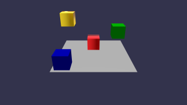 | 0.000 / 0.000 | 0.000 / 0.000 | PBR and Standard Thin Instances |
| 18 | 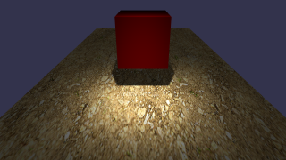 | 0.000 / 0.000 | 0.000 / 0.000 | PCF Spotlight Shadows |
| 19 |  | 0.000 / 0.000 | 0.000 / 0.000 | PBR Clearcoat |
| 20 | 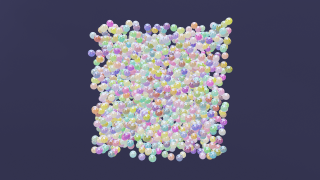 | 0.002 / 0.007 | 0.002 / 0.007 | PBR Emissive Sphere Grid |
| 21 |  | 0.330 / 0.330 | 0.330 / 0.330 | PBR Sheen Cloth |
| 22 | 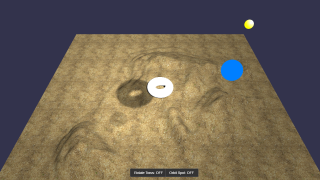 | 0.232 / 0.232 | 0.232 / 0.232 | PBR Shadow Receiver |
| 23 |  | 0.002 / 0.017 | 0.002 / 0.017 | PBR Anisotropy |
| 24 |  | 0.004 / 0.004 | 0.000 / 0.000 | Hill Valley |
| 25 |  | 0.000 / 0.000 | 0.000 / 0.000 | KTX Compressed Texture |
| 26 |  | 0.000 / 0.000 | 0.000 / 0.000 | PBR Subsurface |
| 27 |  | 0.000 / 0.000 | 0.000 / 0.000 | Material Variants |
| 28 |  | 0.001 / 0.007 | 0.001 / 0.007 | Clearcoat glTF |
| 29 |  | 0.000 / 0.008 | 0.000 / 0.008 | Sheen Cloth glTF |
| 30 |  | 0.007 / 0.010 | 0.003 / 0.005 | Volume Testing |
| 31 |  | 0.000 / 0.003 | 0.000 / 0.003 | Emissive Strength |
| 32 |  | 0.000 / 0.000 | 0.000 / 0.000 | Unlit glTF |
| 33 |  | 0.000 / 0.009 | 0.000 / 0.006 | Punctual Lights |
| 34 |  | 0.000 / 0.000 | 0.000 / 0.000 | Node Visibility |
| 35 |  | 0.000 / 0.000 | 0.000 / 0.000 | Simple Instancing |
| 36 |  | 0.000 / 0.000 | 0.000 / 0.000 | Basis Universal Texture |
| 37 |  | 0.001 / 0.006 | 0.001 / 0.006 | Sheen Wood Leather Sofa |
| 38 | 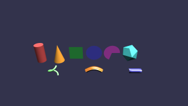 | 0.000 / 0.000 | 0.000 / 0.000 | Mesh Builder Gallery |
| 39 |  | 0.000 / 0.001 | 0.000 / 0.001 | Animated Waterfall |
| 40 |  | $\color{#1a7f37}{\textsf{0.332}} / \color{#9a6700}{\textsf{0.777}}$ | $\color{#1a7f37}{\textsf{0.332}} / \color{#9a6700}{\textsf{0.777}}$ | Bullet/Havok sphere-drop solver delta; not a renderer-fidelity value. |
| 43 | 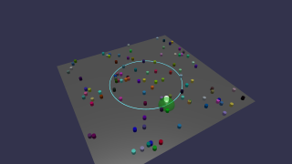 | 0.000 / 0.000 | 0.000 / 0.000 | Parametric Proximity Path |
| 44 | 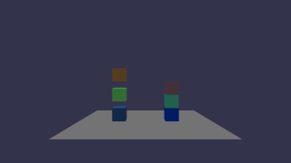 | $\color{#1a7f37}{\textsf{0.007}} / \color{#1a7f37}{\textsf{0.047}}$ | $\color{#1a7f37}{\textsf{0.007}} / \color{#1a7f37}{\textsf{0.047}}$ | Bullet/Havok sleeping-tower solver delta; not a renderer-fidelity value. |
| 50 |  | 0.000 / 0.000 | 0.000 / 0.000 | Sprite Grid |
| 51 | 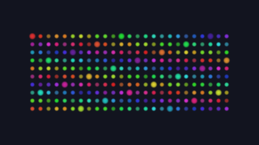 | 0.000 / 0.000 | 0.000 / 0.000 | Soft-Edged Sprite Grid |
| 52 | 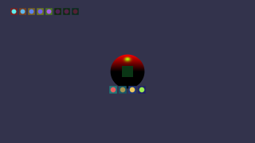 | 0.000 / 0.000 | 0.000 / 0.000 | HUD on 3D |
| 53 | 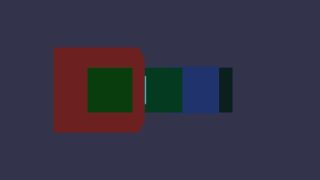 | 0.000 / 0.000 | 0.000 / 0.000 | Depth-Hosted Sprites |
| 54 |  | 0.000 / 0.000 | 0.000 / 0.000 | Facing Billboards |
| 55 |  | 0.000 / 0.000 | 0.000 / 0.000 | Billboard Field |
| 56 |  | 0.000 / 0.000 | 0.000 / 0.000 | Axis-Locked Billboards |
| 57 |  | 0.000 / 0.000 | 0.000 / 0.000 | Cutout Billboards |
| 58 | 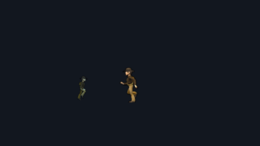 | 0.000 / 0.000 | 0.000 / 0.000 | Sprite2D Frame Animation |
| 59 | 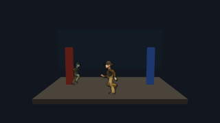 | 0.000 / 0.000 | 0.000 / 0.000 | Billboard Sprite Frame Animation |
| 60 |  | 0.000 / 0.000 | 0.000 / 0.000 | NME Flat Colour |
| 61 |  | 0.000 / 0.000 | 0.000 / 0.000 | NME Normal Colour |
| 62 |  | 0.000 / 0.000 | 0.000 / 0.000 | NME Diffuse Texture |
| 63 |  | 0.000 / 0.000 | 0.000 / 0.000 | NME Directional Light |
| 64 | 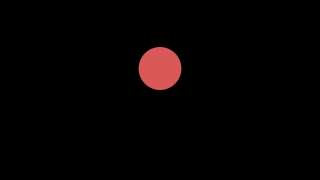 | 0.000 / 0.000 | 0.000 / 0.000 | NME Morph Targets |
| 65 | 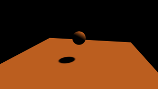 | 0.000 / 0.000 | 0.000 / 0.000 | Node Material Shadow Receiver |
| 66 | 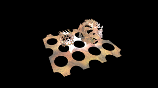 | 0.000 / 0.000 | 0.000 / 0.000 | NME Full Playground |
| 67 |  | 0.000 / 0.002 | 0.000 / 0.002 | NME PBR Core |
| 68 |  | 0.000 / 0.004 | 0.000 / 0.004 | NME PBR Clearcoat |
| 69 |  | 0.000 / 0.008 | 0.000 / 0.008 | NME PBR Sheen |
| 70 |  | 0.001 / 0.021 | 0.001 / 0.021 | NME PBR Anisotropy |
| 71 |  | 0.000 / 0.008 | 0.000 / 0.008 | NME PBR Subsurface |
| 72 | 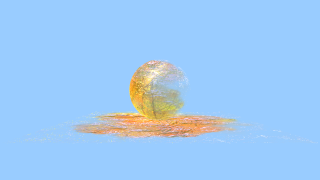 | 0.001 / 0.011 | 0.001 / 0.011 | NME PBR Full |
| 74 |  | 0.000 / 0.000 | 0.000 / 0.000 | Effect Renderer |
| 75 |  | 0.000 / 0.000 | 0.000 / 0.000 | Effect Render Target |
| 76 |  | 0.000 / 0.000 | 0.000 / 0.000 | Effect Texture |
| 77 |  | 0.000 / 0.000 | 0.000 / 0.000 | NME Pass-Through Blocks |
| 78 |  | 0.000 / 0.000 | 0.000 / 0.000 | NME Math Blocks |
| 79 |  | 0.000 / 0.000 | 0.000 / 0.000 | NME Curves and Waves |
| 80 |  | 0.000 / 0.000 | 0.000 / 0.000 | NME Colour Blocks |
| 81 |  | 0.000 / 0.000 | 0.000 / 0.000 | NME UV Projection |
| 82 |  | 0.000 / 0.000 | 0.000 / 0.000 | NME Procedural Noise |
| 83 | 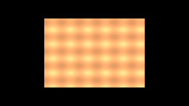 | 0.000 / 0.000 | 0.000 / 0.000 | NME Normals |
| 84 |  | 0.000 / 0.000 | 0.000 / 0.000 | NME Fragment Depth |
| 85 |  | 0.000 / 0.000 | 0.000 / 0.000 | NME Matrix Blocks |
| 87 |  | 0.000 / 0.001 | 0.000 / 0.001 | NME Iridescence and Image Processing |
| 88 |  | 0.000 / 0.000 | 0.000 / 0.000 | NME Loop Block |
| 89 |  | 0.000 / 0.000 | 0.000 / 0.000 | NME Storage Blocks |
| 90 | 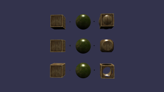 | 0.000 / 0.000 | 0.000 / 0.000 | CSG Operations |
| 92 |  | 0.000 / 0.000 | 0.000 / 0.000 | Sprite Custom Shader |
| 93 |  | 0.000 / 0.000 | 0.000 / 0.000 | Sprite Palette Shader |
| 94 |  | 0.000 / 0.000 | 0.000 / 0.000 | Billboard Custom Shader |
| 95 |  | 0.000 / 0.000 | 0.000 / 0.000 | Billboard Palette Shader |
| 96 |  | 0.000 / 0.000 | 0.000 / 0.000 | Sprite UV Scroll |
| 97 |  | 0.000 / 0.000 | 0.000 / 0.000 | Sprite Multiply Blend |
| 98 |  | 0.000 / 0.000 | 0.000 / 0.000 | Billboard Sprites |
| 99 | 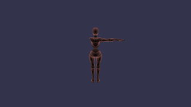 | 0.000 / 0.000 | 0.000 / 0.000 | Bone Control |
| 100 |  | $\color{#1a7f37}{\textsf{0.332}} / \color{#9a6700}{\textsf{0.777}}$ | $\color{#1a7f37}{\textsf{0.332}} / \color{#9a6700}{\textsf{0.777}}$ | Bullet/Havok collision-event solver delta; not a renderer-fidelity value. |
| 110 |  | 0.000 / 0.000 | 0.000 / 0.000 | Render Target Diffuse Texture |
| 111 | 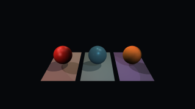 | 0.000 / 0.001 | 0.000 / 0.001 | Scene-Wide Light UBO Stress |
| 116 |  | 0.000 / 0.000 | 0.000 / 0.000 | No-Color Depth Views |
| 117 | 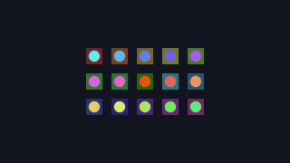 | 0.000 / 0.000 | 0.000 / 0.000 | 2D Sprite Picking |
| 118 | 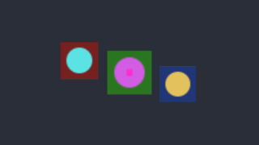 | 0.000 / 0.000 | 0.000 / 0.000 | Billboard Sprite Picking |
| 120 |  | 0.001 / 0.003 | 0.001 / 0.003 | Gaussian Splatting |
| 125 | 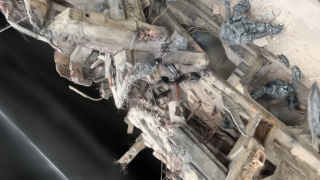 | 0.000 / 0.000 | 0.000 / 0.000 | Gaussian Splat Transform Bake |
| 126 | 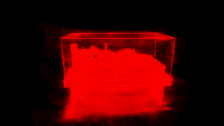 | 0.000 / 0.001 | 0.002 / 0.005 | Gaussian Splat Shader Plugin |
| 127 |  | 0.000 / 0.000 | 0.000 / 0.000 | Gaussian Splat Linear Depth |
| 128 | 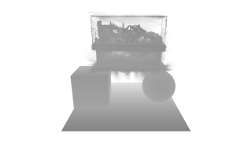 | 0.000 / 0.000 | 0.000 / 0.000 | Gaussian Splat Alpha-Blended Depth |
| 129 | 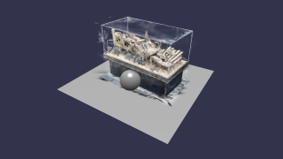 | 0.001 / 0.004 | 0.001 / 0.004 | Gaussian Splat GPU Picking |
| 141 | 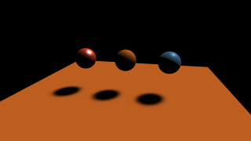 | 0.000 / 0.000 | 0.000 / 0.000 | Node, Standard and PBR ESM Casters |
| 142 |  | 0.000 / 0.000 | 0.000 / 0.000 | Post-Process Viewports |
| 143 |  | 0.000 / 0.000 | 0.000 / 0.000 | Post-Process Chain |
| 144 | 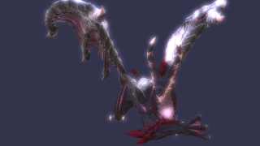 | 0.003 / 0.018 | 0.004 / 0.020 | Bloom |
| 145 |  | 0.022 / 0.021 | 0.010 / 0.009 | Standard Geometry Outputs |
| 146 |  | 0.003 / 0.003 | 0.003 / 0.003 | PBR Geometry Outputs |
| 147 |  | 0.000 / 0.000 | 0.000 / 0.000 | Circle of Confusion |
| 148 |  | 0.001 / 0.001 | 0.001 / 0.001 | Depth of Field |
| 150 |  | 0.000 / 0.000 | 0.000 / 0.000 | Property Position Animation |
| 151 |  | 0.000 / 0.000 | 0.000 / 0.000 | Property Transform Animation |
| 152 |  | 0.010 / 0.281 | 0.010 / 0.281 | Managed Animation Groups |
| 154 |  | 0.000 / 0.000 | 0.000 / 0.000 | STEP Time Animation |
| 155 |  | 0.000 / 0.000 | 0.000 / 0.000 | Weighted Property Blending |
| 156 |  | 0.000 / 0.000 | 0.000 / 0.000 | Manual Cross-Fade Animation |
| 157 |  | 0.000 / 0.000 | 0.000 / 0.000 | Weighted Skeleton Blending |
| 158 |  | 0.000 / 0.001 | 0.000 / 0.001 | Additive Pose Blending |
| 159 |  | 0.000 / 0.000 | 0.000 / 0.000 | Shader Flat Color |
| 160 |  | 0.000 / 0.000 | 0.000 / 0.000 | Shader Texture Sampler |
| 161 |  | 0.000 / 0.000 | 0.000 / 0.000 | Shader Custom Uniforms |
| 162 |  | 0.000 / 0.000 | 0.000 / 0.000 | Shader Defines |
| 163 |  | 0.000 / 0.000 | 0.000 / 0.000 | Shader Alpha Cutout |
| 165 | 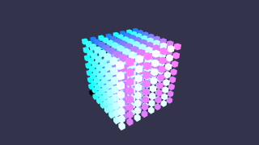 | 0.000 / 0.000 | 0.000 / 0.000 | Shader Material Thin Instances |
| 166 | 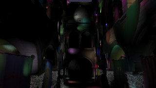 | 0.000 / 0.000 | 0.000 / 0.000 | Clustered Sponza Spot Lights |
| 167 | 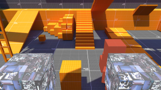 | 0.000 / 0.000 | 0.000 / 0.000 | PBR Lightmap |
| 168 |  | 0.000 / 0.002 | 0.000 / 0.002 | Mirrored Double-Sided Winding |
| 170 | 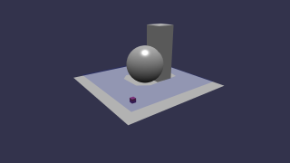 | 0.000 / 0.000 | 0.000 / 0.000 | Navigation Crowd |
| 171 | 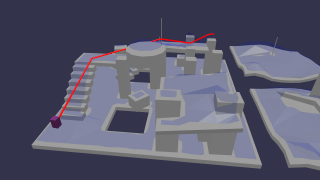 | 0.013 / 0.028 | 0.013 / 0.028 | Navigation Crowd Path |
| 172 | 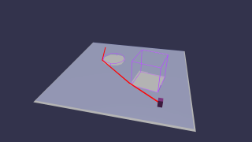 | 0.000 / 0.000 | 0.000 / 0.000 | Navigation Tile Cache Obstacles |
| 173 |  | 0.000 / 0.000 | 0.000 / 0.000 | Navigation Obstacle Toggle |
| 174 | 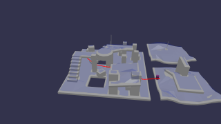 | 0.006 / 0.023 | 0.006 / 0.023 | Navigation Off-Mesh Connections |
| 175 | 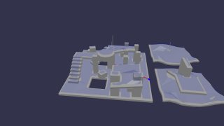 | 0.006 / 0.023 | 0.006 / 0.023 | Navigation Raycast |
| 176 |  | 0.016 / 0.016 | 0.014 / 0.014 | Mosquito In Amber |
| 177 |  | 0.021 / 0.021 | 0.021 / 0.021 | Iridescence Sphere |
| 178 |  | 0.018 / 0.016 | 0.018 / 0.016 | Iridescence Abalone |
| 179 | 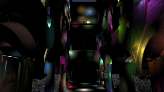 | 0.000 / 0.000 | 0.000 / 0.000 | Clustered Sponza Lights |
| 200 | 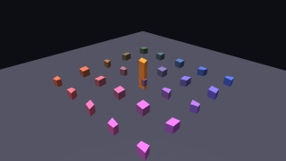 | 0.000 / 0.000 | 0.000 / 0.000 | High-Precision Matrix Off |
| 201 | 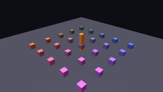 | 0.000 / 0.000 | 0.000 / 0.000 | High-Precision Matrix On |
| 202 | 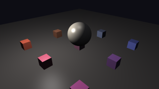 | 0.000 / 0.000 | 0.000 / 0.000 | Floating Origin Point Light |
| 203 | 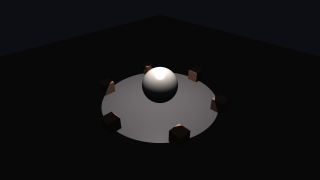 | 0.000 / 0.000 | 0.000 / 0.000 | Floating Origin Spot Light |
| 204 | 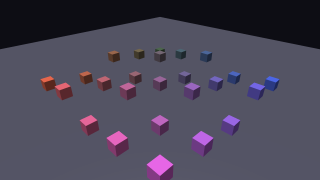 | 0.000 / 0.000 | 0.000 / 0.000 | Floating Origin Thin Instances |
| 205 | 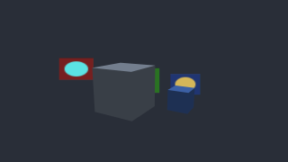 | 0.000 / 0.000 | 0.000 / 0.000 | Floating Origin Facing Billboards |
| 206 | 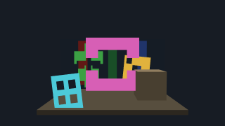 | 0.000 / 0.000 | 0.000 / 0.000 | Floating Origin Cutout Billboards |
| 207 | 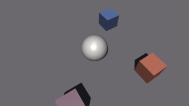 | 0.000 / 0.000 | 0.000 / 0.000 | Floating Origin Directional Shadows |
| 210 |  | 0.000 / 0.000 | 0.000 / 0.000 | XMP Metadata Rounded Cube |
| 211 | 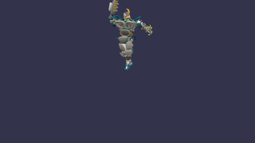 | 0.000 / 0.002 | 0.000 / 0.002 | BrainStem Meshopt |
| 212 |  | 0.014 / 0.016 | 0.010 / 0.011 | Dispersion Test |
| 213 |  | 0.000 / 0.000 | 0.000 / 0.000 | Grid Material Ordering |
| 214 | 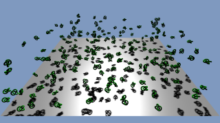 | 0.000 / 0.000 | 0.000 / 0.000 | Cascaded Shadow Torus Knots |
| 215 | 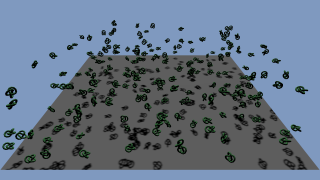 | 0.000 / 0.000 | 0.000 / 0.000 | Cascaded Shadows On A PBR Receiver |
| 216 |  | 0.000 / 0.000 | 0.000 / 0.000 | PBR Fog |
| 217 |  | 0.000 / 0.000 | 0.000 / 0.000 | Material Plugins |
| 220 |  | 0.001 / 0.002 | 0.001 / 0.002 | Quantized Duck |
| 223 |  | 0.000 / 0.000 | 0.000 / 0.000 | Camera And Light Gizmos |
| 226 |  | 0.001 / 0.003 | 0.001 / 0.003 | Gaussian Splatting glTF |
| 229 |  | 0.000 / 0.000 | 0.000 / 0.000 | Triangle Without Indices |
| 240 |  | 0.000 / 0.000 | 0.000 / 0.000 | Animated Triangle |
| 242 |  | 0.000 / 0.004 | 0.000 / 0.004 | Emissive Fireflies |
| 243 |  | 0.000 / 0.005 | 0.000 / 0.005 | Morph Stress Test |
| 244 |  | 0.001 / 0.011 | 0.001 / 0.011 | Pot of Coals |
| 245 |  | 0.000 / 0.000 | 0.000 / 0.000 | Recursive Skeletons |
| 246 |  | 0.000 / 0.000 | 0.000 / 0.000 | Simple Skin |
| 247 |  | 0.001 / 0.009 | 0.001 / 0.009 | Teapots Galore |
| 248 |  | 0.000 / 0.000 | 0.000 / 0.000 | Texture Settings |
| 249 |  | 0.000 / 0.004 | 0.000 / 0.004 | Vertex Alpha Clip |
| 250 |  | 0.004 / 0.004 | 0.003 / 0.003 | VirtualCity Cameras |
| 251 |  | 0.000 / 0.000 | 0.000 / 0.000 | Animation Group Mask |
| 252 |  | 0.000 / 0.000 | 0.000 / 0.000 | Standard Morph Target |
| 253 |  | 0.001 / 0.002 | 0.001 / 0.002 | Animate All The Things |
| 254 |  | 0.001 / 0.003 | 0.001 / 0.003 | Animation Sampler Type |
| 255 |  | 0.000 / 0.000 | 0.000 / 0.000 | Animation Skin Type |
| 256 |  | 0.000 / 0.005 | 0.000 / 0.005 | Normal Tangent Test |
| 257 |  | 0.001 / 0.005 | 0.001 / 0.005 | Node Negative Scale |
| 258 |  | 0.002 / 0.004 | 0.002 / 0.004 | Interleaved Buffer |
| 259 |  | 0.000 / 0.000 | 0.000 / 0.000 | Material Texture |
| 260 |  | 0.000 / 0.000 | 0.000 / 0.000 | Triangle Strip Primitive |
| 262 |  | 0.000 / 0.000 | 0.000 / 0.000 | NPE Particle Size |
| 263 |  | 0.000 / 0.000 | 0.000 / 0.000 | NPE Particle Gravity |
| 264 |  | 0.000 / 0.000 | 0.000 / 0.000 | NPE Particle Sphere Emitter |
| 265 |  | 0.000 / 0.008 | 0.000 / 0.008 | Environment Test |
| 266 |  | 0.009 / 0.017 | 0.009 / 0.017 | Negative Scale Spheres |
| 267 |  | 0.000 / 0.000 | 0.000 / 0.000 | Standard Vertex Colors |
| 268 |  | 0.000 / 0.000 | 0.000 / 0.000 | Orthographic Camera |
| 269 |  | 0.001 / 0.006 | 0.001 / 0.006 | Mirrored Transform Reparenting |
| 270 |  | 0.000 / 0.000 | 0.000 / 0.000 | Mirrored Standard Meshes |
| 271 |  | 0.000 / 0.000 | 0.000 / 0.000 | Shadow Light Rebuild |
| 273 |  | 0.000 / 0.000 | 0.000 / 0.000 | Runtime Material Family |
| 274 |  | 0.000 / 0.000 | 0.000 / 0.000 | Alpha to Coverage |
| 276 |  | 0.000 / 0.000 | 0.000 / 0.000 | NPE Sprite Sheet Particles |
| 277 |  | 0.000 / 0.000 | 0.000 / 0.000 | NPE Attractor Update |
| 278 |  | 0.000 / 0.000 | 0.000 / 0.000 | Line System |
| 279 |  | 0.000 / 0.000 | 0.000 / 0.000 | Line System Update |
| 280 |  | 0.000 / 0.000 | 0.000 / 0.000 | NPE Flow Map Update |
| 281 |  | 0.000 / 0.000 | 0.000 / 0.000 | NPE Noise Update |
| 282 |  | 0.000 / 0.000 | 0.000 / 0.000 | Standard UV Transform |
| 283 |  | 0.000 / 0.000 | 0.000 / 0.000 | NPE Multiply Blend |
| 284 |  | 0.000 / 0.000 | 0.000 / 0.000 | NPE MultiplyAdd Blend |
| 301 |  | 0.000 / 0.000 | 0.000 / 0.000 | NPE Sprite2D Blend Modes |

## Upstream application gates

These are complete applications copied byte-for-byte from the same pinned
Babylon Lite source as the curated scenes. Their full reached source and asset
graphs are SHA-256-checked, then compiled, rendered, and measured by the same
two-backend validation path. They exercise cross-feature behavior that a small
parity scene intentionally does not.

| Application | Preview | SDL_GPU | Dawn | Coverage |
| --- | :---: | ---: | ---: | --- |
| Tetris |  | $\color{#cf222e}{\textsf{1.333}} / \color{#cf222e}{\textsf{1.004}}$ | $\color{#cf222e}{\textsf{1.333}} / \color{#cf222e}{\textsf{1.004}}$ | Thin-instance game; audio; retained UI. UI residual; no-UI MAD: SDL_GPU 0.093 / 0.101, Dawn 0.093 / 0.101. |
| Doom |  | 0.001 / 0.001 | 0.001 / 0.001 | WAD game; sprites; audio; retained UI. |
| LibreQuake |  | 0.058 / 0.058 | 0.058 / 0.058 | BSP/WAD2/MDL game; audio; Canvas2D HUD. |
| Torus States |  | 0.078 / 0.150 | 0.078 / 0.150 | Frame graph; offscreen effects; bloom. |
| Platformer |  | $\color{#cf222e}{\textsf{1.046}} / \color{#cf222e}{\textsf{1.046}}$ | $\color{#cf222e}{\textsf{1.044}} / \color{#cf222e}{\textsf{1.044}}$ | Sprite game; CRT pass; audio; retained UI. UI residual; no-UI MAD: SDL_GPU 0.013 / 0.013, Dawn 0.010 / 0.010. |
| Break Meshes |  | 0.000 / 0.000 | 0.000 / 0.000 | Voronoi fracture; PBR; physics. |
| Racer |  | $\color{#cf222e}{\textsf{1.106}} / \color{#cf222e}{\textsf{1.106}}$ | $\color{#cf222e}{\textsf{1.106}} / \color{#cf222e}{\textsf{1.106}}$ | Driving game; CSM; physics; audio; retained HUD. UI residual; no-UI MAD: SDL_GPU 0.455 / 0.455, Dawn 0.455 / 0.455. |
| Littlest Tokyo |  | 0.161 / 0.121 | 0.161 / 0.121 | Animated glTF; PBR/IBL; retained chrome. |
| Bath Day |  | 0.134 / 0.185 | 0.134 / 0.185 | Skinned Draco/WebP glTF; transmission; retained chrome. |
| Freeciv |  | 0.175 / 0.172 | 0.158 / 0.155 | Strategy map; sprites; picking; retained cursor/tooltips. |
| Voxel Sandbox |  | $\color{#cf222e}{\textsf{1.414}} / \color{#cf222e}{\textsf{1.414}}$ | $\color{#cf222e}{\textsf{1.413}} / \color{#cf222e}{\textsf{1.414}}$ | Procedural voxel world; generated texture atlas; custom shader materials; audio; save/load; retained HUD and crosshair. UI residual; canvas-only MAD: SDL_GPU 0.000 / 0.000, Dawn 0.000 / 0.000. |

## Project-owned differential gates

These scenes are authored in `bblitec`, but their browser reference still runs
the same TypeScript against the pinned Babylon Lite package. Their MAD measures
native differential fidelity; it does not represent upstream corpus coverage.

They cover contracts absent from the measured corpus. A corpus scene supersedes
a project-owned gate when it reaches the same contract.

| Scene | Preview | SDL_GPU | Dawn | Coverage |
| ---: | :---: | ---: | ---: | --- |
| light-setters |  | 0.000 / 0.000 | 0.000 / 0.000 | Light Vector Setters |
| property-animation-paths |  | 0.000 / 0.000 | 0.000 / 0.000 | Property Animation Paths |
| nav-crowd |  | 0.000 / 0.000 | 0.000 / 0.000 | Navigation Crowd Step |
| nav-obstacles |  | 0.000 / 0.000 | 0.000 / 0.000 | Navigation Obstacle Removal |
| mesh-flags |  | 0.000 / 0.000 | 0.000 / 0.000 | Mesh Visible and Pickable |
| material-falloff |  | 0.000 / 0.000 | 0.000 / 0.000 | Material Falloff Write |
| compiler-state |  | 0.000 / 0.000 | 0.000 / 0.000 | Compiler State |
| glTF-track-clamp |  | 0.000 / 0.000 | 0.000 / 0.000 | glTF Track Clamp |
| shader-frame-graph |  | 0.000 / 0.000 | 0.000 / 0.000 | Shader Frame Graph |
| runtime-sweep |  | 0.000 / 0.000 | 0.000 / 0.000 | Runtime Sweep |
| instanced-ground |  | 0.000 / 0.000 | 0.000 / 0.000 | Instanced Ground |
| sprite-layer-arms |  | 0.000 / 0.000 | 0.000 / 0.000 | Sprite Layer Arms |
| glTF-sparse |  | 0.000 / 0.000 | 0.000 / 0.000 | glTF Sparse Accessors |
| glTF-uv-sets |  | 0.000 / 0.000 | 0.000 / 0.000 | glTF UV Sets |
| imported-mesh-walk |  | 0.000 / 0.000 | 0.000 / 0.000 | Recursive Container Flatten |
| glTF-topology |  | 0.000 / 0.000 | 0.000 / 0.000 | glTF Primitive Topology |
| glTF-step-animation |  | 0.000 / 0.000 | 0.000 / 0.000 | glTF STEP Animation |
| morph-ground |  | 0.000 / 0.001 | 0.000 / 0.001 | Morph Storage Ground |
| shadow-pbr-only |  | 0.000 / 0.000 | 0.000 / 0.000 | PBR Shadow Receiver Without Standard |
