# Current status

`bblitec` is a real compiler for a deliberately constrained reachable subset
of Babylon Lite. It is not yet a universal TypeScript or Babylon runtime.
The supported feature set, split into what is decided at compile time and what
lives at run time, is in [features](features.md).

## Curated parity scenes

Thresholds live in `src/scene-registry.ts`; run one scene with
`npm run scene -- parity scene<ID>` or all registered parity scenes with
`npm run scenes:parity`.

Both native GPU backends are measured against the same goldens; the
Dawn backend renders through the browser reference's own compiler and
rasterization stack (see [backends](backends.md)). Each backend column is full-image / foreground MAD. Severity:
$\color{#1a7f37}{\textsf{green below 0.500}}$,
$\color{#9a6700}{\textsf{yellow from 0.500 to below 1.000}}$, and
$\color{#cf222e}{\textsf{red above 1.000}}$.
A value in the green band prints plain; colour marks only the values
that need attention. (GitHub stops rendering math expressions after a
few hundred per page, so a table this size cannot colour its default
state — the tail rows were failing to render.)

A scene that does not reach zero carries a recorded adaptation: every
generated scene writes a `fidelity.json` giving the source and native
semantics side by side, with its risk and validation.

**One row measures something else.** Scene 40 links a different rigid-body
solver than the golden ran, so its number is the distance between two solvers
at a moving pose, not the distance between this port and Babylon Lite, and no
threshold on it can be driven to zero
([fidelity](fidelity.md#physics-contract)).

| Scene | Preview | SDL_GPU | Dawn | Coverage |
| ---: | :---: | ---: | ---: | --- |
| 1 |  | 0.001 / 0.007 | 0.001 / 0.007 | BoomBox glTF, IBL environment, generated PBR diagnostics |
| 2 |  | 0.000 / 0.000 | 0.000 / 0.000 | directional diffuse/specular on a generated Standard sphere |
| 3 | 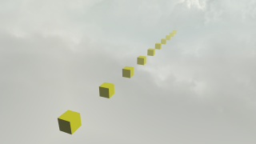 | 0.000 / 0.000 | 0.000 / 0.000 | exponential `setFog`, `loadSkybox` six-face image skybox |
| 5 |  | 0.000 / 0.000 | 0.000 / 0.000 | GPU morph targets plus recursive GPU skeleton skinning |
| 6 |  | 0.001 / 0.013 | 0.001 / 0.013 | specular-glossiness sphere, solid textures, ground, DDS skybox |
| 7 |  | 0.001 / 0.010 | 0.001 / 0.010 | ChibiRex glTF, LINEAR transform tracks, IBL, ground, the pinned solid-colour skybox |
| 8 |  | 0.000 / 0.000 | 0.000 / 0.000 | 1024-sample HDR GGX, cubemap skybox, glass alpha |
| 9 |  | 0.000 / 0.000 | 0.000 / 0.000 | Sponza `.babylon`: 24 Standard materials over six texture slots, cotangent-frame normal maps, three point lights with per-mesh light lists |
| 10 |  | 0.000 / 0.000 | 0.000 / 0.000 | generated sphere, no-IBL PBR, geometric normals |
| 12 | 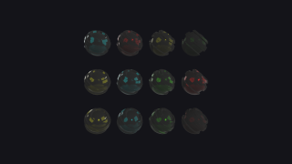 | 0.000 / 0.003 | 0.000 / 0.003 | three cloned skinned shader-ball rows comparing metallic-reflectance, reflectance-colour, and combined alpha-only metallic maps under rotated IBL, frozen by the pin's `?seekTime=0.5` query |
| 13 |  | 0.001 / 0.006 | 0.001 / 0.006 | material grid, ground, explicit occlusion |
| 14 |  | 0.012 / 0.006 | 0.012 / 0.006 | Flight Helmet glTF, default framing, IBL, ground, DDS skybox |
| 15 | 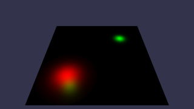 | 0.000 / 0.000 | 0.000 / 0.000 | two scene-code spot lights over a Standard ground, cone cosine and exponent falloff |
| 19 | 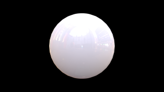 | 0.000 / 0.000 | 0.000 / 0.000 | DDS cubemap environment compiled to harmonics and mip chain, scene-code clearcoat over IBL with the coat's base-F0 remap |
| 21 |  | 0.330 / 0.330 | 0.330 / 0.330 | scene-code sheen under the pinned legacy model, `.env` cubemap reused as its own skybox, destructured parallel loads |
| 23 | 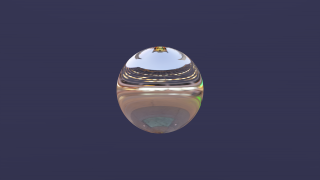 | 0.002 / 0.017 | 0.002 / 0.017 | scene-code PBR anisotropy over an `.env` environment, frozen at the query pose its pinned spec serves |
| 24 |  | 0.004 / 0.004 | 0.000 / 0.000 | Hill Valley `.babylon` geometry, textures, baked lighting; the file camera reads at the pin's JavaScript-number width |
| 25 | 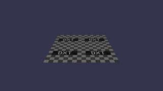 | 0.000 / 0.000 | 0.000 / 0.000 | a BC2 KTX container parsed at load by the pin's own parser and uploaded as the blocks it carries, over a tiled `uvScale` on a scene-code Standard material. Generation resolves which suffix to fetch, because the pin picks it from the device's compressed-format features |
| 26 | 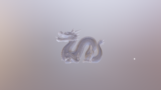 | 0.000 / 0.000 | 0.000 / 0.000 | scene-code PBR translucency with a thickness map and specular AA, an orbiting point light frozen by the pin's `?seekTime=3` query, and mesh-bound overrides participating in default-camera framing |
| 27 | 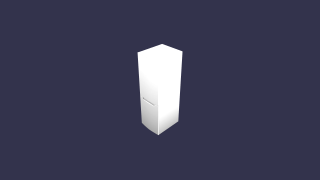 | 0.000 / 0.000 | 0.000 / 0.000 | `KHR_materials_variants` with a statically selected variant, `KHR_materials_specular` and IOR on both candidate materials |
| 28 |  | 0.001 / 0.007 | 0.001 / 0.007 | `KHR_materials_clearcoat` intensity, roughness, coat normals |
| 29 |  | 0.000 / 0.008 | 0.000 / 0.008 | `KHR_materials_sheen` with `KHR_texture_transform` scaling |
| 30 | 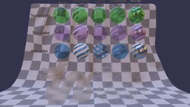 | 0.007 / 0.010 | 0.003 / 0.005 | Draco-compressed geometry decoded at generation time, transmission and volume with a UV-offset transform |
| 31 |  | 0.000 / 0.003 | 0.000 / 0.003 | `KHR_materials_emissive_strength`, factor-only emissive |
| 32 |  | 0.000 / 0.000 | 0.000 / 0.000 | `KHR_materials_unlit` |
| 33 |  | 0.000 / 0.009 | 0.000 / 0.006 | `KHR_lights_punctual` falloff across opaque, transmission, BLEND |
| 34 |  | 0.000 / 0.000 | 0.000 / 0.000 | `KHR_node_visibility` subtree cascade, `KHR_animation_pointer` visibility target |
| 35 | 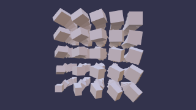 | 0.000 / 0.000 | 0.000 / 0.000 | `EXT_mesh_gpu_instancing`, default framing, camera-target destructuring |
| 36 | 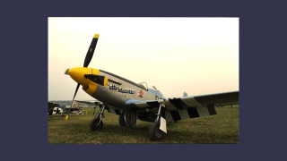 | 0.000 / 0.000 | 0.000 / 0.000 | a Basis Universal texture transcoded to BC7 by the pin's own loader at generation and packaged as KTX1, bound as both the diffuse and the emissive slot of one Standard material; its texture-object `invertY` is what flips the material's UV block |
| 37 | 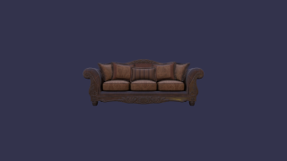 | 0.001 / 0.006 | 0.001 / 0.006 | `EXT_texture_webp` images, per-slot texture transforms, `KHR_materials_sheen` with `KHR_materials_specular`, occlusion UV set chosen per material |
| 39 | 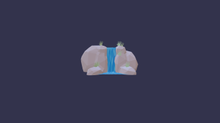 | 0.000 / 0.001 | 0.000 / 0.001 | `KHR_animation_pointer` driving node rotation and `KHR_texture_transform` offset and scale across two scrolling water surfaces |
| 40 | 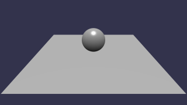 | $\color{#1a7f37}{\textsf{0.332}} / \color{#9a6700}{\textsf{0.777}}$ | $\color{#1a7f37}{\textsf{0.332}} / \color{#9a6700}{\textsf{0.777}}$ | **Not a fidelity number.** Havok sphere drop, frozen at the pin's own `?captureFrame=120`. The port links Bullet where the golden ran Havok, so this row measures the distance between two solvers at a moving pose, and its threshold is a regression gate on this port's own solver — [fidelity](fidelity.md#physics-contract) carries the decomposition |
| 50 | 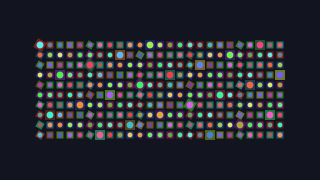 | 0.000 / 0.000 | 0.000 / 0.000 | 250 pure-2D sprites over a compile-time-drawn canvas2D atlas: grid frames, per-sprite tint, rotation and flip, straight-alpha blending through a SpriteRenderer with no scene |
| 54 | 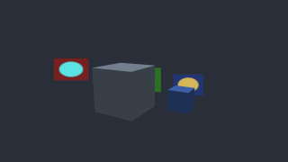 | 0.000 / 0.000 | 0.000 / 0.000 | camera-facing world-space billboards drawn inside the scene pass, depth-tested against Standard-material boxes, with per-sprite pivot and flip |
| 55 | 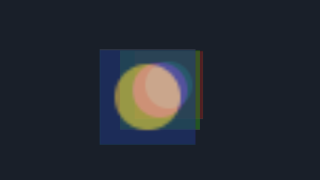 | 0.000 / 0.000 | 0.000 / 0.000 | three overlapping billboards under a free camera and no meshes: the back-to-front sort is the whole image, since a transparent billboard writes no depth |
| 56 | 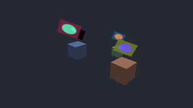 | 0.000 / 0.000 | 0.000 / 0.000 | axis-locked billboards: the quad rotates only around the system's lock axis, normalised where the pin normalises it, with the basis reading that axis out of the system block |
| 57 | 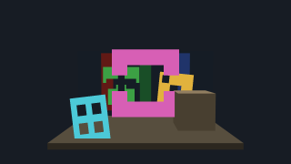 | 0.000 / 0.000 | 0.000 / 0.000 | `billboardBlendCutout` under `setAlphaToCoverage`: replacement colour with depth writes, drawn among the opaque meshes rather than after them, so the GPU resolves overlap and no sort runs |
| 60 |  | 0.000 / 0.000 | 0.000 / 0.000 | the smallest Babylon NME graph, compiled by the pin's own emitter at generation: a uniform colour block into the fragment output over the canonical world-view-projection vertex path |
| 61 | 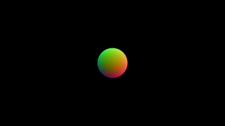 | 0.000 / 0.000 | 0.000 / 0.000 | a node graph carrying the transformed world normal to the fragment as colour, so the emitted stages share a varying |
| 62 | 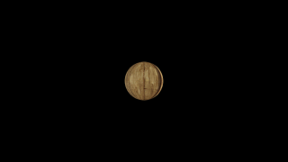 | 0.000 / 0.000 | 0.000 / 0.000 | `TextureBlock` sampling the image the scene's `textures` record supplies, at the group-1 pair the pin's own pipeline builder allocated for it |
| 77 | 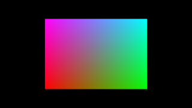 | 0.000 / 0.000 | 0.000 / 0.000 | the pass-through node blocks — elbow, teleport in and out, debug — which the emitter resolves to their own input |
| 78 | 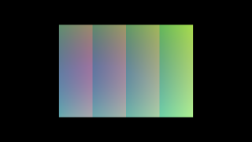 | 0.000 / 0.000 | 0.000 / 0.000 | the scalar and vector math blocks, over a graph the module assembles at load rather than exports as a literal |
| 79 | 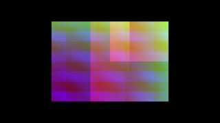 | 0.000 / 0.000 | 0.000 / 0.000 | conditions, curves, waves, spherical interpolation and the pin's own deterministic random block |
| 80 | 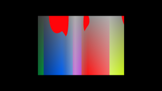 | 0.000 / 0.000 | 0.000 / 0.000 | the colour blocks: converter, desaturate, gradient, posterize and replace-colour |
| 82 | 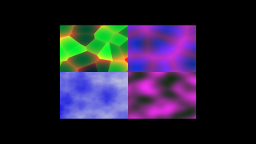 | 0.000 / 0.000 | 0.000 / 0.000 | the procedural noise blocks — simplex, Voronoi, Worley and cloud — each a helper the emitter installs once at module scope |
| 84 | 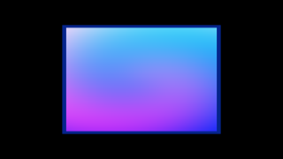 | 0.000 / 0.000 | 0.000 / 0.000 | the fragment-coordinate blocks -- screen position, screen-space projection and twirl -- and `FragDepthBlock`, whose written depth is the pin's own convention and so occludes the plane behind it by that convention |
| 85 | 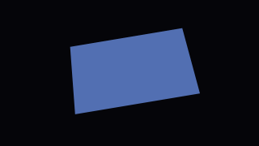 | 0.000 / 0.000 | 0.000 / 0.000 | the matrix blocks: builder, transpose, splitter and determinant, with the vertex position transformed through them |
| 88 | 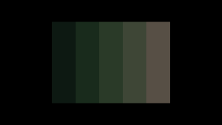 | 0.000 / 0.000 | 0.000 / 0.000 | a loop block accumulating colour bands, its body reading and writing the mutable storage variable the emitter routes the loop id to |
| 89 | 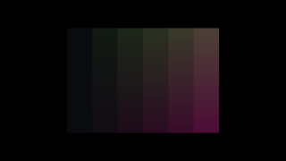 | 0.000 / 0.000 | 0.000 / 0.000 | storage read and write feeding a vec4 back through the graph outside a loop |
| 63 | 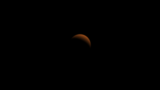 | 0.000 / 0.000 | 0.000 / 0.000 | a node graph shading through the scene's lights: the pin's own lights array at the group-0 slot every composed family shares, walked by the per-mesh selection the graph's mesh block carries |
| 67 | 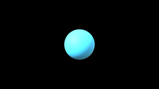 | 0.000 / 0.002 | 0.000 / 0.002 | the node metallic-roughness block over four lights and an `.env` environment, sampling the specular cube and BRDF LUT the material families already bind |
| 68 | 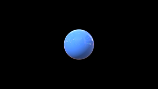 | 0.000 / 0.004 | 0.000 / 0.004 | the same graph with a clearcoat layer, which changes the composed arithmetic and declares no resource of its own |
| 69 | 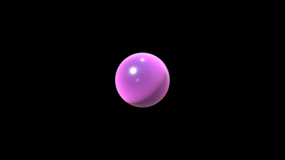 | 0.000 / 0.008 | 0.000 / 0.008 | clearcoat and sheen composed together over the node PBR core |
| 70 | 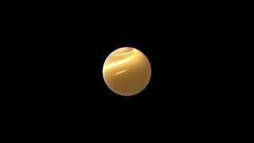 | 0.001 / 0.021 | 0.001 / 0.021 | the anisotropy layer over the node PBR core, with a uv-carrying vertex stage |
| 71 | 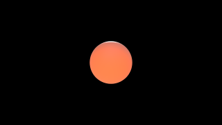 | 0.000 / 0.008 | 0.000 / 0.008 | the subsurface layer over the node PBR core |
| 74 | 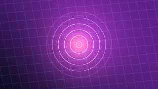 | 0.000 / 0.000 | 0.000 / 0.000 | a procedural fullscreen effect drawn straight to the swapchain: an `EffectRenderer` registered on the engine with no scene at all, over the pin's own fullscreen-triangle vertex stage |
| 75 | 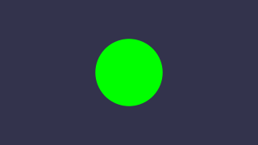 | 0.000 / 0.000 | 0.000 / 0.000 | the same effect as a frame-graph task into a render target, its uniform block set once, and that target read back as a Standard diffuse texture |
| 76 |  | 0.000 / 0.000 | 0.000 / 0.000 | an effect sampling a texture through the descriptor's own texture/sampler pair, bound by `setEffectTexture` |
| 81 | 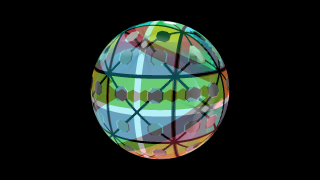 | 0.000 / 0.000 | 0.000 / 0.000 | the UV and projection blocks -- panner, 2D rotate, tri-planar and bi-planar -- over an atlas carried as a `data:` URL and materialized by decode |
| 87 | 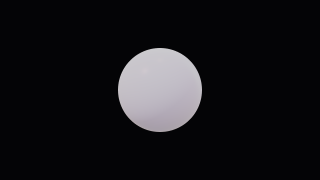 | 0.000 / 0.001 | 0.000 / 0.001 | `IridescenceBlock` and `ImageProcessingBlock` over a graph composed from another module's, with the scene's selected tone-mapping record |
| 92 | 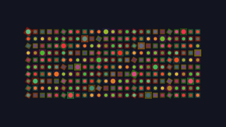 | 0.000 / 0.000 | 0.000 / 0.000 | a per-layer custom fragment shader: the pin's own composer around the caller's WGSL body, with the `fx` block bound beside the layer's and `setSprite2DShaderParams` tinting every sprite |
| 93 | 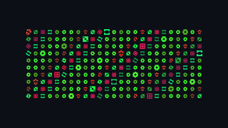 | 0.000 / 0.000 | 0.000 / 0.000 | the same custom-shader path with an extra texture: a 256x1 colormap the scene computes, baked at generation and sampled by the caller's WGSL through the binding pair the pin splices in |
| 94 | 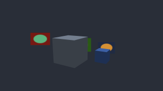 | 0.000 / 0.000 | 0.000 / 0.000 | the billboard mirror of scene 92: the custom composer keeps the world-space vertex stage and adds the view distance and world position a custom body may read |
| 95 | 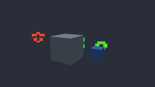 | 0.000 / 0.000 | 0.000 / 0.000 | the billboard mirror of scene 93, where the palette lookup runs in the world-space stage the custom composer brings with it |
| 96 | 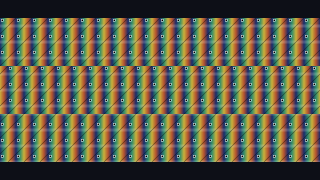 | 0.000 / 0.000 | 0.000 / 0.000 | per-sprite UV scroll: the first `setSprite2DUvOffset` widens the layer's instance layout in place, and a repeat-wrapped tile scrolls by band |
| 97 | 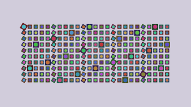 | 0.000 / 0.000 | 0.000 / 0.000 | the opt-in `spriteBlendMultiply` descriptor over a non-black clear, where the sprites darken and tint the background rather than covering it |
| 98 | 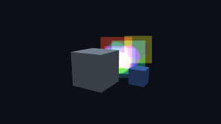 | 0.000 / 0.000 | 0.000 / 0.000 | the opt-in `billboardBlendAdditive` descriptor: overlapping billboards stack and brighten instead of occluding, over depth-tested boxes |
| 11 |  | 0.010 / 0.281 | 0.010 / 0.281 | KHR_materials_pbrSpecularGlossiness: the shark's specular/glossiness pair replacing the metallic-roughness workflow, on a skinned swim cycle pinned to one second |
| 110 | 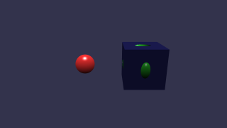 | 0.000 / 0.000 | 0.000 / 0.000 | render-target colour as a Standard diffuse texture, per-pass material override |
| 116 |  | 0.000 / 0.000 | 0.000 / 0.000 | no-color material views, depth targets |
| 120 |  | 0.001 / 0.003 | 0.001 / 0.003 | 345,217 Gaussian splats from a `.ply`: the pin's parser executed at generation, its covariance build and back-to-front counting sort folded from their own AST, and its EWA projection extracted from the bundled WGSL |
| 142 | 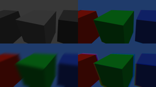 | 0.000 / 0.000 | 0.000 / 0.000 | four post-process passes into one target through normalized viewports: black-and-white, red/cyan anaglyph over a second camera's render task, a 128-pixel diagonal blur, and chromatic aberration |
| 143 | 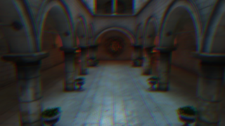 | 0.000 / 0.000 | 0.000 / 0.000 | a chained post-process graph over Sponza: two separable Gaussian blurs into chromatic aberration, each pass the pin's own composed stage |
| 145 |  | 0.022 / 0.021 | 0.010 / 0.009 | `.babylon`, Standard geometry outputs, default anisotropy |
| 146 |  | 0.003 / 0.003 | 0.003 / 0.003 | FreeCamera Sponza, PBR geometry outputs, 7+4 MRT composition |
| 147 |  | 0.000 / 0.000 | 0.000 / 0.000 | the circle-of-confusion map over PowerPlant: a geometry task's normalized view depth read by the lens model, with the colour pass borrowing that task's depth attachment |
| 148 |  | 0.001 / 0.001 | 0.001 / 0.001 | the depth-of-field composite over PowerPlant: eight passes and seven intermediate targets built by the pin's own factory, over a 4x MSAA render resolved into the source |
| 150 |  | 0.000 / 0.000 | 0.000 / 0.000 | property `position.x` animation, track-derived frame rate |
| 151 |  | 0.000 / 0.000 | 0.000 / 0.000 | grouped position, scaling, and quaternion property animation |
| 152 |  | 0.010 / 0.281 | 0.010 / 0.281 | a scene-owned animation manager driving a loaded file's clips beside a camera property clip; the residual is scene 11's skinned shark pose |
| 154 |  | 0.000 / 0.000 | 0.000 / 0.000 | LINEAR versus STEP property interpolation |
| 155 |  | 0.000 / 0.000 | 0.000 / 0.000 | two clips over one `position.x` at weights 0.25 and 0.75, resolved by the pin's weighted property mixer instead of last-write-wins |
| 157 |  | 0.000 / 0.000 | 0.000 / 0.000 | Xbot's walk and run blended at half weight each by the pin's weighted skeleton mixer, over a 67-joint skin on the pinned palette texture |
| 158 |  | 0.000 / 0.001 | 0.000 / 0.001 | the additive pose mixer: sad_pose, marked additive at its frame-0 reference, blended over the playing idle clip by the pin's own accumulation — reference⁻¹ × sample applied onto the base pose, then slerped by the weight — with the scene frozen through its own `?seekTime=` branch and both clips paused |
| 159 |  | 0.000 / 0.000 | 0.000 / 0.000 | scene-local WGSL shader variant, flat-color fragment |
| 160 |  | 0.000 / 0.000 | 0.000 / 0.000 | shader-material sampler pair bound by `setShaderTexture` |
| 161 |  | 0.000 / 0.000 | 0.000 / 0.000 | scene-local WGSL variant with typed custom uniforms |
| 162 |  | 0.000 / 0.000 | 0.000 / 0.000 | shader-material `defines` as the pin's own prelude consts |
| 163 |  | 0.000 / 0.000 | 0.000 / 0.000 | custom shader blend, alpha test, discard |
| 168 |  | 0.000 / 0.002 | 0.000 / 0.002 | double-sided winding through a clockwise front-face pipeline |
| 176 |  | 0.016 / 0.016 | 0.014 / 0.014 | linear transmission, alpha state, IOR, volume, scene-color copy |
| 177 |  | 0.021 / 0.021 | 0.021 / 0.021 | scene-code `setPbrIridescence` over an `.env` environment, two scene materials under independent setters |
| 178 |  | 0.018 / 0.016 | 0.018 / 0.016 | `KHR_materials_iridescence`, camera-following skybox |
| 210 |  | 0.000 / 0.000 | 0.000 / 0.000 | `KHR_xmp_json_ld` metadata on a rounded cube |
| 212 |  | 0.014 / 0.016 | 0.010 / 0.011 | `KHR_materials_dispersion` per-RGB refraction, IOR, volume |
| 213 |  | 0.000 / 0.000 | 0.000 / 0.000 | GridMaterial opaque/transparent families, ordered draw lists |
| 216 |  | 0.000 / 0.000 | 0.000 / 0.000 | linear `setFog` mixed before tone mapping |
| 240 |  | 0.000 / 0.000 | 0.000 / 0.000 | deterministic glTF node rotation animation |
| 242 |  | 0.000 / 0.004 | 0.000 / 0.004 | `KHR_animation_pointer` base color, emissive factor and emissive strength on LINEAR samplers |
| 243 |  | 0.000 / 0.005 | 0.000 / 0.005 | MorphStressTest glTF, overlapping clips, storage-buffer morphing, uv2 occlusion |
| 244 |  | 0.001 / 0.011 | 0.001 / 0.011 | `KHR_animation_pointer` texture-transform rotations on two slots of one material that disagree, `KHR_materials_specular`, transmission reached from the asset |
| 245 |  | 0.000 / 0.000 | 0.000 / 0.000 | recursive skeleton, inverse bind matrices, GPU skinning |
| 246 |  | 0.000 / 0.000 | 0.000 / 0.000 | deterministic SimpleSkin glTF animation |
| 247 |  | 0.001 / 0.009 | 0.001 / 0.009 | `EXT_mesh_gpu_instancing` T/R/S, one native instanced draw |
| 248 |  | 0.000 / 0.000 | 0.000 / 0.000 | external glTF and sampler modes |
| 249 |  | 0.000 / 0.004 | 0.000 / 0.004 | vertex-color alpha and mask cutoff |
| 250 |  | 0.004 / 0.004 | 0.003 / 0.003 | VirtualCity through an imported glTF camera: the `_camera` feature's parented FreeCamera on an animated vehicle node, found by name, frozen at `?seekTime=5` |
| 252 |  | 0.000 / 0.000 | 0.000 / 0.000 | direct single-target morph deformation on a generated Standard sphere |
| 253 |  | 0.001 / 0.002 | 0.001 / 0.002 | `KHR_animation_pointer` across node transforms, punctual lights and material extensions, spot lights, 69 channels |
| 254 |  | 0.001 / 0.003 | 0.001 / 0.003 | signed animation sampler accessors, quaternion slerp |
| 255 |  | 0.000 / 0.000 | 0.000 / 0.000 | normalized integer skin-weight accessors |
| 256 |  | 0.000 / 0.005 | 0.000 / 0.005 | cotangent-frame normal mapping on a mesh with no TANGENT accessor |
| 257 |  | 0.001 / 0.005 | 0.001 / 0.005 | negative-scale hierarchy, generated normals |
| 258 |  | 0.002 / 0.004 | 0.002 / 0.004 | interleaved glTF vertex buffers |
| 259 |  | 0.000 / 0.000 | 0.000 / 0.000 | factor-only emissive material with neutral texture fallback |
| 260 |  | 0.000 / 0.000 | 0.000 / 0.000 | TRIANGLE_STRIP primitive mode with uint32 indices |
| 262 |  | 0.000 / 0.000 | 0.000 / 0.000 | node-particle graph, frozen simulation baked at generation, camera-facing billboards |
| 263 |  | 0.000 / 0.000 | 0.000 / 0.000 | node particles with gravity and colour-over-life gradients |
| 264 |  | 0.000 / 0.000 | 0.000 / 0.000 | node particles from a sphere shape emitter |
| 265 |  | 0.000 / 0.008 | 0.000 / 0.008 | `EXT_lights_image_based` RGBD cubemap, BRDF LUT, SH irradiance, rotation |
| 266 |  | 0.009 / 0.017 | 0.009 / 0.017 | mirrored spheres, source-derived clockwise front face |
| 267 |  | 0.000 / 0.000 | 0.000 / 0.000 | Standard RGBA vertex colors on a raw typed-array quad, unlit and double-sided |
| 268 |  | 0.000 / 0.000 | 0.000 / 0.000 | opt-in orthographic projection, aspect-derived view volume |
| 273 |  | 0.000 / 0.000 | 0.000 / 0.000 | post-registration material-family addition |
| 274 |  | 0.000 / 0.000 | 0.000 / 0.000 | 4x-MSAA alpha-to-coverage |
| 276 |  | 0.000 / 0.000 | 0.000 / 0.000 | node particles through a 66-cell sprite sheet |
| 277 |  | 0.000 / 0.000 | 0.000 / 0.000 | node particles under an attractor update |
| 278 |  | 0.000 / 0.000 | 0.000 / 0.000 | polyline systems on the pin's line-list topology, uniform and per-point colours |
| 279 |  | 0.000 / 0.000 | 0.000 / 0.000 | a fixed-topology line update drawn through thin instances with per-instance colours |
| 280 |  | 0.000 / 0.000 | 0.000 / 0.000 | node particles under a flow map, whose build reads the scene camera |
| 281 |  | 0.000 / 0.000 | 0.000 / 0.000 | node particles under a noise-texture update |
| 283 |  | 0.000 / 0.000 | 0.000 / 0.000 | the exact Multiply particle blend: the pin's own private fragment, which interpolates toward white by source alpha so a transparent texel leaves the warm destination unchanged |
| 284 |  | 0.000 / 0.000 | 0.000 / 0.000 | MultiplyAdd: that pass followed by a stock Add pass over the same instances, two pipelines and one renderable |
| 301 |  | 0.000 / 0.000 | 0.000 / 0.000 | the pure-2D particle bridge: NPE world XY packed into Sprite2D layers with no scene at all, one Multiply layer beside a Multiply-then-Add pair the renderer's stable order keeps adjacent |
| 282 |  | 0.000 / 0.000 | 0.000 / 0.000 | the ninth Standard extension: `enableMaterialUvTransform` composing `stdUvTransformExt`, whose per-channel block the pin's own writer fills over a `createTexture2DFromPixels` diffuse texture. One pixel of 921600 lands 4e-6 from a texel boundary under nearest filtering and takes the neighbouring checker row |
| 220 |  | 0.001 / 0.002 | 0.001 / 0.002 | `KHR_mesh_quantization`, resolved by the pinned feature's own `preParse` at generation: the packaged Duck carries tightly-packed floats, and its unnormalized integer UVs are rescaled by the material's `KHR_texture_transform`. The residual is one LSB over the `.env` IBL band |

## Project-owned differential gates

These scenes are authored in `bblitec`, but their browser reference still runs
the same TypeScript against the pinned Babylon Lite package. Their MAD measures
native differential fidelity; it does not represent upstream corpus coverage.

They are scaffolding for contracts no measured corpus scene reaches yet — a
feature combination the corpus does not exercise, or a slice being built up
ahead of the scene that will use it. A gate is deleted once corpus scenes cover
its contract.

| Scene | Preview | SDL_GPU | Dawn | Coverage |
| ---: | :---: | ---: | ---: | --- |
| light-setters |  | 0.000 / 0.000 | 0.000 / 0.000 | a light's position and direction written after creation: a spot moved onto the ground by its two `ObservableVec3` setters, and a directional position that reaches no pixel but has to compile and link |
| compiler-state |  | 0.000 / 0.000 | 0.000 / 0.000 | flat-entry mutable state, pre-registration compound assignment |
| glTF-track-clamp |  | 0.000 / 0.000 | 0.000 / 0.000 | track endpoint clamping against a longer global duration |
| animation-groups |  | 0.000 / 0.005 | 0.000 / 0.005 | a named glTF clip selected from scene code: `scene.animationGroups` iteration, a group name compared as a runtime string, and the pinned stop/play over three clips of different lengths |
| shader-frame-graph |  | 0.000 / 0.000 | 0.000 / 0.000 | shader materials through a frame-graph render task |
| runtime-sweep |  | 0.000 / 0.000 | 0.000 / 0.000 | thin-instance pools with flush and count updates, handles inside data retired by `removeFromScene`, file-texture sampler contract (Scene 267 measures typed-array meshes from the corpus) |
| instanced-ground |  | 0.000 / 0.000 | 0.000 / 0.000 | `EXT_mesh_gpu_instancing` with the requested environment ground |
| morph-ground |  | 0.000 / 0.001 | 0.000 / 0.001 | storage-buffer morphing with the requested environment ground |
