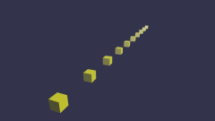
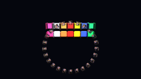
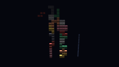

# Current status

`bblitec` is a real compiler for a deliberately constrained reachable subset
of Babylon Lite. It is not yet a universal TypeScript or Babylon runtime.

## Supported vertical slice

| Area | Current support |
| --- | --- |
| TypeScript modules/functions | named local imports and re-exports, module constants, typed non-generic function parameters/defaults, lexical scopes, if/else, numeric for/while with native break/continue, switch over numeric discriminants, static-array for-of unrolling plus runtime range-for over data containers, recursion rejection; fully data-typed functions emit once as real C++ functions with early returns, while handle-touching helpers keep the inline path with one final return |
| Plain-data model | interface-typed structs by value, `T \| null` optionals with checker narrowing, dynamic arrays (`new Array`, fill, multi-element push, pop, index writes, length truncation), `Float32Array`/`Uint32Array` with storage-exact element semantics, string-literal-union enum tags, deep readonly numeric tables with runtime indexing, mutable tuple locals with runtime index writes, tuple/struct destructuring in for-of and declarations, function-valued parameters inlined at their call sites (early bare returns lower through breakable wrappers), numeric `\|\|` fallbacks, object spread in declarations and assignments, runtime `Math` calls, and the pinned seeded `Math.random` contract |
| Engine/scene | creation, registration, fixed delta, reached before-render callbacks, runtime material-family append, `setFog` linear/exp/exp2 fog on PBR, Standard, and image-skybox surfaces |
| Cameras | ArcRotate, FreeCamera, default framing, native controls, target assignment and target record reads |
| Lights | directional, hemispheric, and point with reached diffuse/specular colors; two reached Standard lights; two reached PBR analytic lights (hemispheric, directional, and range-falloff point kinds in either slot, derived from the pinned single-light blocks) |
| Geometry | axis-sized box/sphere, subdivided ground with UV scale, plane, torus, `createMeshFromData` raw typed-array meshes with the pinned computeAabb bounds fold, static `setThinInstances` matrix pools, indexed triangle glTF/GLB, generated/flat normals, negative transforms, reached `.babylon` geometry |
| Assets | external glTF packaging, embedded PNG/JPEG, `.env`, exact compile-time RGBE HDR/GGX cubemaps, glTF image-based lights, DDS, `loadSkybox` six-face image cubemaps, `loadTexture2D` file textures with the pinned sampler defaults, reached `.babylon` textures |
| Materials | Standard, PBR, GridMaterial, unlit, vertex colors, no-color views, typed custom shader variants |
| Material state | alpha mask/blend/coverage, reflectance, emissive strength, lighting intensities, double-sided, normal scale, shared texture scaling, transmission, IOR, volume, dispersion, clearcoat, sheen, iridescence |
| Animation | deterministic seeking; property-animation groups for reached mesh position/scaling/quaternion paths with LINEAR/STEP tracks; glTF LINEAR/CUBICSPLINE rotation/translation/scale and LINEAR morph weights |
| Deformation | recursive skeleton hierarchies, inverse bind matrices, four-weight GPU skinning, GPU position/normal/tangent morph targets, uncapped storage-buffer morphing beyond two targets, static GPU instancing, post-deformation flat normals |
| Frame graph | render targets/tasks, material overrides, depth-only passes, 7+4 geometry MRTs, blits, MSAA resolve |
| Runtime | typed handles/records, immediate AOT promises, typed JSON/binary views, tree-shaken GPU deformation and cyclic flat-normal uploads |
| Shaders | generated WGSL through pinned Tint; DXIL/SPIR-V via normalized Tint HLSL and DXC; MSL via Tint; the Dawn backend consumes the WGSL directly |
| Native renderer | generated ordered draw lists over two peer GPU backends (SDL_GPU and Dawn/WebGPU), linear RGBA16F transmission with per-sample image processing on Dawn, deterministic SDL_Renderer fallback |

Generated behavior is tied to `@babylonjs/lite@1.18.0` at commit
`7184feda683072980735f9a180e6f567ee5717ba`.

## Scene 1 (BoomBox) baseline

Development Windows machine, D3D12, 1280x720; frame times are
same-session paired runs (`BBLITE_BENCHMARK_FRAMES=2000`, 30 warmup
frames, immediate present, frame CPU time from acquire through
submit and present):

| Renderer | Full MAD | Foreground MAD | Frame time |
| --- | ---: | ---: | ---: |
| SDL_GPU, 4x MSAA | $\color{#1a7f37}{\textsf{0.001}}$ | $\color{#1a7f37}{\textsf{0.015}}$ | 0.192 ms average, 0.155 ms median |
| Dawn, 4x MSAA | $\color{#1a7f37}{\textsf{0.001}}$ | $\color{#1a7f37}{\textsf{0.015}}$ | 0.229 ms average, 0.179 ms median |

Against the pinned Babylon Lite output, Scene 1 rendering is effectively exact
on both backends. Dawn's higher CPU frame time is its always-on validation and
robustness (the browser reference runs with both) plus per-draw uniform-buffer
writes where SDL_GPU uses push constants; see
[backends](backends.md) for the full comparison. Regression ceilings are
`0.01` full and `0.03` foreground MAD.

## Curated parity scenes

Thresholds live in `src/scene-registry.ts`; run one scene with
`npm run scene -- parity scene<ID>` or all registered parity scenes with
`npm run scenes:parity`.

Both native GPU backends are measured against the same goldens; the
Dawn backend renders through the browser reference's own compiler and
rasterization stack (see [backends](backends.md)). MAD severity:
$\color{#1a7f37}{\textsf{green below 0.500}}$,
$\color{#9a6700}{\textsf{yellow from 0.500 to below 1.000}}$, and
$\color{#cf222e}{\textsf{red above 1.000}}$.

| Scene | Preview | SDL_GPU MAD (full / fg) | Dawn MAD (full / fg) | Primary coverage |
| ---: | :---: | ---: | ---: | --- |
| 1 |  | $\color{#1a7f37}{\textsf{0.001}}$ / $\color{#1a7f37}{\textsf{0.015}}$ | $\color{#1a7f37}{\textsf{0.001}}$ / $\color{#1a7f37}{\textsf{0.015}}$ | BoomBox glTF, IBL environment, generated PBR diagnostics |
| 2 |  | $\color{#1a7f37}{\textsf{0.000}}$ / $\color{#1a7f37}{\textsf{0.000}}$ | $\color{#1a7f37}{\textsf{0.000}}$ / $\color{#1a7f37}{\textsf{0.000}}$ | Directional-light diffuse/specular colors on a generated Standard sphere |
| 3 |  | $\color{#1a7f37}{\textsf{0.000}}$ / $\color{#1a7f37}{\textsf{0.000}}$ | $\color{#1a7f37}{\textsf{0.000}}$ / $\color{#1a7f37}{\textsf{0.000}}$ | exponential `setFog` over Standard boxes with a `loadSkybox` six-face image skybox through the pinned fogged skybox-cubemap fragment <em>Effectively pixel-exact on both backends (maximum channel delta 1).</em> |
| 5 |  | $\color{#1a7f37}{\textsf{0.001}}$ / $\color{#1a7f37}{\textsf{0.020}}$ | $\color{#1a7f37}{\textsf{0.001}}$ / $\color{#1a7f37}{\textsf{0.020}}$ | GPU morph targets plus recursive GPU skeleton skinning |
| 6 |  | $\color{#1a7f37}{\textsf{0.283}}$ / $\color{#1a7f37}{\textsf{0.015}}$ | $\color{#1a7f37}{\textsf{0.283}}$ / $\color{#1a7f37}{\textsf{0.014}}$ | specular-glossiness gold sphere, solid textures, requested ground, and finite DDS skybox |
| 7 |  | $\color{#1a7f37}{\textsf{0.247}}$ / $\color{#1a7f37}{\textsf{0.273}}$ | $\color{#1a7f37}{\textsf{0.247}}$ / $\color{#1a7f37}{\textsf{0.273}}$ | ChibiRex glTF with LINEAR translation/rotation/scale channels, camera target assignment over default framing, IBL, and requested ground <em>Both backends agree to the third decimal, so the residual is CPU-side: the pinned solid skybox reduces to the clear color under the deliberately disabled position-seeded background dither (the scenes 6/14 floor), plus a sub-pixel tongue/eye contour epsilon. Instrumented bone-texture captures compare bit for bit: with the pinned double-precision sampler evaluation ported, four of six skin palettes are bit-identical, and the remaining two differ only by the pinned mixer's `invMeshWorld` float round-trip on the two transformed skinned mesh nodes (tracked in TODO). Background draws now push an identity deformation block; stale skinning uniforms previously collapsed the ground quad in deformation scenes.</em> |
| 8 |  | $\color{#1a7f37}{\textsf{0.129}}$ / $\color{#1a7f37}{\textsf{0.134}}$ | $\color{#1a7f37}{\textsf{0.129}}$ / $\color{#1a7f37}{\textsf{0.134}}$ | exact 1024-sample HDR GGX, cubemap skybox, glass alpha/reflectance <em>Skybox outside the glass sphere is effectively exact (0.00023 MAD); remaining error is concentrated on transparent sphere edges. The HDR path materializes Babylon's compute-generated rgba16f BRDF LUT instead of substituting the bundled PNG.</em> |
| 10 |  | $\color{#1a7f37}{\textsf{0.000}}$ / $\color{#1a7f37}{\textsf{0.000}}$ | $\color{#1a7f37}{\textsf{0.000}}$ / $\color{#1a7f37}{\textsf{0.000}}$ | generated sphere, no-IBL PBR, geometric normals |
| 13 |  | $\color{#1a7f37}{\textsf{0.001}}$ / $\color{#1a7f37}{\textsf{0.014}}$ | $\color{#1a7f37}{\textsf{0.001}}$ / $\color{#1a7f37}{\textsf{0.014}}$ | material grid, requested ground, and explicit occlusion semantics |
| 14 |  | $\color{#1a7f37}{\textsf{0.290}}$ / $\color{#1a7f37}{\textsf{0.051}}$ | $\color{#1a7f37}{\textsf{0.289}}$ / $\color{#1a7f37}{\textsf{0.049}}$ | Flight Helmet glTF with default framing, IBL, requested ground, and finite translated DDS skybox <em>Babylon Lite translates the ground mesh to the scene root but evaluates its camera fade from the world origin; preserving that distinction enables requested grounds without regressing Scenes 1, 6, or 13.</em> |
| 24 |  | $\color{#1a7f37}{\textsf{0.021}}$ / $\color{#1a7f37}{\textsf{0.022}}$ | $\color{#1a7f37}{\textsf{0.015}}$ / $\color{#1a7f37}{\textsf{0.016}}$ | Hill Valley `.babylon` geometry, camera, textures, and baked lighting <em>The loader multiplies material ambient by the scene `ambientColor` like the pinned `.babylon` loader; HillValley's black scene ambient zeroes a neon-grid ambient that previously rendered too bright.</em> |
| 28 |  | $\color{#1a7f37}{\textsf{0.001}}$ / $\color{#1a7f37}{\textsf{0.016}}$ | $\color{#1a7f37}{\textsf{0.001}}$ / $\color{#1a7f37}{\textsf{0.016}}$ | `KHR_materials_clearcoat` intensity, roughness, and coat-normal textures |
| 29 |  | $\color{#1a7f37}{\textsf{0.000}}$ / $\color{#1a7f37}{\textsf{0.009}}$ | $\color{#1a7f37}{\textsf{0.000}}$ / $\color{#1a7f37}{\textsf{0.009}}$ | `KHR_materials_sheen` cloth with shared `KHR_texture_transform` scaling |
| 31 |  | $\color{#1a7f37}{\textsf{0.000}}$ / $\color{#1a7f37}{\textsf{0.002}}$ | $\color{#1a7f37}{\textsf{0.000}}$ / $\color{#1a7f37}{\textsf{0.003}}$ | `KHR_materials_emissive_strength` and factor-only emissive materials |
| 32 |  | $\color{#1a7f37}{\textsf{0.000}}$ / $\color{#1a7f37}{\textsf{0.000}}$ | $\color{#1a7f37}{\textsf{0.000}}$ / $\color{#1a7f37}{\textsf{0.000}}$ | `KHR_materials_unlit` |
| 33 |  | $\color{#1a7f37}{\textsf{0.061}}$ / $\color{#cf222e}{\textsf{1.457}}$ | $\color{#1a7f37}{\textsf{0.005}}$ / $\color{#1a7f37}{\textsf{0.123}}$ | `KHR_lights_punctual` physical-falloff accumulation through opaque, transmission, and BLEND-alpha composition <em>Sampling the scene-color grab through Babylon's repeat-addressing trilinear sampler collapsed the foreground-interior bias to 0.10; the remaining error is raster-edge attribution bounded by the recorded resolve-then-tone-map adaptation in [fidelity.md](fidelity.md).</em> |
| 35 |  | $\color{#1a7f37}{\textsf{0.000}}$ / $\color{#1a7f37}{\textsf{0.000}}$ | $\color{#1a7f37}{\textsf{0.000}}$ / $\color{#1a7f37}{\textsf{0.000}}$ | `EXT_mesh_gpu_instancing` SimpleInstancing sample with default framing, `alpha += π`, and camera-target record destructuring |
| 116 |  | $\color{#1a7f37}{\textsf{0.000}}$ / $\color{#1a7f37}{\textsf{0.000}}$ | $\color{#1a7f37}{\textsf{0.000}}$ / $\color{#1a7f37}{\textsf{0.000}}$ | no-color material views, depth targets |
| 145 |  | $\color{#1a7f37}{\textsf{0.022}}$ / $\color{#1a7f37}{\textsf{0.022}}$ | $\color{#1a7f37}{\textsf{0.008}}$ / $\color{#1a7f37}{\textsf{0.008}}$ | `.babylon`, Standard geometry outputs, default anisotropy <em>The frame-graph copy path matches Babylon Lite's integer viewport and scissor contract, and the loader's scene-ambient multiplication removed the former neon-grid bias. Full-resolution attachment MAD is at most 0.067; view/world normals are 0.002/0.003. Run `npm run scene -- geometry scene145`.</em> |
| 146 |  | $\color{#1a7f37}{\textsf{0.021}}$ / $\color{#1a7f37}{\textsf{0.018}}$ | $\color{#1a7f37}{\textsf{0.021}}$ / $\color{#1a7f37}{\textsf{0.018}}$ | Exact pinned FreeCamera Sponza view, PBR geometry outputs, 7+4 MRT composition <em>Typed static-loop lowering preserves Babylon Lite's double-precision viewport arithmetic before source-derived integer viewport/scissor conversion.</em> |
| 150 |  | $\color{#1a7f37}{\textsf{0.000}}$ / $\color{#1a7f37}{\textsf{0.000}}$ | $\color{#1a7f37}{\textsf{0.000}}$ / $\color{#1a7f37}{\textsf{0.000}}$ | deterministic property `position.x` animation with track-derived frame rate |
| 151 |  | $\color{#1a7f37}{\textsf{0.000}}$ / $\color{#1a7f37}{\textsf{0.000}}$ | $\color{#1a7f37}{\textsf{0.000}}$ / $\color{#1a7f37}{\textsf{0.000}}$ | grouped position, scaling, and quaternion property animation |
| 154 |  | $\color{#1a7f37}{\textsf{0.000}}$ / $\color{#1a7f37}{\textsf{0.000}}$ | $\color{#1a7f37}{\textsf{0.000}}$ / $\color{#1a7f37}{\textsf{0.000}}$ | LINEAR versus STEP property interpolation |
| 163 |  | $\color{#1a7f37}{\textsf{0.000}}$ / $\color{#1a7f37}{\textsf{0.000}}$ | $\color{#1a7f37}{\textsf{0.000}}$ / $\color{#1a7f37}{\textsf{0.000}}$ | custom shader blend, alpha test, discard |
| 168 |  | $\color{#1a7f37}{\textsf{0.000}}$ / $\color{#1a7f37}{\textsf{0.002}}$ | $\color{#1a7f37}{\textsf{0.000}}$ / $\color{#1a7f37}{\textsf{0.002}}$ | mirrored double-sided winding through a clockwise front-face pipeline <em>Effectively exact since texture-less PBR factors bake at the pinned 8-bit precision boundaries and horizon occlusion follows the pinned normal-map gate.</em> |
| 176 |  | $\color{#1a7f37}{\textsf{0.064}}$ / $\color{#1a7f37}{\textsf{0.064}}$ | $\color{#1a7f37}{\textsf{0.039}}$ / $\color{#1a7f37}{\textsf{0.039}}$ | integrated linear transmission, authored alpha state, IOR, volume, and multisampled scene-color copy <em>Babylon's pinned normal-normalization order and repeat-addressing scene-color sampler cut the former 0.263 residual to 0.064; the remainder is bounded by the recorded resolve-then-tone-map adaptation in [fidelity.md](fidelity.md).</em> |
| 178 |  | $\color{#1a7f37}{\textsf{0.018}}$ / $\color{#1a7f37}{\textsf{0.016}}$ | $\color{#1a7f37}{\textsf{0.018}}$ / $\color{#1a7f37}{\textsf{0.016}}$ | `KHR_materials_iridescence` Abalone and camera-following skybox <em>The skybox-mode environment LOD uses Babylon's dedicated unbiased `skyboxAlphaG`, which removed a one-byte sky offset that dominated the former 0.209/0.259 residual.</em> |
| 210 |  | $\color{#1a7f37}{\textsf{0.000}}$ / $\color{#1a7f37}{\textsf{0.000}}$ | $\color{#1a7f37}{\textsf{0.000}}$ / $\color{#1a7f37}{\textsf{0.000}}$ | `KHR_xmp_json_ld` metadata on a rounded cube <em>Pixel-exact once texture-less PBR factors bake at the pinned 8-bit precision boundaries — the former sub-LSB rounding flips were the exact-uniform adaptation.</em> |
| 212 |  | $\color{#1a7f37}{\textsf{0.172}}$ / $\color{#1a7f37}{\textsf{0.182}}$ | $\color{#1a7f37}{\textsf{0.022}}$ / $\color{#1a7f37}{\textsf{0.024}}$ | `KHR_materials_dispersion` per-RGB refraction over transmission, IOR, and volume <em>Unclamped IOR-1.0 refraction, the repeat-addressing scene-color sampler, and the pinned `skyboxAlphaG` environment LOD cut the former 0.303/0.329 residual to well below Babylon Lite's original 0.437 accepted floor; the remainder concentrates on refracted checkerboard edges.</em> |
| 213 |  | $\color{#1a7f37}{\textsf{0.000}}$ / $\color{#1a7f37}{\textsf{0.001}}$ | $\color{#1a7f37}{\textsf{0.000}}$ / $\color{#1a7f37}{\textsf{0.001}}$ | GridMaterial opaque/transparent families and ordered draw lists |
| 216 |  | $\color{#1a7f37}{\textsf{0.000}}$ / $\color{#1a7f37}{\textsf{0.000}}$ | $\color{#1a7f37}{\textsf{0.000}}$ / $\color{#1a7f37}{\textsf{0.000}}$ | linear `setFog` mixed into the linear HDR color before tone mapping through the pinned PBR fog contract <em>Byte-identical to the golden on both backends (maximum channel delta 0).</em> |
| 240 |  | $\color{#1a7f37}{\textsf{0.000}}$ / $\color{#1a7f37}{\textsf{0.000}}$ | $\color{#1a7f37}{\textsf{0.000}}$ / $\color{#1a7f37}{\textsf{0.000}}$ | deterministic glTF node rotation animation |
| 243 |  | $\color{#1a7f37}{\textsf{0.000}}$ / $\color{#1a7f37}{\textsf{0.005}}$ | $\color{#1a7f37}{\textsf{0.000}}$ / $\color{#1a7f37}{\textsf{0.005}}$ | deterministic MorphStressTest glTF animation with Babylon-compatible overlapping clip precedence, pinned uncapped storage-buffer morphing, and the dedicated TEXCOORD_1 occlusion pair <em>The former 1.043 foreground floor was never deformation math: instrumented browser captures localized it to the platform slab's TEXCOORD_1 occlusion texture, which the native pipeline silently dropped; the dedicated uv2 occlusion pair, the pinned factor-texture bake, and the normal-map horizon-occlusion gate closed it to 0.005 on both backends.</em> |
| 245 |  | $\color{#1a7f37}{\textsf{0.000}}$ / $\color{#1a7f37}{\textsf{0.001}}$ | $\color{#1a7f37}{\textsf{0.000}}$ / $\color{#1a7f37}{\textsf{0.001}}$ | recursive skeleton hierarchy, inverse bind matrices, GPU skinning |
| 246 |  | $\color{#1a7f37}{\textsf{0.000}}$ / $\color{#1a7f37}{\textsf{0.000}}$ | $\color{#1a7f37}{\textsf{0.000}}$ / $\color{#1a7f37}{\textsf{0.000}}$ | deterministic SimpleSkin glTF animation <em>Pixel-exact since deformation normals follow Babylon's pinned normalization order.</em> |
| 247 |  | $\color{#1a7f37}{\textsf{0.001}}$ / $\color{#1a7f37}{\textsf{0.014}}$ | $\color{#1a7f37}{\textsf{0.001}}$ / $\color{#1a7f37}{\textsf{0.014}}$ | `EXT_mesh_gpu_instancing` with local extension T/R/S, separate node-world composition, and one native instanced draw <em>The former 0.405 floor was three stacked non-instancing causes found by instrumented capture: the pinned factor-texture bake (base color as hardware-decoded sRGB bytes), JavaScript-double matrix composition (all 1899 thin-instance matrices are now bit-identical to the browser's upload), and the normal-map-gated horizon occlusion that native applied unconditionally.</em> |
| 248 |  | $\color{#1a7f37}{\textsf{0.001}}$ / $\color{#1a7f37}{\textsf{0.005}}$ | $\color{#1a7f37}{\textsf{0.001}}$ / $\color{#1a7f37}{\textsf{0.004}}$ | external glTF and sampler modes |
| 249 |  | $\color{#1a7f37}{\textsf{0.001}}$ / $\color{#1a7f37}{\textsf{0.024}}$ | $\color{#1a7f37}{\textsf{0.001}}$ / $\color{#1a7f37}{\textsf{0.024}}$ | vertex-color alpha and mask cutoff |
| 254 |  | $\color{#1a7f37}{\textsf{0.001}}$ / $\color{#1a7f37}{\textsf{0.004}}$ | $\color{#1a7f37}{\textsf{0.001}}$ / $\color{#1a7f37}{\textsf{0.003}}$ | normalized signed animation sampler accessors with pinned quaternion slerp |
| 255 |  | $\color{#1a7f37}{\textsf{0.000}}$ / $\color{#1a7f37}{\textsf{0.000}}$ | $\color{#1a7f37}{\textsf{0.000}}$ / $\color{#1a7f37}{\textsf{0.000}}$ | normalized integer skin-weight accessors <em>Pixel-effectively exact once the texture-less base color bakes to the pinned sRGB texel and the hardware decodes it (a CPU decode transcription measurably disagreed with the GPU table).</em> |
| 257 |  | $\color{#1a7f37}{\textsf{0.001}}$ / $\color{#1a7f37}{\textsf{0.006}}$ | $\color{#1a7f37}{\textsf{0.001}}$ / $\color{#1a7f37}{\textsf{0.005}}$ | negative-scale hierarchy, generated normals |
| 258 |  | $\color{#1a7f37}{\textsf{0.002}}$ / $\color{#1a7f37}{\textsf{0.005}}$ | $\color{#1a7f37}{\textsf{0.002}}$ / $\color{#1a7f37}{\textsf{0.004}}$ | interleaved glTF vertex buffers |
| 259 |  | $\color{#1a7f37}{\textsf{0.000}}$ / $\color{#1a7f37}{\textsf{0.000}}$ | $\color{#1a7f37}{\textsf{0.000}}$ / $\color{#1a7f37}{\textsf{0.000}}$ | factor-only emissive material with neutral texture fallback |
| 265 |  | $\color{#1a7f37}{\textsf{0.001}}$ / $\color{#1a7f37}{\textsf{0.016}}$ | $\color{#1a7f37}{\textsf{0.001}}$ / $\color{#1a7f37}{\textsf{0.016}}$ | `EXT_lights_image_based` half-float RGBD cubemap, generated 1024-sample BRDF LUT, unclamped SH irradiance, rotation, and raw-vector horizon occlusion |
| 266 |  | $\color{#1a7f37}{\textsf{0.021}}$ / $\color{#1a7f37}{\textsf{0.038}}$ | $\color{#1a7f37}{\textsf{0.021}}$ / $\color{#1a7f37}{\textsf{0.038}}$ | mirrored spheres with source-derived clockwise front-face state <em>The pinned factor-texture bake and normal-map horizon-occlusion gate cut the former 0.247 foreground to silhouette-only rounding.</em> |
| 273 |  | $\color{#1a7f37}{\textsf{0.000}}$ / $\color{#1a7f37}{\textsf{0.000}}$ | $\color{#1a7f37}{\textsf{0.000}}$ / $\color{#1a7f37}{\textsf{0.000}}$ | post-registration material-family addition |
| 274 |  | $\color{#1a7f37}{\textsf{0.000}}$ / $\color{#1a7f37}{\textsf{0.000}}$ | $\color{#1a7f37}{\textsf{0.000}}$ / $\color{#1a7f37}{\textsf{0.000}}$ | 4x-MSAA alpha-to-coverage |
## Project-owned differential gates

These scenes are authored in `bblitec`, but their browser reference still runs
the same TypeScript against the pinned Babylon Lite package. Their MAD measures
native differential fidelity; it does not represent upstream corpus coverage.

| Scene | Preview | SDL_GPU MAD (full / fg) | Dawn MAD (full / fg) | Primary coverage |
| --- | :---: | ---: | ---: | --- |
| compiler-state |  | $\color{#1a7f37}{\textsf{0.000}}$ / $\color{#1a7f37}{\textsf{0.000}}$ | $\color{#1a7f37}{\textsf{0.000}}$ / $\color{#1a7f37}{\textsf{0.000}}$ | flat-entry mutable state and pre-registration mesh compound assignment |
| glTF-track-clamp |  | $\color{#1a7f37}{\textsf{0.000}}$ / $\color{#1a7f37}{\textsf{0.000}}$ | $\color{#1a7f37}{\textsf{0.000}}$ / $\color{#1a7f37}{\textsf{0.000}}$ | translation, rotation, and morph-weight endpoint clamping while another channel extends the global duration |
| shader-frame-graph |  | $\color{#1a7f37}{\textsf{0.000}}$ / $\color{#1a7f37}{\textsf{0.000}}$ | $\color{#1a7f37}{\textsf{0.000}}$ / $\color{#1a7f37}{\textsf{0.000}}$ | alpha-card and circular-cutout shader materials mirrored through a frame-graph render task |
| regression-standard-fog |  | $\color{#1a7f37}{\textsf{0.000}}$ / $\color{#1a7f37}{\textsf{0.000}}$ | $\color{#1a7f37}{\textsf{0.000}}$ / $\color{#1a7f37}{\textsf{0.000}}$ | exponential Standard-material fog through the pinned std-fog gamma-space blend |
| regression-instanced-ground |  | $\color{#1a7f37}{\textsf{0.136}}$ / $\color{#1a7f37}{\textsf{0.089}}$ | $\color{#1a7f37}{\textsf{0.136}}$ / $\color{#1a7f37}{\textsf{0.089}}$ | `EXT_mesh_gpu_instancing` composed with the requested environment ground <em>Every pixel within one LSB on both backends; the residual is the deliberately disabled ground dither.</em> |
| regression-morph-ground |  | $\color{#1a7f37}{\textsf{0.150}}$ / $\color{#1a7f37}{\textsf{0.190}}$ | $\color{#1a7f37}{\textsf{0.150}}$ / $\color{#1a7f37}{\textsf{0.190}}$ | storage-buffer morphing composed with the requested environment ground <em>Every pixel within one LSB on both backends; the residual is the deliberately disabled ground dither.</em> |
| transmission-ior |  | $\color{#1a7f37}{\textsf{0.049}}$ / $\color{#1a7f37}{\textsf{0.130}}$ | $\color{#1a7f37}{\textsf{0.001}}$ / $\color{#1a7f37}{\textsf{0.003}}$ | refraction IOR without glTF-only dielectric F0 |
| transmission-scene-color |  | $\color{#1a7f37}{\textsf{0.024}}$ / $\color{#1a7f37}{\textsf{0.143}}$ | $\color{#1a7f37}{\textsf{0.001}}$ / $\color{#1a7f37}{\textsf{0.005}}$ | linear RGBA16F scene-color transmission |
| transmission-skybox |  | $\color{#1a7f37}{\textsf{0.013}}$ / $\color{#1a7f37}{\textsf{0.013}}$ | $\color{#1a7f37}{\textsf{0.013}}$ / $\color{#1a7f37}{\textsf{0.013}}$ | independent PBR skybox-mode gate |
| transmission-volume |  | $\color{#1a7f37}{\textsf{0.062}}$ / $\color{#1a7f37}{\textsf{0.166}}$ | $\color{#1a7f37}{\textsf{0.001}}$ / $\color{#1a7f37}{\textsf{0.002}}$ | Beer-Lambert volume and independent thickness-as-depth |
| tetris-blocks |  | $\color{#1a7f37}{\textsf{0.000}}$ / $\color{#1a7f37}{\textsf{0.002}}$ | $\color{#1a7f37}{\textsf{0.000}}$ / $\color{#1a7f37}{\textsf{0.002}}$ | the pinned tetris chamfered-box and rounded-box generators (`lab/lite/src/demos/tetris/`) compiled through the plain-data subset into `createMeshFromData` typed-array meshes, plus a 24-segment static `setThinInstances` ring wearing the demo frame colormap through `loadTexture2D` (sRGB base color, nearest filters, no mips); the rounded generator exercises function-valued parameters, mutable tuple locals, early bare returns, and numeric fallbacks <em>A handful of rotated-silhouette pixels differ by one shading step from unpinned `std::cos`/`sin` ULPs against V8 (the fdlibm math TODO); everything else is byte-identical on both backends. The scene runs the demo lighting rig (hemispheric floor lift plus the directional key light) through the ported two-slot PBR analytic lighting.</em> |
| tetris-logic |  | $\color{#1a7f37}{\textsf{0.000}}$ / $\color{#1a7f37}{\textsf{0.000}}$ | $\color{#1a7f37}{\textsf{0.000}}$ / $\color{#1a7f37}{\textsf{0.000}}$ | the pinned tetris demo rules (`lab/lite/src/demos/tetris/game.ts` + `pieces.ts`) compiled through the plain-data subset: native functions, structs, optionals, dynamic arrays, enums, switch, break/continue, destructuring, spread, and seeded `Math.random`, with a scripted 12-piece game rendered as Standard boxes <em>Byte-identical to the browser reference on both backends (maximum channel delta 0): the compiled rules play the identical seeded game as the pinned package.</em> |

## Diagnostics

Scene 1 parity can emit:

- draw and triangle-cluster IDs
- world normal, reflectivity, irradiance, IBL
- normalized depth, albedo, and direct light
- raw base color and pre-tone HDR (`RGBA16F` raw plus PNG preview)
- background, edge, interior, channel-bias, hotspot, and material attribution

Normalized depth is bit-exact against the Babylon Lite WebGPU oracle. See
[fidelity.md](fidelity.md) for artifact semantics.

Current Scene 1 foreground diagnostic MAD: world normal `0.011`, albedo
`0.000`, reflectivity `0.000`, irradiance `0.040`, normalized depth `0.000`.

Requested environment grounds and DDS/HDR skyboxes render by default. They can
be disabled independently with `BBLITE_GROUND=0` and `BBLITE_BACKGROUND=0`.

## Shader pipeline

All native GPU shader families originate as WGSL and use pinned Tint. No HLSL
or MSL source templates remain under `src/`.

| Target | Offline path |
| --- | --- |
| D3D12 | WGSL → Tint HLSL → normalized registers/signatures → DXC DXIL |
| Vulkan | WGSL → Tint HLSL → normalization → DXC SPIR-V |
| Metal | WGSL → Tint MSL |

Tint Inspector bindings are checked against generated WGSL. DXIL/SPIR-V
artifacts are content-addressed and reused across scenes. Direct Tint SPIR-V is
deferred until its resource bindings are remapped to SDL_GPU conventions. The
Dawn backend bypasses this table entirely: it hands the generated WGSL to its
in-process pinned Tint at startup, with no offline artifacts or shader cache.

## Current boundaries

- one statically analyzable entry file and one engine
- selected TypeScript expressions, assignments, callbacks, and intrinsics
- the plain-data model is value-semantic: locals bound from data paths are
  copies that reject writes, object parameters pass by native reference,
  `new Array` elements zero-initialize, and `Math.random` is the pinned
  seeded sequence (each recorded in generated `fidelity.json`)
- no arbitrary object graphs, classes, escaping closures, or runtime module
  loading; recursion stays rejected
- no physics, audio, or networking
- property animation covers LINEAR/STEP scalar/vector tracks, quaternion
  slerp, group ranges/looping/speed, and deterministic seeking for reached
  mesh `position`, `position.x`, `scaling`, and `rotationQuaternion` paths
- glTF animation covers LINEAR/CUBICSPLINE rotation, translation, and scale
  plus LINEAR morph weights; morphing and skinning are vertex-shader
  evaluated.
  Meshes above two morph targets use Babylon's pinned uncapped
  storage-buffer morph path; CPU fallback remains for skins beyond 64
  joints and CPU face-normal recomputation for primitives without source
  normals
- glTF STEP channels, multiple-clip controls, broader property targets,
  and Standard scenes beyond two simultaneous lights remain unsupported
- scene fog is ported for PBR, Standard, and image-skybox surfaces; fog
  composed with Grid, custom-shader, environment-ground/DDS-skybox
  background, transmission, geometry-output, or diagnostic surfaces
  fails explicitly until those fog fragments are ported
- PBR material extensions cover clearcoat, sheen, iridescence, and dispersion
  with one shared UV transform; specular and anisotropy, per-slot texture
  transforms, and layered composition combined with punctual multi-light
  remain unsupported
- no general user WGSL; reached custom variants use typed WGSL reflection and
  required pinned Tint HLSL/MSL emission plus DXC DXIL/SPIR-V compilation
- GridMaterial, frame-graph blit/depth, and attribution utilities use
  generated WGSL through Tint
- ground and cubemap-skybox fragments use generated WGSL through Tint
- PBR and Standard material, diagnostic, and geometry variants use WGSL through
  Tint; no HLSL/MSL source templates remain
- D3D12 is validated locally; Vulkan and Metal artifacts are generated but
  still require real-device validation

Unfinished priorities are maintained only in [TODO](../TODO.md).
