# Current status

`bblitec` is a real compiler for a deliberately constrained reachable subset
of Babylon Lite. It is not yet a universal TypeScript or Babylon runtime.

## Supported vertical slice

| Area | Current support |
| --- | --- |
| TypeScript modules/functions | named local imports and re-exports, module constants, typed non-generic function parameters/defaults, one final return, lexical scopes, if/else, numeric for/while, static-array for-of unrolling, recursion rejection |
| Engine/scene | creation, registration, fixed delta, reached before-render callbacks, runtime material-family append |
| Cameras | ArcRotate, FreeCamera, default framing, native controls |
| Lights | directional, hemispheric, and point with reached diffuse/specular colors; two reached Standard lights |
| Geometry | axis-sized box/sphere, subdivided ground with UV scale, plane, torus, indexed triangle glTF/GLB, generated/flat normals, negative transforms, reached `.babylon` geometry |
| Assets | external glTF packaging, embedded PNG/JPEG, `.env`, exact compile-time RGBE HDR/GGX cubemaps, glTF image-based lights, DDS, reached `.babylon` textures |
| Materials | Standard, PBR, GridMaterial, unlit, vertex colors, no-color views, typed custom shader variants |
| Material state | alpha mask/blend/coverage, reflectance, emissive strength, lighting intensities, double-sided, normal scale, shared texture scaling, transmission, IOR, volume, dispersion, clearcoat, sheen, iridescence |
| Animation | deterministic seeking; property-animation groups for reached mesh position/scaling/quaternion paths with LINEAR/STEP tracks; glTF LINEAR/CUBICSPLINE rotation/translation and LINEAR morph weights |
| Deformation | recursive skeleton hierarchies, inverse bind matrices, four-weight GPU skinning, GPU position/normal/tangent morph targets, static GPU instancing, post-deformation flat normals |
| Frame graph | render targets/tasks, material overrides, depth-only passes, 7+4 geometry MRTs, blits, MSAA resolve |
| Runtime | typed handles/records, immediate AOT promises, typed JSON/binary views, tree-shaken GPU deformation and cyclic flat-normal uploads |
| Shaders | generated WGSL through pinned Tint; DXIL/SPIR-V via normalized Tint HLSL and DXC; MSL via Tint |
| Native renderer | generated ordered draw lists over SDL_GPU, linear RGBA16F transmission, deterministic SDL_Renderer fallback |

Generated behavior is tied to `@babylonjs/lite@1.18.0` at commit
`7184feda683072980735f9a180e6f567ee5717ba`.

## Scene 1 (BoomBox) baseline

Development Windows machine, D3D12, 1280x720:

| Renderer | Full MAD | Foreground MAD | Frame time |
| --- | ---: | ---: | ---: |
| SDL_GPU, 4x MSAA | $\color{#1a7f37}{\textsf{0.001}}$ | $\color{#1a7f37}{\textsf{0.015}}$ | 0.176 ms average, 0.141 ms median |

Against the pinned Babylon Lite output, Scene 1 rendering is effectively exact.
Regression ceilings are `0.01` full and `0.03` foreground MAD.

## Curated parity scenes

Thresholds live in `src/scene-registry.ts`; run one scene with
`npm run scene -- parity scene<ID>` or all registered parity scenes with
`npm run scenes:parity`.

MAD severity: $\color{#1a7f37}{\textsf{green below 0.500}}$,
$\color{#9a6700}{\textsf{yellow from 0.500 to below 1.000}}$, and
$\color{#cf222e}{\textsf{red above 1.000}}$.

| Scene | Preview | Full MAD | Foreground MAD | Primary coverage |
| ---: | :---: | ---: | ---: | --- |
| 1 | 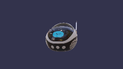 | $\color{#1a7f37}{\textsf{0.001}}$ | $\color{#1a7f37}{\textsf{0.015}}$ | BoomBox glTF, IBL environment, generated PBR diagnostics |
| 2 |  | $\color{#1a7f37}{\textsf{0.000}}$ | $\color{#1a7f37}{\textsf{0.000}}$ | Directional-light diffuse/specular colors on a generated Standard sphere |
| 5 | 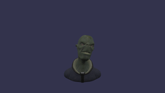 | $\color{#1a7f37}{\textsf{0.001}}$ | $\color{#1a7f37}{\textsf{0.020}}$ | GPU morph targets plus recursive GPU skeleton skinning |
| 6 | 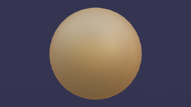 | $\color{#1a7f37}{\textsf{0.284}}$ | $\color{#1a7f37}{\textsf{0.022}}$ | specular-glossiness gold sphere, solid textures, requested ground, and finite DDS skybox |
| 8 | 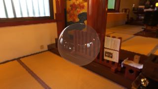 | $\color{#1a7f37}{\textsf{0.129}}$ | $\color{#1a7f37}{\textsf{0.134}}$ | exact 1024-sample HDR GGX, cubemap skybox, glass alpha/reflectance <em>Skybox outside the glass sphere is effectively exact (0.00023 MAD); remaining error is concentrated on transparent sphere edges.</em> |
| 10 | 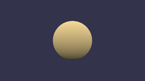 | $\color{#1a7f37}{\textsf{0.000}}$ | $\color{#1a7f37}{\textsf{0.000}}$ | generated sphere, no-IBL PBR, geometric normals |
| 13 | 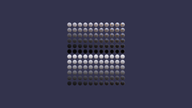 | $\color{#1a7f37}{\textsf{0.010}}$ | $\color{#1a7f37}{\textsf{0.081}}$ | material grid, requested ground, and explicit occlusion semantics |
| 14 | 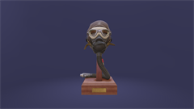 | $\color{#1a7f37}{\textsf{0.290}}$ | $\color{#1a7f37}{\textsf{0.051}}$ | Flight Helmet glTF with default framing, IBL, requested ground, and finite translated DDS skybox <em>Babylon Lite translates the ground mesh to the scene root but evaluates its camera fade from the world origin; preserving that distinction enables requested grounds without regressing Scenes 1, 6, or 13.</em> |
| 24 | 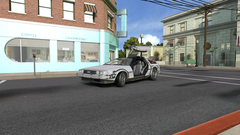 | $\color{#1a7f37}{\textsf{0.114}}$ | $\color{#1a7f37}{\textsf{0.120}}$ | Hill Valley `.babylon` geometry, camera, textures, and baked lighting |
| 28 | 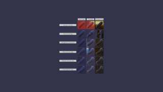 | $\color{#1a7f37}{\textsf{0.004}}$ | $\color{#1a7f37}{\textsf{0.049}}$ | `KHR_materials_clearcoat` intensity, roughness, and coat-normal textures |
| 29 | 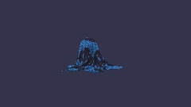 | $\color{#1a7f37}{\textsf{0.000}}$ | $\color{#1a7f37}{\textsf{0.009}}$ | `KHR_materials_sheen` cloth with shared `KHR_texture_transform` scaling |
| 31 | 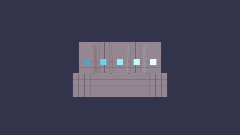 | $\color{#1a7f37}{\textsf{0.003}}$ | $\color{#1a7f37}{\textsf{0.018}}$ | `KHR_materials_emissive_strength` and factor-only emissive materials |
| 32 |  | $\color{#1a7f37}{\textsf{0.000}}$ | $\color{#1a7f37}{\textsf{0.000}}$ | `KHR_materials_unlit` |
| 33 | 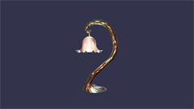 | $\color{#1a7f37}{\textsf{0.083}}$ | $\color{#cf222e}{\textsf{1.978}}$ | `KHR_lights_punctual` physical-falloff accumulation through opaque, transmission, and BLEND-alpha composition <em>The scene-color copy now resolves and preserves the 4x-MSAA color/depth attachments before transmissive draws resume; 82% of the remaining error is raster-edge attribution.</em> |
| 116 | 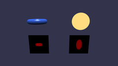 | $\color{#1a7f37}{\textsf{0.000}}$ | $\color{#1a7f37}{\textsf{0.000}}$ | no-color material views, depth targets |
| 145 | 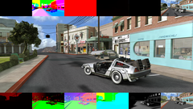 | $\color{#1a7f37}{\textsf{0.063}}$ | $\color{#1a7f37}{\textsf{0.063}}$ | `.babylon`, Standard geometry outputs, default anisotropy <em>The frame-graph copy path now matches Babylon Lite's integer viewport and scissor contract. Full-resolution attachment MAD is at most 0.067; view/world normals are 0.002/0.003. Run `npm run scene -- geometry scene145`.</em> |
| 146 | 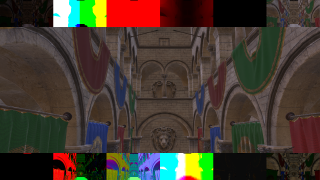 | $\color{#1a7f37}{\textsf{0.021}}$ | $\color{#1a7f37}{\textsf{0.019}}$ | Exact pinned FreeCamera Sponza view, PBR geometry outputs, 7+4 MRT composition <em>Typed static-loop lowering preserves Babylon Lite's double-precision viewport arithmetic before source-derived integer viewport/scissor conversion.</em> |
| 150 |  | $\color{#1a7f37}{\textsf{0.000}}$ | $\color{#1a7f37}{\textsf{0.000}}$ | deterministic property `position.x` animation with track-derived frame rate |
| 151 |  | $\color{#1a7f37}{\textsf{0.000}}$ | $\color{#1a7f37}{\textsf{0.000}}$ | grouped position, scaling, and quaternion property animation |
| 154 | 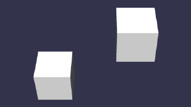 | $\color{#1a7f37}{\textsf{0.000}}$ | $\color{#1a7f37}{\textsf{0.000}}$ | LINEAR versus STEP property interpolation |
| 163 | 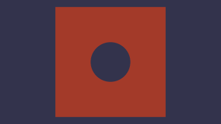 | $\color{#1a7f37}{\textsf{0.000}}$ | $\color{#1a7f37}{\textsf{0.000}}$ | custom shader blend, alpha test, discard |
| 168 | 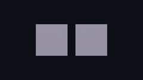 | $\color{#1a7f37}{\textsf{0.068}}$ | $\color{#1a7f37}{\textsf{0.388}}$ | mirrored double-sided winding through a clockwise front-face pipeline; 100% within one byte |
| 176 | 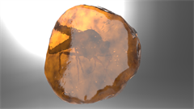 | $\color{#1a7f37}{\textsf{0.263}}$ | $\color{#1a7f37}{\textsf{0.263}}$ | integrated linear transmission, authored alpha state, IOR, volume, and multisampled scene-color copy |
| 178 | 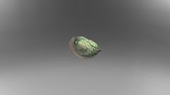 | $\color{#1a7f37}{\textsf{0.209}}$ | $\color{#1a7f37}{\textsf{0.259}}$ | `KHR_materials_iridescence` Abalone and camera-following skybox <em>Every pixel is within one byte of the pinned output.</em> |
| 210 | 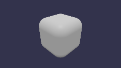 | $\color{#1a7f37}{\textsf{0.037}}$ | $\color{#1a7f37}{\textsf{0.210}}$ | `KHR_xmp_json_ld` metadata on a rounded cube |
| 212 | 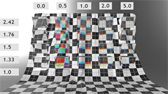 | $\color{#1a7f37}{\textsf{0.303}}$ | $\color{#1a7f37}{\textsf{0.329}}$ | `KHR_materials_dispersion` per-RGB refraction over transmission, IOR, and volume <em>Preserving 4x MSAA across the scene-color copy reduces the former 0.608/0.673 resolve gap below Babylon Lite's original 0.437 accepted floor; the residual remains concentrated on refracted checkerboard edges.</em> |
| 213 | 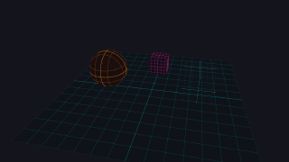 | $\color{#1a7f37}{\textsf{0.000}}$ | $\color{#1a7f37}{\textsf{0.001}}$ | GridMaterial opaque/transparent families and ordered draw lists |
| 240 |  | $\color{#1a7f37}{\textsf{0.000}}$ | $\color{#1a7f37}{\textsf{0.000}}$ | deterministic glTF node rotation animation |
| 243 | 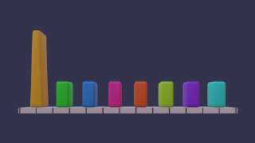 | $\color{#1a7f37}{\textsf{0.046}}$ | $\color{#cf222e}{\textsf{1.043}}$ | deterministic MorphStressTest glTF animation with Babylon-compatible overlapping clip precedence |
| 245 | 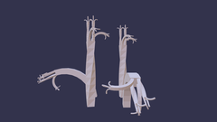 | $\color{#1a7f37}{\textsf{0.000}}$ | $\color{#1a7f37}{\textsf{0.001}}$ | recursive skeleton hierarchy, inverse bind matrices, GPU skinning |
| 246 | 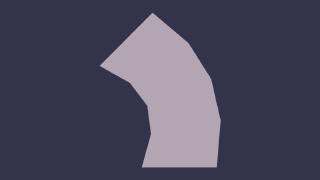 | $\color{#1a7f37}{\textsf{0.006}}$ | $\color{#1a7f37}{\textsf{0.042}}$ | deterministic SimpleSkin glTF animation |
| 247 | 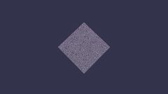 | $\color{#1a7f37}{\textsf{0.055}}$ | $\color{#9a6700}{\textsf{0.644}}$ | `EXT_mesh_gpu_instancing` with local extension T/R/S, separate node-world composition, and one native instanced draw |
| 248 | 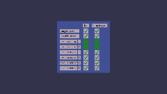 | $\color{#1a7f37}{\textsf{0.001}}$ | $\color{#1a7f37}{\textsf{0.005}}$ | external glTF and sampler modes |
| 249 | 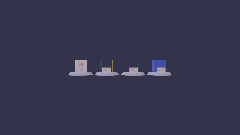 | $\color{#1a7f37}{\textsf{0.001}}$ | $\color{#1a7f37}{\textsf{0.024}}$ | vertex-color alpha and mask cutoff |
| 254 | 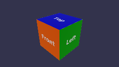 | $\color{#1a7f37}{\textsf{0.001}}$ | $\color{#1a7f37}{\textsf{0.004}}$ | normalized signed animation sampler accessors with pinned quaternion slerp |
| 255 |  | $\color{#1a7f37}{\textsf{0.011}}$ | $\color{#1a7f37}{\textsf{0.101}}$ | normalized integer skin-weight accessors |
| 257 | 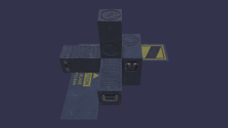 | $\color{#1a7f37}{\textsf{0.001}}$ | $\color{#1a7f37}{\textsf{0.006}}$ | negative-scale hierarchy, generated normals |
| 258 | 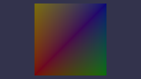 | $\color{#1a7f37}{\textsf{0.002}}$ | $\color{#1a7f37}{\textsf{0.005}}$ | interleaved glTF vertex buffers |
| 259 |  | $\color{#1a7f37}{\textsf{0.000}}$ | $\color{#1a7f37}{\textsf{0.000}}$ | factor-only emissive material with neutral texture fallback |
| 265 | 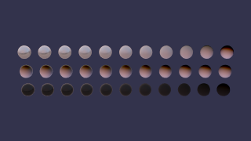 | $\color{#1a7f37}{\textsf{0.002}}$ | $\color{#1a7f37}{\textsf{0.037}}$ | `EXT_lights_image_based` half-float RGBD cubemap, generated 1024-sample BRDF LUT, unclamped SH irradiance, rotation, and raw-vector horizon occlusion |
| 266 | 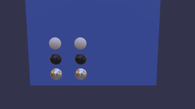 | $\color{#1a7f37}{\textsf{0.130}}$ | $\color{#1a7f37}{\textsf{0.247}}$ | mirrored spheres with source-derived clockwise front-face state; 99.46% within one byte |
| 273 | 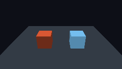 | $\color{#1a7f37}{\textsf{0.000}}$ | $\color{#1a7f37}{\textsf{0.000}}$ | post-registration material-family addition |
| 274 | 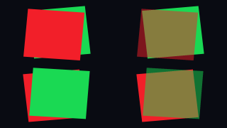 | $\color{#1a7f37}{\textsf{0.000}}$ | $\color{#1a7f37}{\textsf{0.000}}$ | 4x-MSAA alpha-to-coverage |
## Project-owned differential gates

These scenes are authored in `bblitec`, but their browser reference still runs
the same TypeScript against the pinned Babylon Lite package. Their MAD measures
native differential fidelity; it does not represent upstream corpus coverage.

| Scene | Preview | Full MAD | Foreground MAD | Primary coverage |
| --- | :---: | ---: | ---: | --- |
| compiler-state | 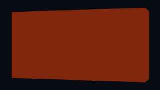 | $\color{#1a7f37}{\textsf{0.000}}$ | $\color{#1a7f37}{\textsf{0.000}}$ | flat-entry mutable state and pre-registration mesh compound assignment |
| glTF-track-clamp |  | $\color{#1a7f37}{\textsf{0.000}}$ | $\color{#1a7f37}{\textsf{0.000}}$ | translation, rotation, and morph-weight endpoint clamping while another channel extends the global duration |
| shader-frame-graph | 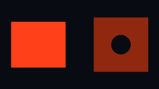 | $\color{#1a7f37}{\textsf{0.000}}$ | $\color{#1a7f37}{\textsf{0.000}}$ | alpha-card and circular-cutout shader materials mirrored through a frame-graph render task |
| transmission-ior | 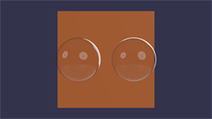 | $\color{#1a7f37}{\textsf{0.049}}$ | $\color{#1a7f37}{\textsf{0.130}}$ | refraction IOR without glTF-only dielectric F0 |
| transmission-scene-color |  | $\color{#1a7f37}{\textsf{0.024}}$ | $\color{#1a7f37}{\textsf{0.143}}$ | linear RGBA16F scene-color transmission |
| transmission-skybox | 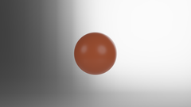 | $\color{#1a7f37}{\textsf{0.091}}$ | $\color{#1a7f37}{\textsf{0.091}}$ | independent PBR skybox-mode gate |
| transmission-volume | 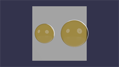 | $\color{#1a7f37}{\textsf{0.062}}$ | $\color{#1a7f37}{\textsf{0.166}}$ | Beer-Lambert volume and independent thickness-as-depth |

## Diagnostics

Scene 1 parity can emit:

- draw and triangle-cluster IDs
- world normal, reflectivity, irradiance, IBL
- normalized depth, albedo, and direct light
- raw base color and pre-tone HDR (`RGBA16F` raw plus PNG preview)
- background, edge, interior, channel-bias, hotspot, and material attribution

Normalized depth is bit-exact against the Babylon Lite WebGPU oracle. See
[fidelity.md](fidelity.md) for artifact semantics.

Current Scene 1 foreground diagnostic MAD: world normal `0.011`, albedo
`0.000`, reflectivity `0.000`, irradiance `0.040`, normalized depth `0.000`.

Requested environment grounds and DDS/HDR skyboxes render by default. They can
be disabled independently with `BBLITE_GROUND=0` and `BBLITE_BACKGROUND=0`.

## Shader pipeline

All native GPU shader families originate as WGSL and use pinned Tint. No HLSL
or MSL source templates remain under `src/`.

| Target | Offline path |
| --- | --- |
| D3D12 | WGSL → Tint HLSL → normalized registers/signatures → DXC DXIL |
| Vulkan | WGSL → Tint HLSL → normalization → DXC SPIR-V |
| Metal | WGSL → Tint MSL |

Tint Inspector bindings are checked against generated WGSL. DXIL/SPIR-V
artifacts are content-addressed and reused across scenes. Direct Tint SPIR-V is
deferred until its resource bindings are remapped to SDL_GPU conventions.

## Current boundaries

- one statically analyzable entry file and one engine
- selected TypeScript expressions, assignments, callbacks, and intrinsics
- no general modules/functions/control flow, arbitrary object graphs, or
  runtime module loading
- no physics, audio, or networking
- property animation covers LINEAR/STEP scalar/vector tracks, quaternion
  slerp, group ranges/looping/speed, and deterministic seeking for reached
  mesh `position`, `position.x`, `scaling`, and `rotationQuaternion` paths
- glTF animation covers LINEAR/CUBICSPLINE rotation and translation plus
  LINEAR morph weights; morphing and skinning are vertex-shader evaluated,
  with CPU fallback beyond 64 joints/two morph targets and CPU face-normal
  recomputation for primitives without source normals
- glTF scale/STEP channels, multiple-clip controls, broader property targets,
  and Standard scenes beyond two simultaneous lights remain unsupported
- PBR material extensions cover clearcoat, sheen, iridescence, and dispersion
  with one shared UV transform; specular and anisotropy, per-slot texture
  transforms, and layered composition combined with punctual multi-light
  remain unsupported
- no general user WGSL; reached custom variants use typed WGSL reflection and
  required pinned Tint HLSL/MSL emission plus DXC DXIL/SPIR-V compilation
- GridMaterial, frame-graph blit/depth, and attribution utilities use
  generated WGSL through Tint
- ground and cubemap-skybox fragments use generated WGSL through Tint
- PBR and Standard material, diagnostic, and geometry variants use WGSL through
  Tint; no HLSL/MSL source templates remain
- D3D12 is validated locally; Vulkan and Metal artifacts are generated but
  still require real-device validation

Unfinished priorities are maintained only in [TODO](../TODO.md).
