# Current status

Published full-image / foreground MAD against pinned browser references. `pixel-perfect` marks a
backend whose capture matches its reference exactly; a MAD below 0.0005 that is not zero still reads
0.000. Registry poses/gates and repeatability exceptions remain authoritative.
Values describe saved reports, not the current working tree. Verify with `npm run status:verify`.

## Curated parity scenes

Numbered scene coverage starts with its registry name. Colors: below 0.5 green,
0.5–1 yellow, 1+ red. Repeatability-exempt rows retain their published values.
Physics rows measure Bullet against Havok: their residuals are solver deltas, not renderer fidelity
([contract](fidelity.md#physics-contract)).

| Scene | Preview | SDL_GPU | Dawn | Coverage |
| ---: | :---: | ---: | ---: | --- |
| 1 | 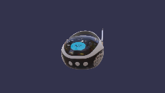 | pixel‑perfect | pixel‑perfect | BoomBox PBR |
| 2 |  | pixel‑perfect | pixel‑perfect | Directional Light Sphere |
| 3 | 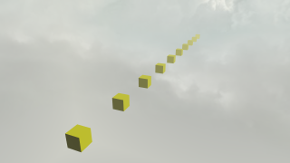 | pixel‑perfect | pixel‑perfect | Fog Boxes |
| 4 | 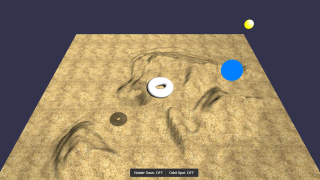 | 0.042/0.042 | 0.042/0.042 | ESM Directional and PCF Spot Shadows |
| 5 | 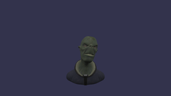 | pixel‑perfect | pixel‑perfect | Alien Morph and Skeleton |
| 6 | 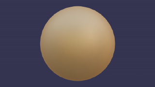 | pixel‑perfect | pixel‑perfect | PBR Gold Sphere |
| 7 | 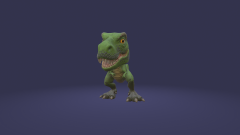 | 0.001/0.008 | 0.001/0.008 | ChibiRex Default Camera |
| 8 | 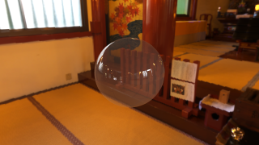 | pixel‑perfect | pixel‑perfect | HDR Glass Sphere |
| 9 | 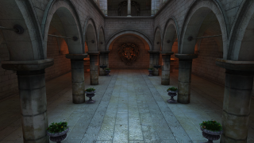 | pixel‑perfect | 0.000/0.000 | Sponza |
| 10 | 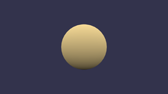 | pixel‑perfect | pixel‑perfect | PBR Rough Sphere |
| 11 |  | pixel‑perfect | pixel‑perfect | Spec-Gloss Shark |
| 12 | 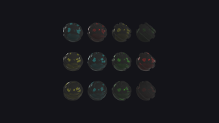 | pixel‑perfect | pixel‑perfect | PBR Shader Balls |
| 13 | 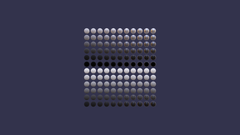 | pixel‑perfect | pixel‑perfect | PBR Spheres Grid |
| 14 | 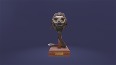 | 0.000/0.005 | pixel‑perfect | Flight Helmet |
| 15 | 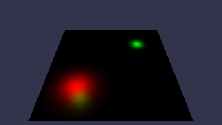 | pixel‑perfect | pixel‑perfect | Two Spot Lights |
| 16 | 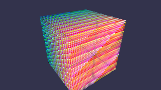 | pixel‑perfect | pixel‑perfect | Thin Instances |
| 17 | 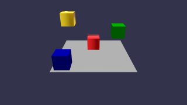 | pixel‑perfect | pixel‑perfect | PBR and Standard Thin Instances |
| 18 | 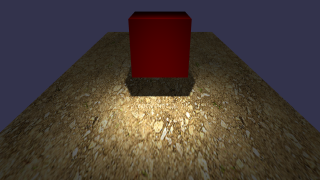 | 0.000/0.000 | 0.000/0.000 | PCF Spotlight Shadows |
| 19 | 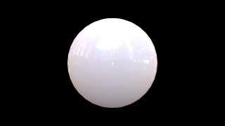 | pixel‑perfect | pixel‑perfect | PBR Clearcoat |
| 20 | 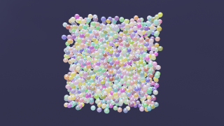 | pixel‑perfect | pixel‑perfect | PBR Emissive Sphere Grid |
| 21 | 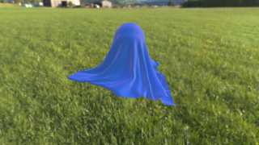 | pixel‑perfect | pixel‑perfect | PBR Sheen Cloth |
| 22 | 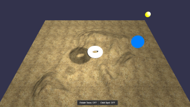 | 0.040/0.040 | 0.040/0.040 | PBR Shadow Receiver |
| 23 | 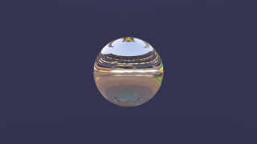 | pixel‑perfect | pixel‑perfect | PBR Anisotropy |
| 24 | 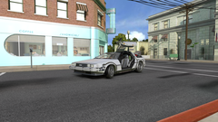 | 0.000/0.000 | pixel‑perfect | Hill Valley |
| 25 | 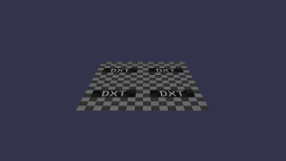 | pixel‑perfect | pixel‑perfect | KTX Compressed Texture |
| 26 | 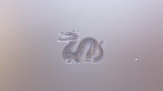 | pixel‑perfect | pixel‑perfect | PBR Subsurface |
| 27 | 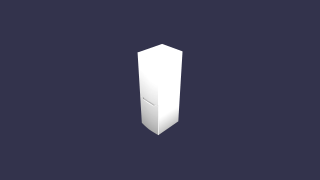 | pixel‑perfect | pixel‑perfect | Material Variants |
| 28 | 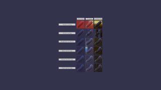 | pixel‑perfect | pixel‑perfect | Clearcoat glTF |
| 29 | 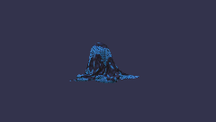 | pixel‑perfect | pixel‑perfect | Sheen Cloth glTF |
| 30 | 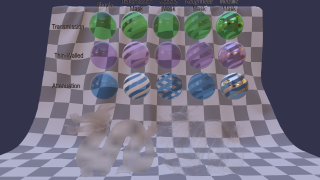 | 0.000/0.000 | 0.000/0.000 | Volume Testing |
| 31 | 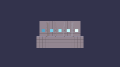 | pixel‑perfect | pixel‑perfect | Emissive Strength |
| 32 |  | pixel‑perfect | pixel‑perfect | Unlit glTF |
| 33 | 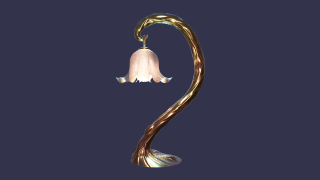 | pixel‑perfect | pixel‑perfect | Punctual Lights |
| 34 |  | pixel‑perfect | pixel‑perfect | Node Visibility |
| 35 | 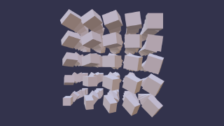 | pixel‑perfect | pixel‑perfect | Simple Instancing |
| 36 | 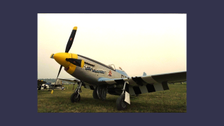 | pixel‑perfect | pixel‑perfect | Basis Universal Texture |
| 37 | 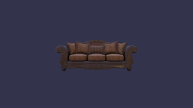 | 0.001/0.005 | 0.001/0.006 | Sheen Wood Leather Sofa |
| 38 | 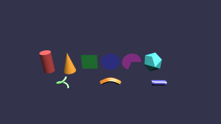 | pixel‑perfect | pixel‑perfect | Mesh Builder Gallery |
| 39 | 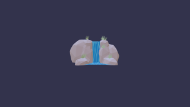 | pixel‑perfect | pixel‑perfect | Animated Waterfall |
| 40 | 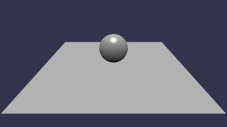 | 0.003/0.006 | 0.003/0.006 | Havok Sphere Drop; Bullet on Havok's sub-steps, speculative landing and rebound |
| 41 | 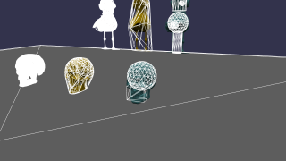 | 0.215/0.284 | 0.215/0.284 | Physics Shape Debug Viewer; Mesh, hull and compound bodies with retained debug overlays; free fall |
| 42 | 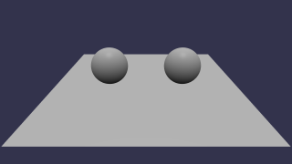 | 0.000/0.000 | 0.000/0.000 | Physics Clone Pre-Step |
| 43 | 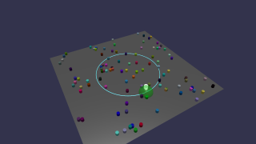 | pixel‑perfect | pixel‑perfect | Parametric Proximity Path |
| 44 | 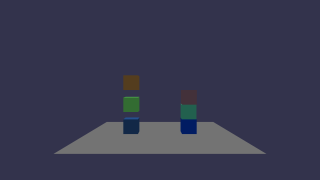 | 0.006/0.037 | 0.006/0.037 | Physics Sleeping Towers |
| 45 | 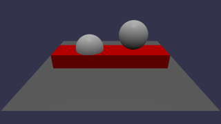 | 0.039/0.074 | 0.039/0.074 | Physics Collision Filtering; landing hops under -1 gravity |
| 46 | 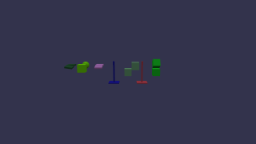 | 0.001/0.077 | 0.001/0.077 | Physics Constraints; Seven constraint types including radial limits; upstream frame 10. Later trajectories differ between solvers |
| 47 | 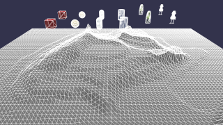 | 0.000/0.001 | 0.000/0.001 | Physics Heightfield; Heightfield and six falling shape types; upstream frame 1. Later contact trajectories differ between solvers |
| 48 | 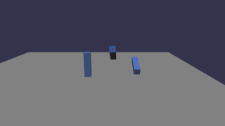 | 0.060/0.098 | 0.060/0.098 | Physics Centre of Mass; Authored centres of mass under a kick, captured mid-topple; contact-instant lateral drift |
| 49 | 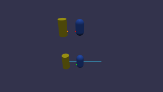 | pixel‑perfect | pixel‑perfect | Physics Shape Queries; cylinder/capsule proximity and cast with live rotation, query, orbit and resize controls |
| 50 | 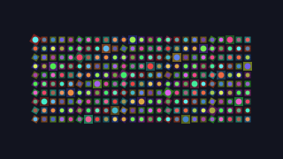 | pixel‑perfect | pixel‑perfect | Sprite Grid |
| 51 | 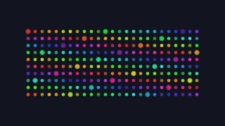 | pixel‑perfect | pixel‑perfect | Soft-Edged Sprite Grid |
| 52 | 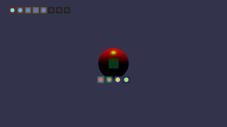 | pixel‑perfect | pixel‑perfect | HUD on 3D |
| 53 | 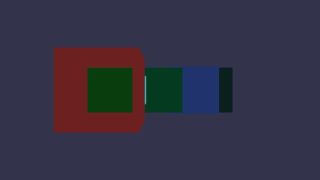 | pixel‑perfect | pixel‑perfect | Depth-Hosted Sprites |
| 54 | 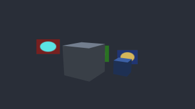 | pixel‑perfect | pixel‑perfect | Facing Billboards |
| 55 | 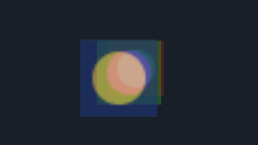 | 0.000/0.000 | 0.000/0.000 | Billboard Field |
| 56 | 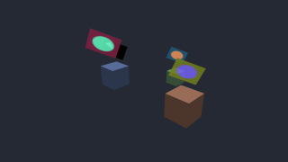 | 0.000/0.000 | 0.000/0.000 | Axis-Locked Billboards |
| 57 | 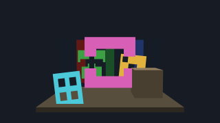 | pixel‑perfect | pixel‑perfect | Cutout Billboards |
| 58 | 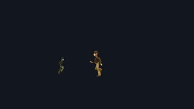 | pixel‑perfect | pixel‑perfect | Sprite2D Frame Animation |
| 59 | 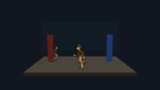 | pixel‑perfect | pixel‑perfect | Billboard Sprite Frame Animation |
| 60 |  | pixel‑perfect | pixel‑perfect | NME Flat Colour |
| 61 | 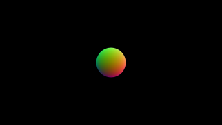 | pixel‑perfect | pixel‑perfect | NME Normal Colour |
| 62 | 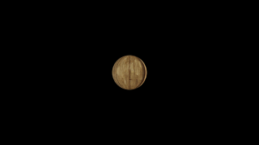 | pixel‑perfect | pixel‑perfect | NME Diffuse Texture |
| 63 | 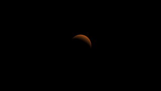 | pixel‑perfect | pixel‑perfect | NME Directional Light |
| 64 | 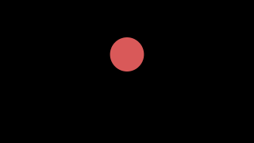 | pixel‑perfect | pixel‑perfect | NME Morph Targets |
| 65 | 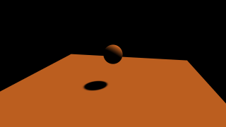 | pixel‑perfect | pixel‑perfect | Node Material Shadow Receiver |
| 66 | 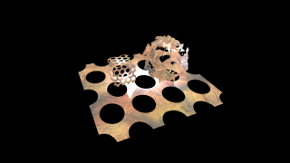 | 0.000/0.000 | 0.000/0.000 | NME Full Playground |
| 67 | 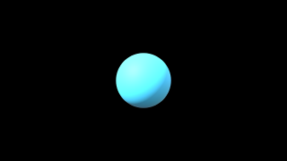 | pixel‑perfect | pixel‑perfect | NME PBR Core |
| 68 | 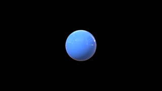 | pixel‑perfect | pixel‑perfect | NME PBR Clearcoat |
| 69 | 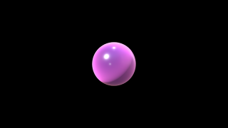 | pixel‑perfect | pixel‑perfect | NME PBR Sheen |
| 70 | 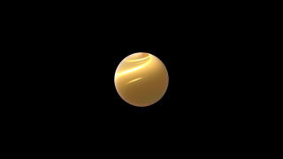 | pixel‑perfect | pixel‑perfect | NME PBR Anisotropy |
| 71 | 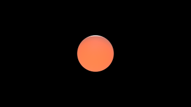 | pixel‑perfect | pixel‑perfect | NME PBR Subsurface |
| 72 | 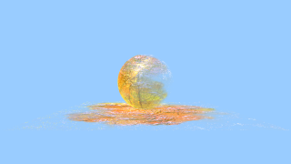 | pixel‑perfect | pixel‑perfect | NME PBR Full |
| 73 | 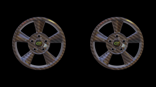 | pixel‑perfect | pixel‑perfect | Split-Viewport NME Comparison |
| 74 | 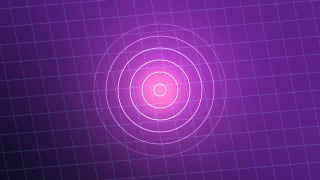 | pixel‑perfect | pixel‑perfect | Effect Renderer |
| 75 | 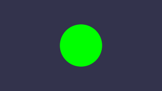 | pixel‑perfect | pixel‑perfect | Effect Render Target |
| 76 |  | pixel‑perfect | pixel‑perfect | Effect Texture |
| 77 | 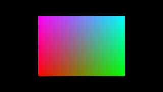 | pixel‑perfect | pixel‑perfect | NME Pass-Through Blocks |
| 78 | 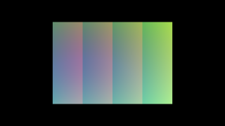 | pixel‑perfect | pixel‑perfect | NME Math Blocks |
| 79 | 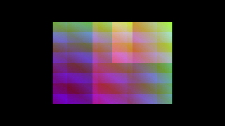 | pixel‑perfect | pixel‑perfect | NME Curves and Waves |
| 80 | 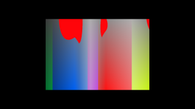 | pixel‑perfect | pixel‑perfect | NME Colour Blocks |
| 81 | 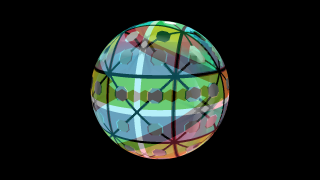 | pixel‑perfect | pixel‑perfect | NME UV Projection |
| 82 | 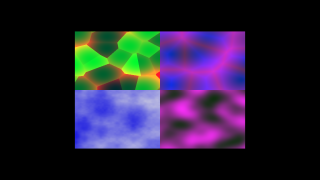 | pixel‑perfect | pixel‑perfect | NME Procedural Noise |
| 83 | 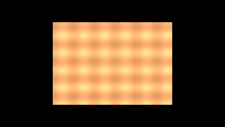 | pixel‑perfect | pixel‑perfect | NME Normals |
| 84 | 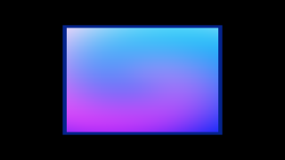 | pixel‑perfect | pixel‑perfect | NME Fragment Depth |
| 85 | 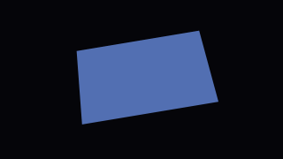 | pixel‑perfect | pixel‑perfect | NME Matrix Blocks |
| 86 |  | pixel‑perfect | pixel‑perfect | NME Scene and Mesh State |
| 87 | 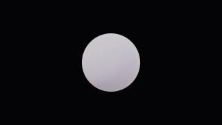 | pixel‑perfect | pixel‑perfect | NME Iridescence and Image Processing |
| 88 | 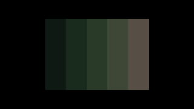 | pixel‑perfect | pixel‑perfect | NME Loop Block |
| 89 | 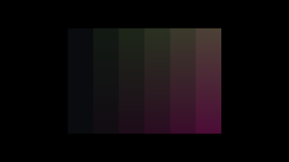 | pixel‑perfect | pixel‑perfect | NME Storage Blocks |
| 90 | 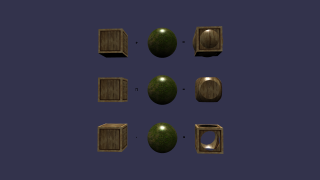 | pixel‑perfect | pixel‑perfect | CSG Operations |
| 91 | 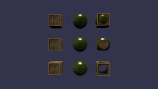 | pixel‑perfect | pixel‑perfect | CSG2 Operations; Manifold operations and material partitions |
| 92 | 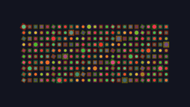 | pixel‑perfect | pixel‑perfect | Sprite Custom Shader |
| 93 | 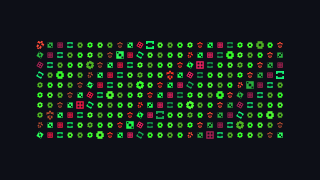 | pixel‑perfect | pixel‑perfect | Sprite Palette Shader |
| 94 | 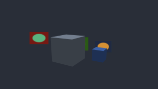 | pixel‑perfect | pixel‑perfect | Billboard Custom Shader |
| 95 | 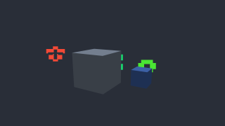 | pixel‑perfect | pixel‑perfect | Billboard Palette Shader |
| 96 | 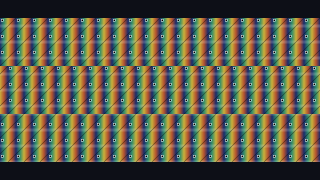 | pixel‑perfect | pixel‑perfect | Sprite UV Scroll |
| 97 | 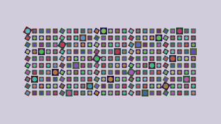 | pixel‑perfect | pixel‑perfect | Sprite Multiply Blend |
| 98 | 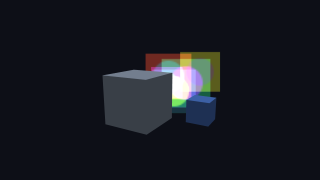 | pixel‑perfect | pixel‑perfect | Billboard Sprites |
| 99 | 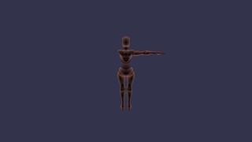 | pixel‑perfect | pixel‑perfect | Bone Control |
| 100 |  | 0.003/0.006 | 0.003/0.006 | Havok Collision Event; Scene 40 plus the collision event |
| 101 | 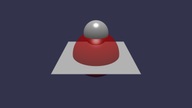 | 0.027/0.178 | 0.027/0.178 | Physics Trigger Volume; trigger drop two elastic bounces in; the rebound rule's 0.2% compounding |
| 102 | 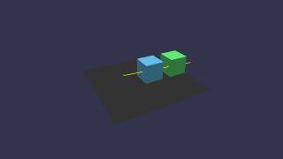 | 0.003/0.125 | 0.003/0.125 | Havok Filtered Raycast; raycast over triangle-soup colliders |
| 103 | 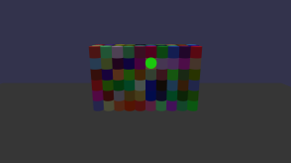 | pixel‑perfect | pixel‑perfect | Physics Raycast Instance Picking; exact captureFrame=5 pose. |
| 104 | 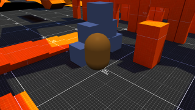 | 0.013/0.012 | 0.013/0.012 | Havok Character Controller; Character capsule movement, collision events, keyboard/jump and camera follow; imported level lightmaps |
| 105 | 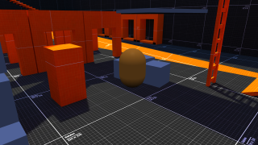 | 0.032/0.023 | 0.032/0.023 | Havok Character Moving Platform; Character movement and animated platform |
| 106 | 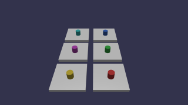 | 0.019/0.104 | 0.019/0.104 | Physics Motion and Prestep Grid; geometry and solver residual at frame 20. |
| 110 | 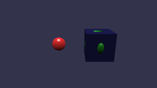 | pixel‑perfect | pixel‑perfect | Render Target Diffuse Texture |
| 111 | 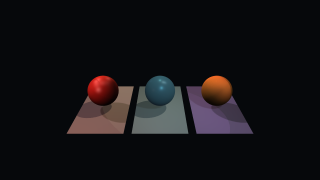 | 0.000/0.001 | 0.000/0.001 | Scene-Wide Light UBO Stress |
| 112 | 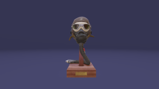 | pixel‑perfect | pixel‑perfect | Flight Helmet KTX2 |
| 113 | 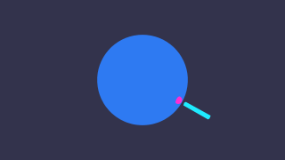 | pixel‑perfect | pixel‑perfect | Picking Precision |
| 114 | 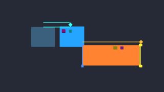 | pixel‑perfect | pixel‑perfect | Morph and Skeleton Picking |
| 115 | 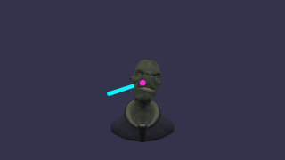 | pixel‑perfect | pixel‑perfect | Alien Picking at Frame 100 |
| 116 | 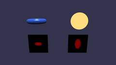 | pixel‑perfect | pixel‑perfect | No-Color Depth Views |
| 117 | 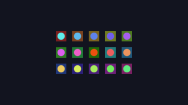 | pixel‑perfect | pixel‑perfect | 2D Sprite Picking |
| 118 | 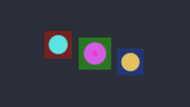 | pixel‑perfect | pixel‑perfect | Billboard Sprite Picking |
| 120 |  | 0.001/0.003 | 0.001/0.003 | Gaussian Splatting |
| 121 | 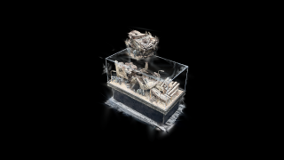 | 0.001/0.007 | 0.001/0.006 | Gaussian Splatting Data Updates |
| 122 | 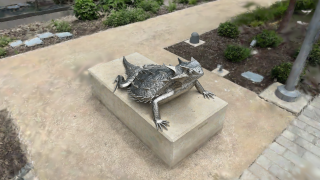 | 0.001/0.001 | 0.001/0.001 | Gaussian Splatting SOG |
| 123 |  | 0.001/0.001 | 0.001/0.001 | Gaussian Splatting SPZ |
| 124 | 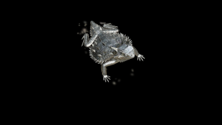 | 0.000/0.002 | 0.000/0.003 | Compressed PLY Gaussian Splatting |
| 125 | 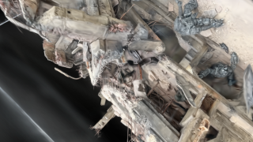 | 0.000/0.000 | 0.000/0.000 | Gaussian Splat Transform Bake |
| 126 | 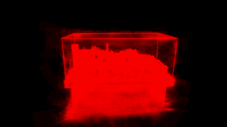 | 0.000/0.001 | 0.002/0.005 | Gaussian Splat Shader Plugin |
| 127 |  | pixel‑perfect | pixel‑perfect | Gaussian Splat Linear Depth |
| 128 | 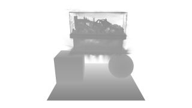 | 0.000/0.000 | 0.000/0.000 | Gaussian Splat Alpha-Blended Depth |
| 129 | 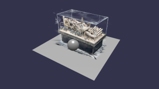 | 0.001/0.004 | 0.001/0.004 | Gaussian Splat GPU Picking |
| 140 | 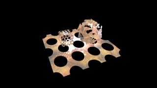 | 0.000/0.000 | 0.000/0.000 | NME Alpha-Discard Shadows |
| 141 | 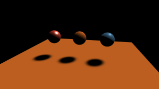 | pixel‑perfect | pixel‑perfect | Node, Standard and PBR ESM Casters |
| 142 | 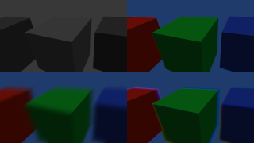 | pixel‑perfect | pixel‑perfect | Post-Process Viewports |
| 143 | 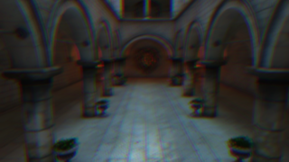 | pixel‑perfect | pixel‑perfect | Post-Process Chain |
| 144 | 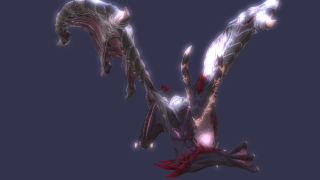 | pixel‑perfect | pixel‑perfect | Bloom |
| 145 | 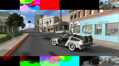 | 0.016/0.015 | 0.010/0.009 | Standard Geometry Outputs |
| 146 | 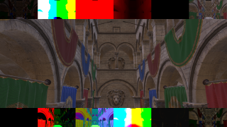 | 0.001/0.001 | 0.001/0.001 | PBR Geometry Outputs |
| 147 | 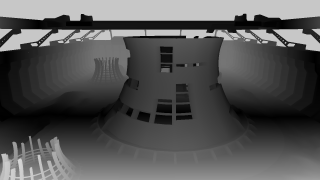 | pixel‑perfect | pixel‑perfect | Circle of Confusion |
| 148 | 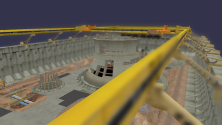 | pixel‑perfect | pixel‑perfect | Depth of Field |
| 149 | 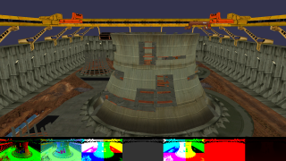 | 0.007/0.009 | pixel‑perfect | Node Material Geometry Outputs |
| 150 |  | pixel‑perfect | pixel‑perfect | Property Position Animation |
| 151 |  | pixel‑perfect | pixel‑perfect | Property Transform Animation |
| 152 | 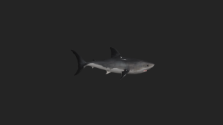 | pixel‑perfect | pixel‑perfect | Managed Animation Groups |
| 153 |  | 0.000/0.028 | 0.000/0.028 | Autonomous Canvas Animation |
| 154 | 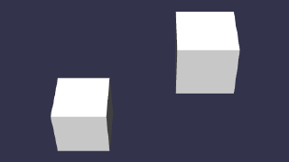 | pixel‑perfect | pixel‑perfect | STEP Time Animation |
| 155 |  | pixel‑perfect | pixel‑perfect | Weighted Property Blending |
| 156 |  | pixel‑perfect | pixel‑perfect | Manual Cross-Fade Animation |
| 157 | 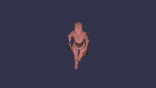 | pixel‑perfect | pixel‑perfect | Weighted Skeleton Blending |
| 158 | 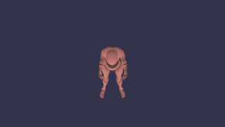 | pixel‑perfect | pixel‑perfect | Additive Pose Blending |
| 159 | 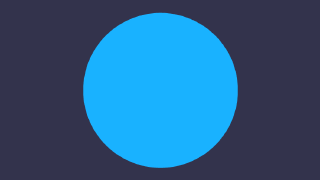 | pixel‑perfect | pixel‑perfect | Shader Flat Color |
| 160 |  | pixel‑perfect | pixel‑perfect | Shader Texture Sampler |
| 161 |  | pixel‑perfect | pixel‑perfect | Shader Custom Uniforms |
| 162 |  | pixel‑perfect | pixel‑perfect | Shader Defines |
| 163 |  | pixel‑perfect | pixel‑perfect | Shader Alpha Cutout |
| 164 | 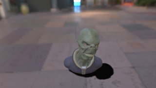 | pixel‑perfect | pixel‑perfect | Device Loss Recovery |
| 165 | 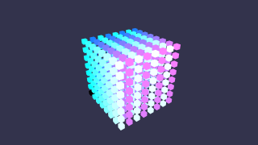 | pixel‑perfect | pixel‑perfect | Shader Material Thin Instances |
| 166 | 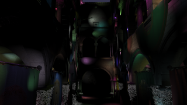 | pixel‑perfect | pixel‑perfect | Clustered Sponza Spot Lights |
| 167 | 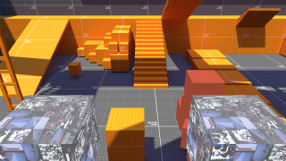 | pixel‑perfect | pixel‑perfect | PBR Lightmap |
| 168 | 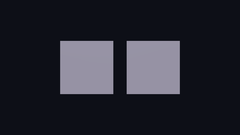 | pixel‑perfect | pixel‑perfect | Mirrored Double-Sided Winding |
| 170 | 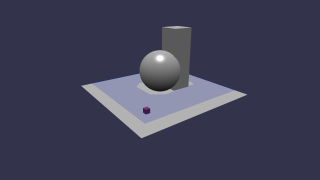 | pixel‑perfect | pixel‑perfect | Navigation Crowd |
| 171 | 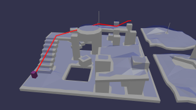 | 0.000/0.000 | 0.000/0.000 | Navigation Crowd Path |
| 172 |  | pixel‑perfect | pixel‑perfect | Navigation Tile Cache Obstacles |
| 173 | 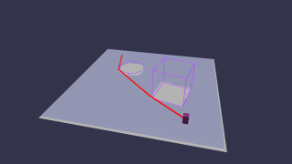 | pixel‑perfect | pixel‑perfect | Navigation Obstacle Toggle |
| 174 | 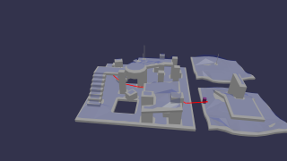 | 0.000/0.000 | 0.000/0.000 | Navigation Off-Mesh Connections |
| 175 | 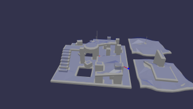 | 0.000/0.000 | 0.000/0.000 | Navigation Raycast |
| 176 | 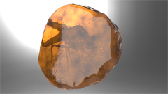 | 0.000/0.000 | 0.000/0.000 | Mosquito In Amber |
| 177 | 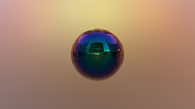 | pixel‑perfect | pixel‑perfect | Iridescence Sphere |
| 178 | 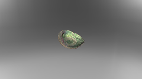 | pixel‑perfect | pixel‑perfect | Iridescence Abalone |
| 179 | 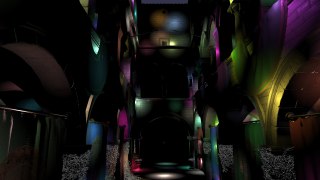 | pixel‑perfect | pixel‑perfect | Clustered Sponza Lights |
| 180 | 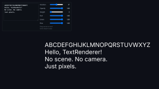 | 0.020/0.455 | 0.020/0.455 | Standalone Text Renderer |
| 181 | 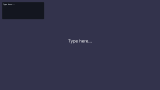 | 0.002/0.028 | 0.002/0.028 | Live Text Editor |
| 186 | 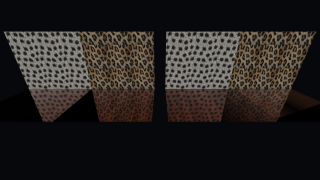 | pixel‑perfect | pixel‑perfect | Local Cubemap Blending |
| 187 | 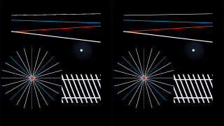 | pixel‑perfect | pixel‑perfect | Subpixel Morphological Anti-Aliasing |
| 200 | 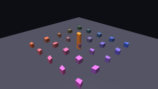 | pixel‑perfect | pixel‑perfect | High-Precision Matrix Off |
| 201 | 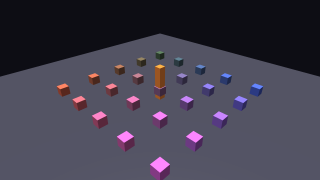 | pixel‑perfect | pixel‑perfect | High-Precision Matrix On |
| 202 | 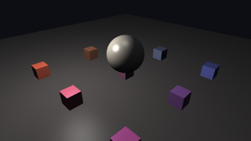 | pixel‑perfect | pixel‑perfect | Floating Origin Point Light |
| 203 | 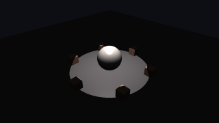 | 0.000/0.000 | 0.000/0.000 | Floating Origin Spot Light |
| 204 | 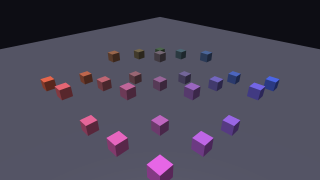 | pixel‑perfect | pixel‑perfect | Floating Origin Thin Instances |
| 205 | 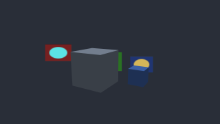 | pixel‑perfect | pixel‑perfect | Floating Origin Facing Billboards |
| 206 | 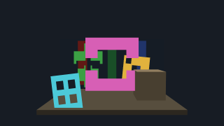 | pixel‑perfect | pixel‑perfect | Floating Origin Cutout Billboards |
| 207 | 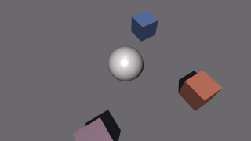 | pixel‑perfect | pixel‑perfect | Floating Origin Directional Shadows |
| 209 | 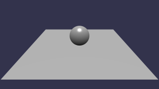 | 0.000/0.000 | 0.000/0.000 | Floating Origin Havok Physics; Floating Origin Physics Regions |
| 210 | 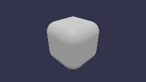 | pixel‑perfect | pixel‑perfect | XMP Metadata Rounded Cube |
| 211 | 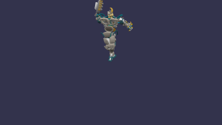 | pixel‑perfect | pixel‑perfect | BrainStem Meshopt |
| 212 | 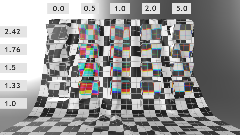 | pixel‑perfect | pixel‑perfect | Dispersion Test |
| 213 | 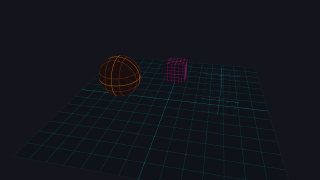 | pixel‑perfect | pixel‑perfect | Grid Material Ordering |
| 214 | 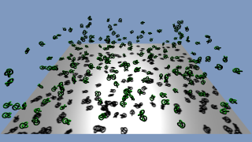 | 0.000/0.000 | 0.000/0.000 | Cascaded Shadow Torus Knots |
| 215 | 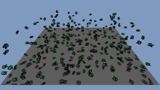 | 0.000/0.000 | 0.000/0.000 | Cascaded Shadows On A PBR Receiver |
| 216 | 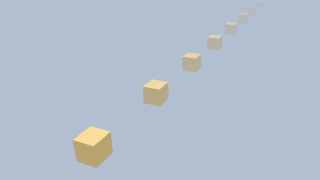 | pixel‑perfect | pixel‑perfect | PBR Fog |
| 217 | 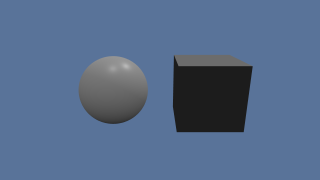 | pixel‑perfect | pixel‑perfect | Material Plugins |
| 218 |  | pixel‑perfect | pixel‑perfect | VAT Shark |
| 219 | 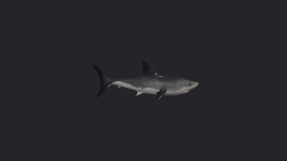 | pixel‑perfect | pixel‑perfect | Instanced VAT Shark |
| 220 | 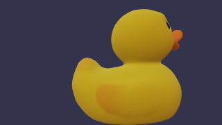 | pixel‑perfect | pixel‑perfect | Quantized Duck |
| 221 | 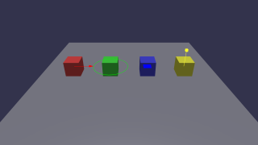 | pixel‑perfect | pixel‑perfect | Pointer Drags |
| 222 | 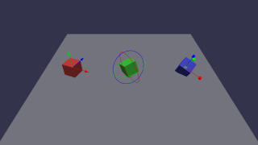 | 0.000/0.000 | 0.000/0.000 | Composite Gizmos |
| 223 | 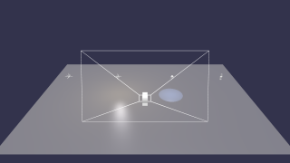 | pixel‑perfect | pixel‑perfect | Camera And Light Gizmos |
| 224 | 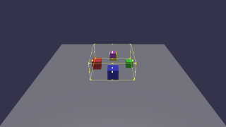 | pixel‑perfect | pixel‑perfect | Bounding Box Gizmo |
| 225 | 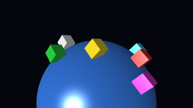 | pixel‑perfect | pixel‑perfect | Geospatial Camera; renders its pose, controls attach without input arms. |
| 226 | 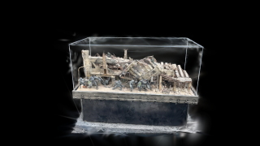 | 0.001/0.003 | 0.001/0.003 | Gaussian Splatting glTF |
| 227 | 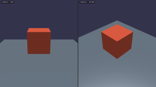 | 0.001/0.001 | 0.001/0.001 | Shared Scene Surfaces |
| 228 | 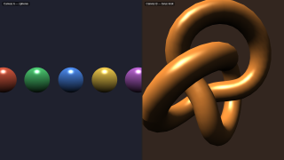 | 0.001/0.001 | 0.001/0.001 | Independent Scene Surfaces |
| 229 |  | pixel‑perfect | pixel‑perfect | Triangle Without Indices |
| 231 | 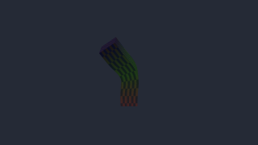 | 0.000/0.001 | 0.000/0.000 | Standard Material Deform Features |
| 240 |  | pixel‑perfect | pixel‑perfect | Animated Triangle |
| 241 | 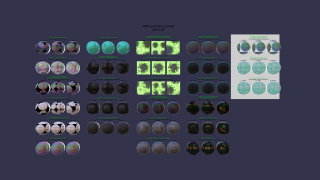 | 0.000/0.000 | 0.000/0.000 | Animation Pointer UVs |
| 242 |  | pixel‑perfect | pixel‑perfect | Emissive Fireflies |
| 243 | 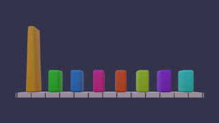 | pixel‑perfect | pixel‑perfect | Morph Stress Test |
| 244 | 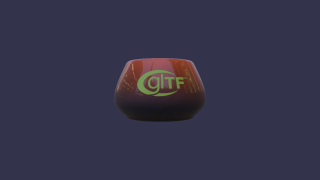 | pixel‑perfect | pixel‑perfect | Pot of Coals |
| 245 | 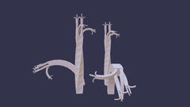 | pixel‑perfect | pixel‑perfect | Recursive Skeletons |
| 246 |  | pixel‑perfect | pixel‑perfect | Simple Skin |
| 247 |  | pixel‑perfect | pixel‑perfect | Teapots Galore |
| 248 | 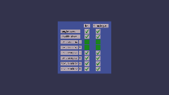 | pixel‑perfect | pixel‑perfect | Texture Settings |
| 249 | 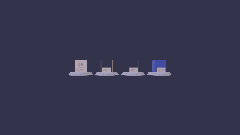 | pixel‑perfect | pixel‑perfect | Vertex Alpha Clip |
| 250 | 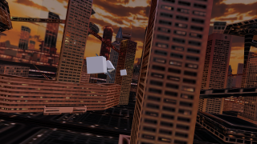 | 0.000/0.000 | pixel‑perfect | VirtualCity Cameras |
| 251 | 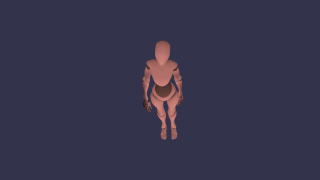 | pixel‑perfect | pixel‑perfect | Animation Group Mask |
| 252 | 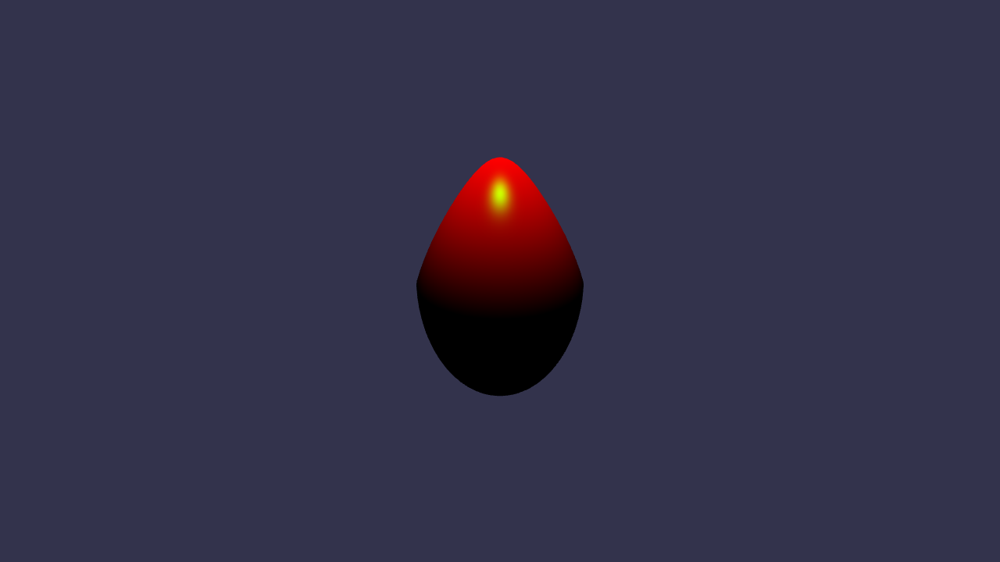 | pixel‑perfect | pixel‑perfect | Standard Morph Target |
| 253 | 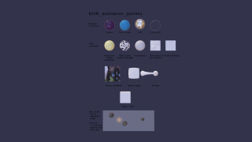 | pixel‑perfect | pixel‑perfect | Animate All The Things |
| 254 | 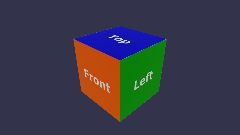 | pixel‑perfect | pixel‑perfect | Animation Sampler Type |
| 255 |  | pixel‑perfect | pixel‑perfect | Animation Skin Type |
| 256 | 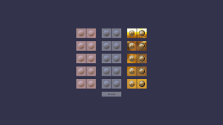 | pixel‑perfect | pixel‑perfect | Normal Tangent Test |
| 257 | 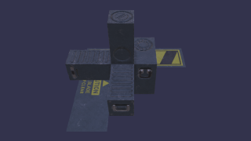 | pixel‑perfect | pixel‑perfect | Node Negative Scale |
| 258 | 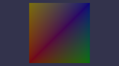 | pixel‑perfect | pixel‑perfect | Interleaved Buffer |
| 259 |  | pixel‑perfect | pixel‑perfect | Material Texture |
| 260 | 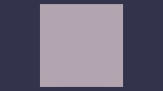 | pixel‑perfect | pixel‑perfect | Triangle Strip Primitive |
| 261 | 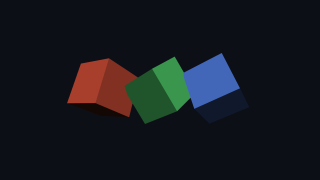 | pixel‑perfect | pixel‑perfect | Temporal Anti-Aliasing |
| 262 | 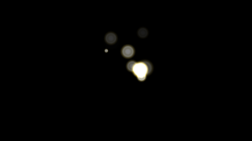 | pixel‑perfect | pixel‑perfect | NPE Particle Size |
| 263 | 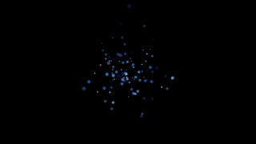 | pixel‑perfect | pixel‑perfect | NPE Particle Gravity |
| 264 | 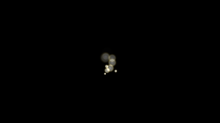 | pixel‑perfect | pixel‑perfect | NPE Particle Sphere Emitter |
| 265 | 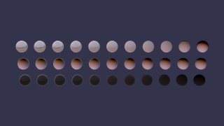 | pixel‑perfect | pixel‑perfect | Environment Test |
| 266 | 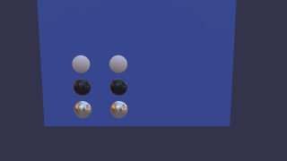 | pixel‑perfect | pixel‑perfect | Negative Scale Spheres |
| 267 | 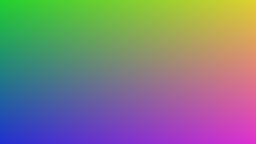 | pixel‑perfect | pixel‑perfect | Standard Vertex Colors |
| 268 | 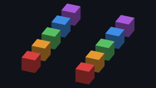 | pixel‑perfect | pixel‑perfect | Orthographic Camera |
| 269 | 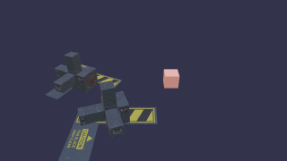 | 0.000/0.000 | 0.000/0.000 | Mirrored Transform Reparenting |
| 270 | 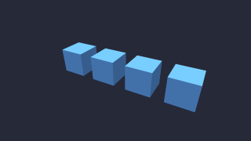 | pixel‑perfect | pixel‑perfect | Mirrored Standard Meshes |
| 271 | 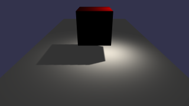 | pixel‑perfect | pixel‑perfect | Shadow Light Rebuild |
| 272 | 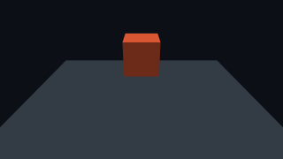 | pixel‑perfect | pixel‑perfect | Runtime Mesh Swap |
| 273 | 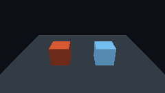 | pixel‑perfect | pixel‑perfect | Runtime Material Family |
| 274 | 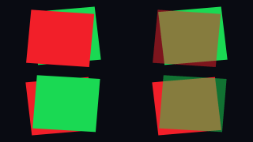 | pixel‑perfect | pixel‑perfect | Alpha to Coverage |
| 275 | 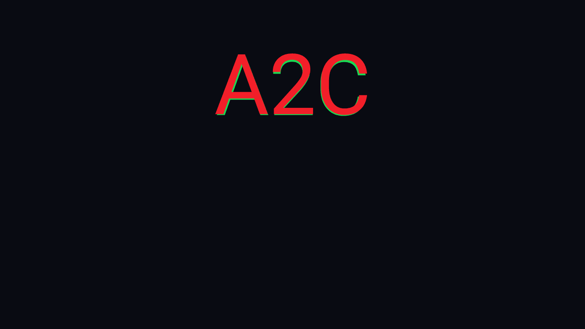 | pixel‑perfect | pixel‑perfect | Text Alpha-to-Coverage |
| 276 | 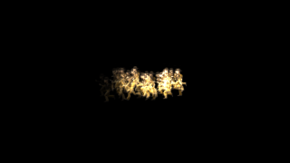 | pixel‑perfect | pixel‑perfect | NPE Sprite Sheet Particles |
| 277 | 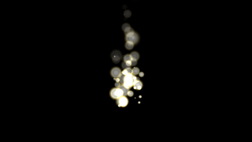 | pixel‑perfect | pixel‑perfect | NPE Attractor Update |
| 278 | 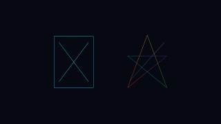 | pixel‑perfect | pixel‑perfect | Line System |
| 279 | 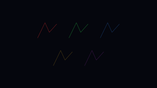 | pixel‑perfect | pixel‑perfect | Line System Update |
| 280 | 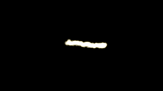 | pixel‑perfect | pixel‑perfect | NPE Flow Map Update |
| 281 | 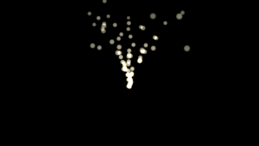 | pixel‑perfect | pixel‑perfect | NPE Noise Update |
| 282 | 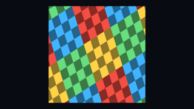 | pixel‑perfect | pixel‑perfect | Standard UV Transform |
| 283 | 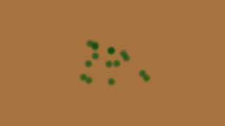 | pixel‑perfect | pixel‑perfect | NPE Multiply Blend |
| 284 | 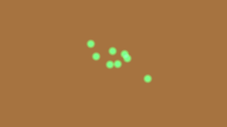 | pixel‑perfect | pixel‑perfect | NPE MultiplyAdd Blend |
| 286 | 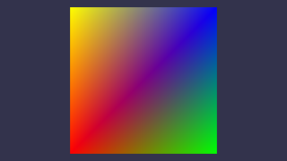 | pixel‑perfect | pixel‑perfect | ShaderMaterial on Interleaved glTF |
| 290 | 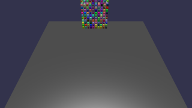 | 0.017/0.027 | 0.017/0.027 | Havok Thin Instances; 2,009 bodies at frame 180 |
| 300 | 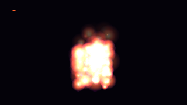 | pixel‑perfect | pixel‑perfect | Frozen NPE Sprite2D Sheet; frozen buffer and shared sprite sheet |
| 301 | 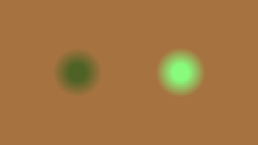 | pixel‑perfect | pixel‑perfect | NPE Sprite2D Blend Modes |
| 302 | 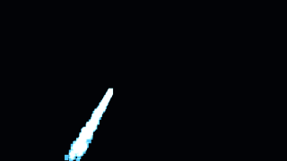 | 0.000/0.000 | 0.000/0.000 | NPE Moving Emitter |
| 303 | 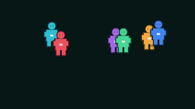 | pixel‑perfect | pixel‑perfect | Sprite2D Renderer-Native Y-Sort |
| 304 | 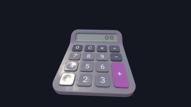 | 0.000/0.000 | 0.000/0.000 | Calculator KHR_interactivity |
| 305 |  | pixel‑perfect | pixel‑perfect | NPE Teleport Graph Plumbing |
| 306 |  | pixel‑perfect | pixel‑perfect | External Video Texture |

## Upstream application gates

Unchanged pinned applications, including their reached source and asset graphs.

| Application | Preview | SDL_GPU | Dawn | Coverage |
| --- | :---: | ---: | ---: | --- |
| Ocean | 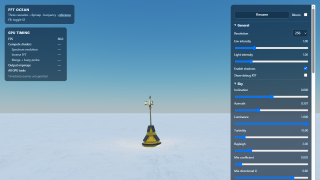 | 0.303/0.299 | 0.303/0.298 | Spectral ocean; compute FFT and mipmaps; procedural sky; buoyancy; retained controls; canvas-only MAD: 0.005/0.005 on both backends. |
| Offscreen (Worker) | 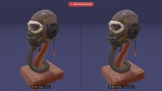 | $\color{#1a7f37}{\textsf{0.401}} / \color{#9a6700}{\textsf{0.548}}$ | $\color{#1a7f37}{\textsf{0.401}} / \color{#9a6700}{\textsf{0.548}}$ | Dedicated Worker realms; transferred canvases; retained blocking control. UI and localized lens residuals; canvas-only: pixel-perfect on both backends. |
| Tetris | 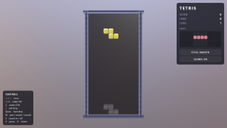 | $\color{#cf222e}{\textsf{1.143}} / \color{#9a6700}{\textsf{0.904}}$ | $\color{#cf222e}{\textsf{1.143}} / \color{#9a6700}{\textsf{0.904}}$ | Thin-instance game; audio; retained UI. UI residual; canvas-only MAD: 0.080/0.086 on both backends, the demo's doubled `devicePixelRatio` supersample (the port renders at the window's size). |
| Doom | 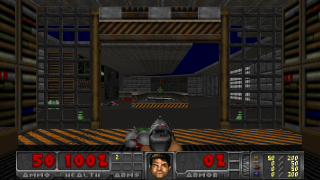 | 0.000/0.000 | 0.000/0.000 | WAD game; sprites; audio; retained UI. |
| LibreQuake | 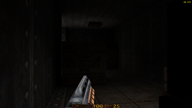 | 0.027/0.027 | 0.027/0.027 | BSP/WAD2/MDL game; audio; Canvas2D HUD. |
| Torus States | 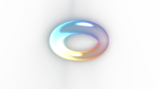 | pixel‑perfect | pixel‑perfect | Frame graph; offscreen effects; bloom. |
| Platformer | 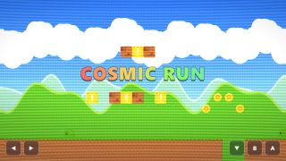 | $\color{#9a6700}{\textsf{0.664}} / \color{#9a6700}{\textsf{0.664}}$ | $\color{#9a6700}{\textsf{0.664}} / \color{#9a6700}{\textsf{0.664}}$ | Sprite game; CRT pass; audio; retained UI. UI residual; canvas-only: pixel-perfect on both backends. |
| Break Meshes | 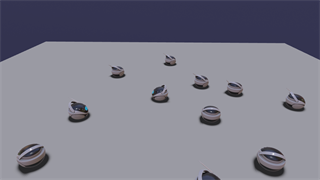 | 0.000/0.000 | 0.000/0.000 | Voronoi fracture; PBR; physics. |
| Racer | 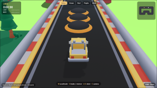 | 0.466/0.466 | 0.466/0.466 | Driving game; CSM; physics; audio; retained HUD. UI residual; canvas-only MAD: 0.004/0.004 on both backends. |
| Antigravity Racer | 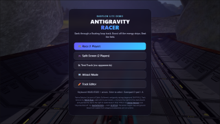 | $\color{#cf222e}{\textsf{2.393}} / \color{#cf222e}{\textsf{2.437}}$ | $\color{#cf222e}{\textsf{2.393}} / \color{#cf222e}{\textsf{2.437}}$ | Antigravity racing game; dynamic hierarchy instances; shader storage; CSM; HDR/IBL; gamepads; GPU picking; retained menu. UI residual; canvas-only MAD: SDL_GPU 0.000/0.000, Dawn pixel-perfect. |
| Littlest Tokyo | 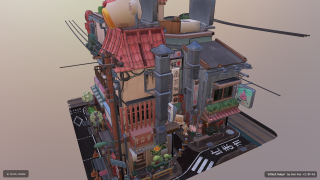 | 0.141/0.107 | 0.141/0.107 | Animated glTF; PBR/IBL; retained chrome. |
| Bath Day | 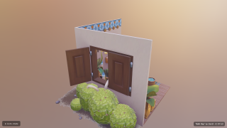 | 0.102/0.140 | 0.102/0.140 | Skinned Draco/WebP glTF; transmission; retained chrome. |
| Freeciv | 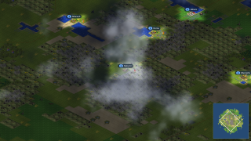 | 0.115/0.113 | 0.115/0.113 | Strategy map; sprites; picking; retained cursor/tooltips. |
| The Playroom (`playroom`) |  | $\color{#9a6700}{\textsf{0.957}} / \color{#9a6700}{\textsf{0.720}}$ | $\color{#9a6700}{\textsf{0.959}} / \color{#9a6700}{\textsf{0.723}}$ | Physics game; ragdoll; thin instances; skeleton shadows; audio; retained HUD. Not qualified: the Bullet ragdoll settles in another pose than Havok's by the reference frame, so the canvas differs; physics performance remains below target; canvas-only MAD: SDL_GPU 3.364/3.126, Dawn 3.363/3.126. |
| Sandblox | 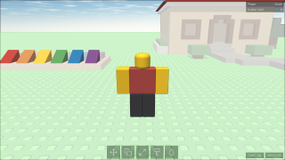 | 0.073/0.077 | 0.073/0.077 | 3D building sandbox; dynamic coloured thin instances; material plugins; property animation; audio; JSON save/load; retained editing UI. UI residual; canvas-only MAD: 0.000/0.000 on both backends. |
| Voxel Sandbox | 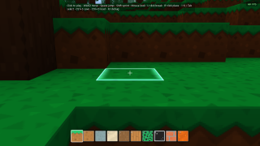 | $\color{#cf222e}{\textsf{1.090}} / \color{#cf222e}{\textsf{1.090}}$ | $\color{#cf222e}{\textsf{1.090}} / \color{#cf222e}{\textsf{1.090}}$ | Procedural voxel world; generated texture atlas; custom shader materials; audio; save/load; retained HUD and crosshair. UI residual; canvas-only MAD: 0.000/0.000 on both backends. |
| NPE on Sprite2D | 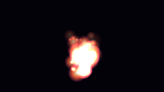 | pixel‑perfect | pixel‑perfect | Live pure-2D node particles; sprite atlas; pointer-following emitter. |
| Screen-Space Effects | 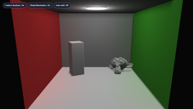 | 0.361/0.440 | 0.361/0.440 | Contact shadows; one-bounce GI; temporal history; retained controls. UI residual; canvas-only: pixel-perfect on both backends. |
| Mosquito in Amber | 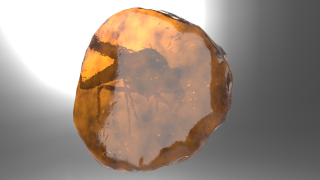 | 0.000/0.000 | 0.000/0.000 | Transmissive glTF (scene 176) as a demo; studio HDR IBL; retained chrome. |
| Calculator | 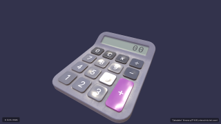 | $\color{#1a7f37}{\textsf{0.196}} / \color{#9a6700}{\textsf{0.895}}$ | $\color{#1a7f37}{\textsf{0.196}} / \color{#9a6700}{\textsf{0.895}}$ | KHR_interactivity flow graph; GPU picking under the selectability filter; retained chrome. UI residual; canvas-only: pixel-perfect on both backends. |

## Project-owned differential gates

Repository fixtures running against pinned Babylon Lite. These measure contracts outside current corpus coverage.

| Scene | Preview | SDL_GPU | Dawn | Coverage |
| ---: | :---: | ---: | ---: | --- |
| light-setters | 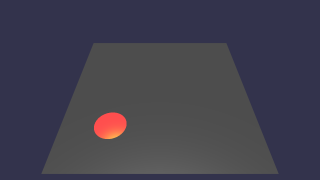 | pixel‑perfect | pixel‑perfect | Light Vector Setters |
| property-animation-paths | 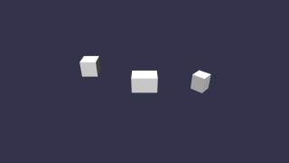 | pixel‑perfect | pixel‑perfect | Property Animation Paths |
| nav-crowd | 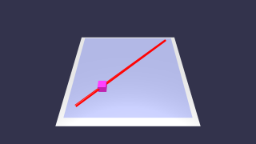 | pixel‑perfect | pixel‑perfect | Navigation Crowd Step |
| nav-obstacles | 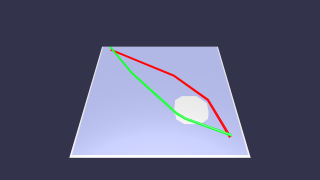 | pixel‑perfect | pixel‑perfect | Navigation Obstacle Removal |
| mesh-flags | 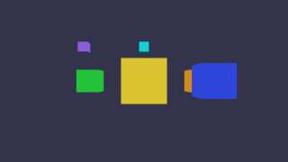 | pixel‑perfect | pixel‑perfect | Mesh Visible and Pickable |
| physics-aggregate-options | 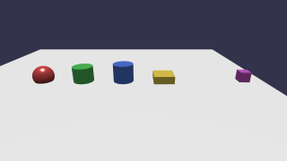 | 0.031/0.049 | 0.031/0.049 | Physics Aggregate Options |
| physics-floating-origin | 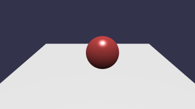 | 0.000/0.000 | 0.000/0.000 | Physics Floating Origin Regions |
| material-falloff | 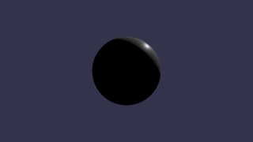 | pixel‑perfect | pixel‑perfect | Material Falloff Write |
| opacity-alpha-write |  | pixel‑perfect | 0.000/0.000 | Opacity Alpha Write |
| blend-alpha-write | 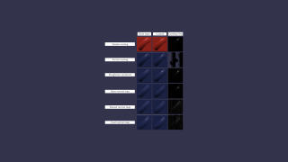 | pixel‑perfect | pixel‑perfect | Blend Alpha Write |
| runtime-options | 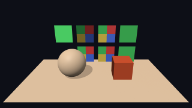 | 0.000/0.001 | 0.000/0.001 | Runtime Options |
| engine-calls | 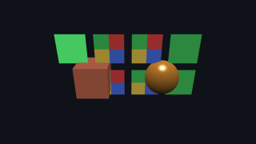 | pixel‑perfect | pixel‑perfect | Engine Calls |
| no-camera-floating-origin |  | pixel‑perfect | pixel‑perfect | No Camera Floating Origin |
| compiler-state | 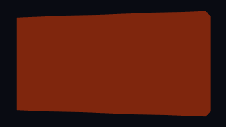 | pixel‑perfect | pixel‑perfect | Compiler State |
| glTF-track-clamp |  | pixel‑perfect | pixel‑perfect | glTF Track Clamp |
| shader-frame-graph |  | pixel‑perfect | pixel‑perfect | Shader Frame Graph |
| runtime-sweep | 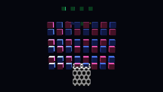 | pixel‑perfect | pixel‑perfect | Runtime Sweep |
| instanced-ground | 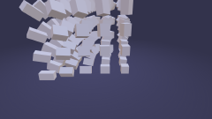 | pixel‑perfect | pixel‑perfect | Instanced Ground |
| sprite-layer-arms | 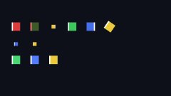 | pixel‑perfect | pixel‑perfect | Sprite Layer Arms |
| glTF-sparse | 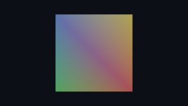 | pixel‑perfect | pixel‑perfect | glTF Sparse Accessors |
| glTF-uv-sets | 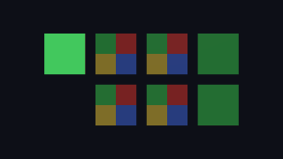 | pixel‑perfect | pixel‑perfect | glTF UV Sets |
| glTF-topology | 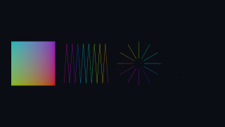 | pixel‑perfect | pixel‑perfect | glTF Primitive Topology |
| glTF-step-animation | 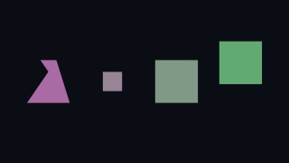 | pixel‑perfect | pixel‑perfect | glTF STEP Animation |
| node-local-attributes | 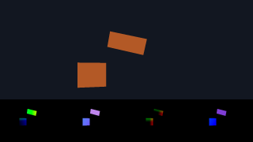 | pixel‑perfect | pixel‑perfect | Node Local Attributes |
| morph-ground | 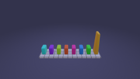 | pixel‑perfect | pixel‑perfect | Morph Storage Ground |
| timer-callback-cells |  | pixel‑perfect | pixel‑perfect | Timer Callback Cells |
| host-page |  | $\color{#1a7f37}{\textsf{0.069}} / \color{#cf222e}{\textsf{6.774}}$ | $\color{#1a7f37}{\textsf{0.069}} / \color{#cf222e}{\textsf{6.774}}$ | HTML host page: markup, sheets, inline loader, engine-less Canvas2D. UI text residual. |
| page-canvas |  | 0.009/0.024 | 0.009/0.024 | Text scene on a page-authored canvas over page chrome; canvas-only: pixel‑perfect on both backends. UI text residual. |
| filter-values | 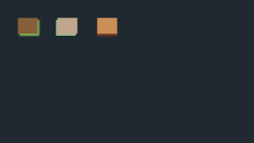 | 0.002/0.044 | 0.002/0.044 | Inherited custom properties, scalar/pixel math and computed shadow color. |
| markup-values | 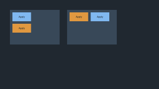 | 0.035/0.124 | 0.035/0.124 | Stored markup snapshots, conditional order and queried button interaction. |
| grid-placement | 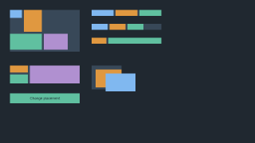 | 0.038/0.141 | 0.038/0.141 | Two-axis spans, intrinsic/finite tracks, auto-repeat and reversible isolation. |
| retained-svg |  | 0.007/0.299 | 0.007/0.299 | SVG namespace construction, live shape attributes, replacement and inherited color. |
| page-scene-canvas | 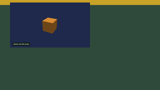 | $\color{#1a7f37}{\textsf{0.357}} / \color{#9a6700}{\textsf{0.633}}$ | $\color{#1a7f37}{\textsf{0.357}} / \color{#9a6700}{\textsf{0.633}}$ | Scene through a laid-out page canvas: preceding page paint stays beneath it; intrinsic canvas size; vertical-align, p and code defaults. UI text residual. |
